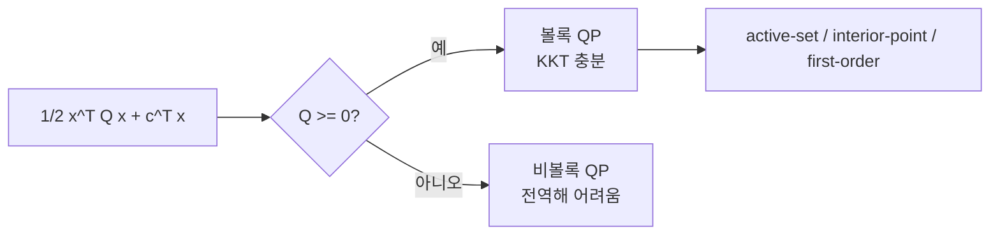

# 2차 프로그래밍 (Quadratic Programming)

- Level: Advanced
- Prerequisites: [Math/Optimization/Linear-Programming.md](Linear-Programming.md), [Math/Optimization/Convex-Optimization.md](Convex-Optimization.md)
- Status: Draft
- Reviewed-by: -
- Depth: Deep-dive (자기완결)

---

## 개념 (Concept)

2차 프로그래밍(QP)은 2차 목적 함수를 선형 제약 아래에서 최적화하는 문제다. 목적이 볼록(헤시안이 양의 준정부호)이면 효율적으로 풀린다. SVM, 포트폴리오 최적화, 제어가 대표 응용이다.

## 직관 (Intuition)

LP의 목적이 평평한 직선이라면, QP의 목적은 그릇 모양(2차)이다. 그래서 최적해가 꼭짓점이 아니라 그릇의 바닥이나 제약 경계에 걸린 곳에 생긴다. "비용은 제곱으로 커지고 제약은 선형"인 많은 실무 문제가 정확히 이 형태다.



## 이론 (Theory)

표준형:

$$\min_x\ \tfrac{1}{2}x^\top Q x + c^\top x \quad \text{s.t.}\quad Ax\le b,\ Ex=d$$

$Q$가 양의 준정부호이면 볼록 QP로 전역 최적이 보장된다. 최적성은 KKT 조건으로 특징지어진다: 정상성, 원시·쌍대 가능성, 상보 여유(complementary slackness). 등식 제약만 있으면 KKT는 하나의 선형 시스템이 되어 닫힌 형식으로 풀린다. 부등식 제약은 active set 또는 내부점법으로 다룬다.

### 무제약 QP

제약이 없고 $Q$가 양정부호이면 gradient를 0으로 두어 닫힌 해를 얻는다.

$$
\nabla\left(\frac12x^\top Qx+c^\top x\right)=Qx+c=0
\quad\Rightarrow\quad
x^\*=-Q^{-1}c
$$

$Q$가 준정부호이면 해가 유일하지 않을 수 있고, $c$가 $Q$의 영공간 방향과 맞지 않으면 아래로 무한히 내려갈 수 있다.

### 등식 제약 QP의 KKT 시스템

등식 제약 $Ex=d$만 있으면

$$
\begin{bmatrix}
Q&E^\top\\
E&0
\end{bmatrix}
\begin{bmatrix}
x\\
\nu
\end{bmatrix}
=
\begin{bmatrix}
-c\\
d
\end{bmatrix}
$$

를 푼다. 이 saddle-point 선형 시스템의 조건수와 희소 구조가 실제 성능을 크게 좌우한다.

### active set 관점

부등식 제약 중 최적점에서 등호로 붙는 제약만 active set에 들어간다. active-set 방법은 활성 제약을 추측하고 등식 QP를 풀며, KKT 부호 조건을 위반하면 활성 집합을 조정한다. 작은 dense QP나 warm-start가 중요한 MPC에서 자주 쓰인다.

## 구현 (Implementation)

```python
# min 1/2 x^T Q x + c^T x  s.t. Ax <= b  (개념: cvxpy)
import cvxpy as cp
import numpy as np

Q = np.array([[2.0, 0.0], [0.0, 2.0]])
c = np.array([-2.0, -5.0])
x = cp.Variable(2)
prob = cp.Problem(cp.Minimize(0.5 * cp.quad_form(x, Q) + c @ x),
                  [x >= 0, cp.sum(x) <= 3])
prob.solve()
print(x.value)
```

무제약 QP는 선형 시스템으로 직접 풀 수 있다.

```python
Q = np.array([[4.0, 1.0], [1.0, 2.0]])
c = np.array([-1.0, -1.0])
x_star = np.linalg.solve(Q, -c)
print(x_star)
```

## 복잡도 (Complexity)

볼록 QP는 내부점법으로 다항 시간에 풀린다. active set 방법은 제약을 하나씩 활성/비활성하며 일련의 등식 QP(선형 시스템)를 푼다. 비볼록 QP($Q$가 부정부호)는 일반적으로 NP-난해다. 문제 크기(변수·제약 수)와 $Q$의 구조(희소·저랭크)가 실제 비용을 좌우한다.

## 응용 (Applications)

- 서포트 벡터 머신(SVM)의 마진 최대화
- 마코위츠 포트폴리오(분산 최소화)
- 모델 예측 제어(MPC)
- 최소제곱에 제약을 더한 문제

## 흔한 오해 (Common Misunderstandings)

- $Q$가 양의 준정부호가 아니면 볼록성이 깨져 전역 최적 보장이 사라진다.
- QP가 LP보다 항상 어렵지는 않다(볼록 QP는 여전히 효율적).
- 등식 제약 QP는 닫힌 형식이지만, 부등식이 들어가면 반복법이 필요하다.
- KKT 조건은 필요조건이며, 볼록 문제에서 충분조건이 된다.
- $Q$가 양의 준정부호여도 목적이 강볼록이 아닐 수 있어 해가 여러 개일 수 있다.
- solver 입력에서 $Q$ 대칭성이 깨지면 수치 문제가 생길 수 있으므로 보통 $(Q+Q^\top)/2$로 대칭화한다.

## TMI

- SVM의 쌍대 문제는 전형적인 볼록 QP로, 커널 트릭이 자연스럽게 들어간다.
- 마코위츠의 포트폴리오 이론(1952)은 금융에 QP를 도입해 노벨 경제학상으로 이어졌다.
- MPC는 매 시간 스텝마다 QP를 실시간으로 풀어 제어 입력을 결정한다.

## 연습 / 확인 문제 (Exercises)

- 등식 제약만 있는 QP의 KKT 시스템을 세워라.
- $Q$가 양정부호일 때 무제약 QP의 닫힌 형식 해를 구하라.
- SVM의 마진 최대화가 왜 QP로 표현되는지 설명하라.
- $Q=\operatorname{diag}(1,0)$인 무제약 QP에서 해가 유일하지 않은 경우를 만들어라.
- 활성 제약이 하나 있는 2변수 QP를 그래프로 그리고 KKT 조건을 표시하라.

## 이어서 읽기 (Reading Path)

- 이전: [선형 프로그래밍](Linear-Programming.md)
- 다음: [라그랑주 승수법](Lagrangian.md), [AI/Machine-Learning/](../../AI/Machine-Learning/)

## 참조 (References)

- [Math/Optimization/Lagrangian.md](Lagrangian.md)
- [Math/Optimization/Convex-Optimization.md](Convex-Optimization.md)
- [Reference/Books.md](../../Reference/Books.md)
