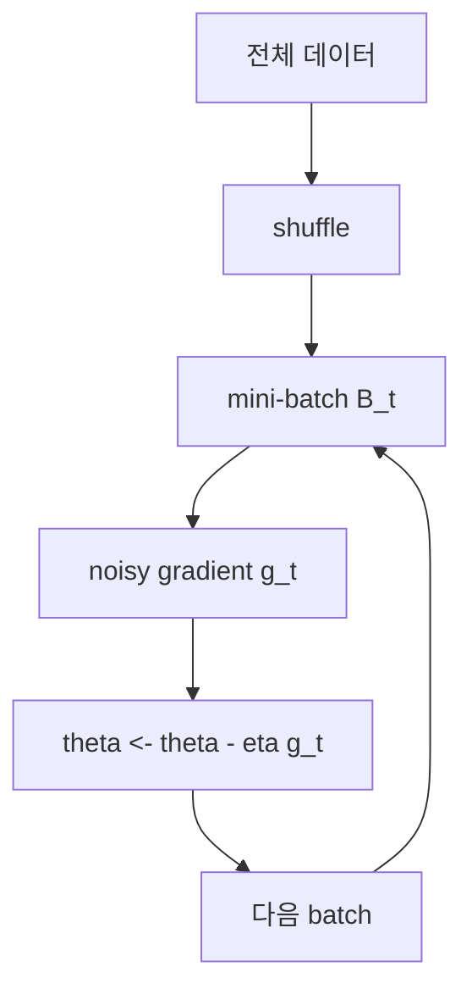

# 확률적 경사 하강법 (Stochastic Gradient Descent)

- Level: Intermediate
- Prerequisites: [Math/Optimization/Gradient-Descent.md](Gradient-Descent.md), [Math/Probability-Statistics/Expectation.md](../Probability-Statistics/Expectation.md)
- Status: Draft
- Reviewed-by: -
- Depth: Deep-dive (자기완결)

---

## 개념 (Concept)

확률적 경사 하강법(SGD)은 전체 데이터의 정확한 기울기 대신 무작위 표본이나 미니배치가 주는 noisy gradient로 파라미터를 갱신한다. 한 스텝이 싸고 스트리밍 데이터에도 적용할 수 있어 대규모 머신러닝의 기본 최적화 방법이다.

## 직관 (Intuition)

모든 설문 응답을 확인한 뒤 방향을 정하는 대신 작은 무작위 표본으로 빠르게 방향을 추정한다. 한 번의 방향은 흔들리지만 여러 번 갱신하면 전체 경향을 따라간다. 이 잡음은 수렴을 불안정하게 만들기도 하고 평평한 영역이나 안장점을 벗어나는 데 도움을 주기도 한다.



## 이론 (Theory)

경험 위험

$$
J(\theta)=\frac{1}{m}\sum_{i=1}^m\ell_i(\theta)
$$

에서 미니배치 $\mathcal B_t$를 뽑아

$$
g_t=\frac{1}{|\mathcal B_t|}\sum_{i\in\mathcal B_t}\nabla\ell_i(\theta_t),
\qquad \theta_{t+1}=\theta_t-\eta_t g_t
$$

로 갱신한다. 균등 표집이면 보통 $E[g_t\mid\theta_t]=\nabla J(\theta_t)$인 불편 추정량이다. 배치가 커질수록 분산은 줄지만 스텝당 계산·메모리가 늘어난다.

볼록 확률근사에서 $\sum_t\eta_t=\infty$, $\sum_t\eta_t^2<\infty$ 같은 감소 학습률 조건은 잡음을 줄이며 수렴을 돕는다. 딥러닝에서는 momentum, learning-rate schedule, warmup과 함께 사용한다.

### batch size와 gradient noise

미니배치 gradient는 전체 gradient의 추정량이다. 배치 크기 $b$를 키우면 분산은 대략 줄지만, 스텝 하나의 비용이 커진다. 중요한 것은 "한 스텝의 정확도"가 아니라 "같은 시간 또는 같은 연산량 안에서 얼마나 잘 내려가는가"다.

| 배치 크기 | 장점 | 단점 |
|---|---|---|
| 작음 | 싸고 자주 갱신, noise가 탐색에 도움 | loss가 흔들리고 하드웨어 효율이 낮을 수 있음 |
| 큼 | gradient가 안정적, 병렬화 효율 좋음 | 메모리 큼, 일반화/스케줄 민감 |
| 전체 배치 | 정확한 gradient | 대규모 데이터에서 느리고 saddle 탈출이 둔함 |

### epoch, step, effective batch

한 epoch는 데이터 전체를 한 번 처리한 것이다. step은 파라미터 갱신 한 번이다. gradient accumulation을 쓰면 여러 작은 미니배치의 gradient를 더해 큰 effective batch를 흉내 낼 수 있지만, batch normalization이나 dropout처럼 step 단위 동작과 상호작용하는 요소는 별도로 확인해야 한다.

### 학습률 스케줄

고정 학습률은 최솟값 주변에서 noise ball 안에 머물 수 있다. 감소 스케줄은 후반 진동을 줄이고, warmup은 초기 큰 gradient와 불안정한 optimizer state 때문에 너무 큰 update가 나오는 것을 완화한다. 딥러닝에서는 cosine decay, step decay, linear warmup을 자주 쓴다.

## 구현 (Implementation)

```python
import random


def sgd_linear_regression(xs, ys, lr=0.05, epochs=100):
    w, b = 0.0, 0.0
    indices = list(range(len(xs)))
    for _ in range(epochs):
        random.shuffle(indices)
        for i in indices:
            error = (w * xs[i] + b) - ys[i]
            w -= lr * 2 * error * xs[i]
            b -= lr * 2 * error
    return w, b


print(sgd_linear_regression([0, 1, 2, 3], [1, 3, 5, 7]))
```

실전 미니배치는 벡터화 연산을 활용하고 epoch마다 데이터 순서를 섞되 재현 가능한 난수 seed를 기록한다.

momentum을 더하면 일관된 방향을 누적하고 진동을 줄일 수 있다.

```python
def sgd_momentum_1d(grad, x=0.0, lr=0.1, momentum=0.9, steps=50):
    velocity = 0.0
    for _ in range(steps):
        velocity = momentum * velocity + grad(x)
        x -= lr * velocity
    return x

print(sgd_momentum_1d(lambda x: 2 * (x - 3)))
```

## 복잡도 (Complexity)

특성 수 $d$, 미니배치 크기 $b$일 때 한 스텝은 보통 `O(bd)`다. 한 epoch는 모든 $m$개 표본을 처리하므로 `O(md)`이며, 전체 비용은 epoch 수 $E$에 대해 `O(Emd)`다.

메모리는 모델 파라미터 `O(d)`에 더해 미니배치 `O(bd)`와 optimizer state가 필요하다. momentum은 파라미터와 같은 크기의 velocity를 하나 더 저장한다.

## 응용 (Applications)

- 신경망과 대규모 선형 모델 학습
- 온라인 학습과 데이터 스트림
- 행렬 분해와 임베딩 학습
- 분산 데이터 병렬 학습

## 흔한 오해 (Common Misunderstandings)

- 이름이 SGD여도 실무에서는 표본 하나보다 미니배치를 주로 쓴다.
- loss가 매 스텝 감소해야 정상인 것은 아니다. noisy gradient 때문에 오르내릴 수 있다.
- 큰 batch가 항상 더 빠르거나 일반화가 좋은 것은 아니다.
- 데이터 순서를 섞지 않으면 정렬·상관 구조가 편향된 갱신을 만들 수 있다.
- "epoch 수가 같다"가 같은 학습량을 뜻하지 않을 수 있다. batch size가 바뀌면 step 수가 달라진다.
- gradient accumulation은 메모리 문제를 완화하지만, 모든 학습 동작이 실제 큰 batch와 완전히 같아지는 것은 아니다.

## TMI

- momentum은 과거 gradient의 이동 평균을 이용해 진동을 줄이고 일관된 방향을 가속한다.
- epoch, step, iteration은 혼용되기 쉽지만 epoch는 전체 데이터 한 바퀴, step은 한 번의 파라미터 갱신이다.
- gradient accumulation은 작은 메모리로 큰 유효 배치를 흉내 낸다.

## 연습 / 확인 문제 (Exercises)

- 배치 크기 1과 전체 배치에서 loss 곡선의 흔들림을 비교하라.
- 학습률을 일정하게 유지할 때 최솟값 주변에서 진동하는 이유를 설명하라.
- momentum을 위 구현에 추가하라.
- 같은 epoch 수에서 batch size를 1, 4, 전체로 바꾸면 step 수가 어떻게 달라지는지 계산하라.
- 데이터가 label 순서로 정렬된 상태에서 shuffle을 끄면 어떤 편향이 생길 수 있는지 설명하라.

## 이어서 읽기 (Reading Path)

- 이전: [경사 하강법](Gradient-Descent.md)
- 다음: [적응형 최적화 방법](Adaptive-Methods.md)
- 관련: [기댓값](../Probability-Statistics/Expectation.md)

## 참조 (References)

- [Math/Optimization/Gradient-Descent.md](Gradient-Descent.md)
- [Math/Probability-Statistics/Expectation.md](../Probability-Statistics/Expectation.md)
- [Reference/Books.md](../../Reference/Books.md)
- [Reference/Courses.md](../../Reference/Courses.md)
