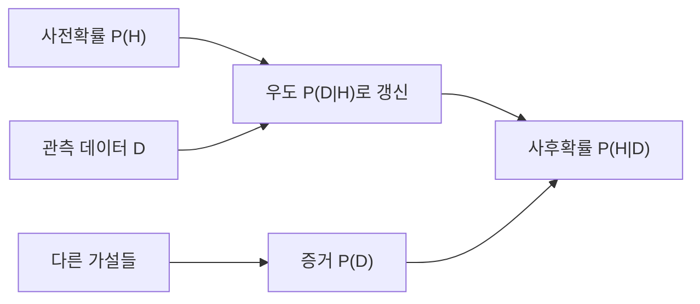

# 베이즈 정리 (Bayes' Theorem)

- Level: Intermediate
- Prerequisites: [Math/Probability-Statistics/Probability-Basics.md](Probability-Basics.md), [Math/Probability-Statistics/Distributions.md](Distributions.md)
- Status: Draft
- Reviewed-by: -
- Depth: Deep-dive (자기완결)

---

## 개념 (Concept)

베이즈 정리는 관측 전의 믿음인 사전확률을 데이터의 우도와 결합해 관측 후의 사후확률로 갱신한다.

$$
P(H\mid D)=\frac{P(D\mid H)P(H)}{P(D)}
$$

$H$는 가설, $D$는 관측 데이터다. 분모는 모든 가설 아래 데이터가 나타날 전체 확률이다.

## 직관 (Intuition)

검사가 정확해 보여도 질병 자체가 매우 드물면 양성인 사람 중 실제 환자 비율은 생각보다 낮을 수 있다. 베이즈 정리는 검사 성능뿐 아니라 검사 전 질병 빈도인 기저율을 함께 계산하게 한다.



## 이론 (Theory)

곱셈법칙 $P(H,D)=P(D\mid H)P(H)=P(H\mid D)P(D)$에서 베이즈 정리가 나온다. 서로 배타적이고 전체를 이루는 가설 $H_i$가 있으면

$$
P(D)=\sum_i P(D\mid H_i)P(H_i)
$$

이다. 연속 매개변수 $\theta$에서는 밀도로

$$
p(\theta\mid D)=\frac{p(D\mid\theta)p(\theta)}{p(D)}
\propto p(D\mid\theta)p(\theta)
$$

라고 쓴다. 사전분포와 우도를 곱한 형태가 같은 분포족의 사후분포를 만들면 켤레사전분포라 하며 계산이 단순해진다.

### 자연빈도 관점

확률식이 헷갈릴 때는 10,000명 같은 자연빈도로 바꾸면 직관이 좋아진다. 유병률 1%, 민감도 99%, 위양성률 5%라면 10,000명 중 실제 환자는 100명이다. 그중 약 99명이 양성이다. 비환자 9,900명 중 5%인 495명도 양성이다. 양성 전체는 594명이고, 실제 환자는 99명이므로 양성 후 질병 확률은 $99/594 \approx 16.7\%$다.

## 구현 (Implementation)

유병률 1%, 민감도 99%, 위양성률 5%인 검사의 양성 후 질병 확률을 계산한다.

```python
def posterior(prior, sensitivity, false_positive_rate):
    positive = sensitivity * prior + false_positive_rate * (1 - prior)
    return sensitivity * prior / positive


print(round(posterior(0.01, 0.99, 0.05), 3))  # 약 0.167
```

양성이라는 관측이 확률을 1%에서 약 16.7%로 크게 올리지만 99%로 만들지는 않는다.

odds 형태로도 계산할 수 있다.

```python
prior = 0.01
prior_odds = prior / (1 - prior)
likelihood_ratio = 0.99 / 0.05
posterior_odds = prior_odds * likelihood_ratio
posterior_prob = posterior_odds / (1 + posterior_odds)
print(round(posterior_prob, 3))  # 0.167
```

likelihood ratio는 "양성 결과가 환자에게서 비환자보다 몇 배 더 잘 나오는가"를 나타낸다.

## 복잡도 (Complexity)

유한 가설 $k$개의 사후확률 계산은 `O(k)`다. 고차원 연속 모형에서는 정규화 상수 $p(D)$ 적분이 어려워 MCMC, 변분 추론, 중요도 샘플링 같은 근사법을 사용한다.

워크드 예제의 유한 가설은 `환자/비환자` 두 개라 `O(2)`이다. 하지만 가설이 질병 100종이라면 각 질병에 대한 `P(D|H_i)P(H_i)`를 모두 계산하고 정규화해야 하므로 `O(k)`가 된다.

## 응용 (Applications)

- 의료검사와 고장 진단
- 스팸 필터와 확률적 분류
- A/B 테스트와 순차적 의사결정
- 확률 그래프 모델과 베이즈 신경망

## 흔한 오해 (Common Misunderstandings)

- $P(H\mid D)$와 $P(D\mid H)$는 다르다.
- 사전분포는 임의로 결과를 조작하는 값이 아니라 관측 전 정보를 명시하는 모델 요소다.
- 데이터가 많아지면 사전분포의 영향이 줄어드는 경우가 많지만 항상 그런 것은 아니다.
- 베이즈 정리는 인과관계를 자동으로 알려 주지 않는다.

## TMI

- odds 형태에서는 posterior odds가 prior odds와 likelihood ratio의 곱이 되어 증거의 영향을 분리해 볼 수 있다.
- Naive Bayes는 특징의 조건부 독립을 강하게 가정하지만 텍스트 분류에서 의외로 잘 작동한다.
- 베이즈 추론은 하나의 점 추정치보다 매개변수 전체의 불확실성을 사후분포로 남길 수 있다.

## 연습 / 확인 문제 (Exercises)

- 위 예제에서 유병률을 10%로 바꾸고 사후확률 변화를 설명하라.
- 두 개의 상자 중 하나를 고른 뒤 공을 관측하는 문제를 베이즈 정리로 풀어라.
- likelihood ratio와 prior odds로 같은 검사 문제를 다시 계산하라.

## 이어서 읽기 (Reading Path)

- 이전: [확률 변수와 분포](Distributions.md)
- 다음: [최대 우도 추정](MLE.md)
- 관련: [확률 공리와 조건부 확률](Probability-Basics.md)

## 참조 (References)

- [Math/Probability-Statistics/Probability-Basics.md](Probability-Basics.md)
- [Math/Probability-Statistics/Distributions.md](Distributions.md)
- [Reference/Books.md](../../Reference/Books.md)
- [Reference/Courses.md](../../Reference/Courses.md)
