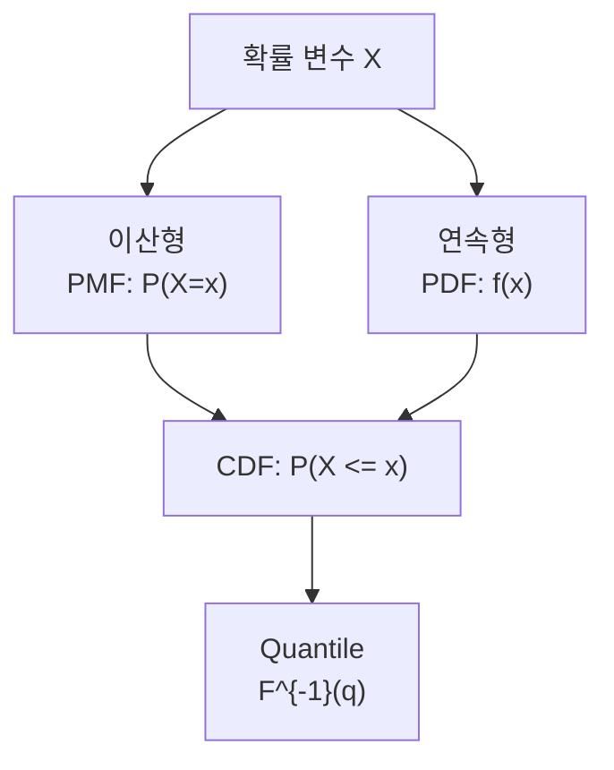

# 확률 변수와 분포 (Random Variables and Distributions)

- Level: Intermediate
- Prerequisites: [Math/Probability-Statistics/Probability-Basics.md](Probability-Basics.md)
- Status: Draft
- Reviewed-by: -
- Depth: Deep-dive (자기완결)

---

## 개념 (Concept)

확률 변수는 표본 공간의 결과를 수로 대응시키는 함수이고, 확률 분포는 그 값들이 얼마나 자주 나타나는지 기술한다. 이산 변수는 확률질량함수(PMF), 연속 변수는 확률밀도함수(PDF), 둘 모두 누적분포함수(CDF)로 표현할 수 있다.

## 직관 (Intuition)

동전을 열 번 던졌을 때 앞면의 개수는 0부터 10까지인 이산 확률 변수다. 사람의 키는 구간 안의 연속적인 값을 갖는 연속 확률 변수로 모델링할 수 있다. 분포는 가능한 값의 목록뿐 아니라 값마다 확률이 어떻게 퍼져 있는지를 함께 말한다.



## 이론 (Theory)

이산 변수 $X$의 PMF는 $p(x)=P(X=x)$이고 $\sum_x p(x)=1$이다. 연속 변수의 PDF $f(x)$는 구간 확률을 적분으로 준다.

$$
P(a\le X\le b)=\int_a^b f(x)\,dx,\qquad F(x)=P(X\le x)
$$

| 분포 | 주요 매개변수 | 대표 용도 |
|---|---|---|
| Bernoulli | 성공확률 $p$ | 한 번의 성공/실패 |
| Binomial | 시행 수 $n$, 확률 $p$ | 독립 시행의 성공 횟수 |
| Poisson | 발생률 $\lambda$ | 구간 내 사건 횟수 |
| Uniform | 구간 $[a,b]$ | 구간에서 동일한 밀도 |
| Normal | 평균 $\mu$, 분산 $\sigma^2$ | 합성 오차와 자연 변동 |
| Exponential | 발생률 $\lambda$ | Poisson 사건 사이 대기시간 |

PDF 값은 확률 자체가 아니며 1보다 클 수도 있다. 연속 변수에서 한 점의 확률은 0이고, 구간 아래 면적이 확률이다.

### CDF와 quantile

누적분포함수 $F(x)=P(X\le x)$는 이산·연속 모두에 쓸 수 있는 공통 표현이다. 분포 비교, 분위수, 임계값 계산은 보통 CDF를 통해 이루어진다. $q$-quantile은 $F(x)\ge q$가 되는 가장 작은 $x$로 생각할 수 있고, 중앙값은 $q=0.5$인 분위수다.

예를 들어 모델 점수의 95번째 분위수는 "정상 데이터의 95%가 이 값 이하"라는 임계값으로 쓸 수 있다. 단, 꼬리가 두꺼운 분포에서는 평균과 표준편차보다 분위수가 더 안정적인 요약일 수 있다.

### 어떤 분포를 고를까

| 데이터 형태 | 자연스러운 후보 | 점검할 질문 |
|---|---|---|
| 성공/실패 | Bernoulli, Binomial | 시행이 독립이고 성공확률이 일정한가? |
| 단위 시간 사건 횟수 | Poisson | 사건 발생률이 대략 일정한가? |
| 대기시간 | Exponential, Gamma | memoryless 가정이 맞는가? |
| 측정 오차 | Normal, Student-t | 꼬리가 두껍거나 이상치가 많은가? |
| 양수 크기 | Log-normal, Gamma | 로그를 취하면 더 대칭적인가? |

분포는 "데이터 모양에 맞는 곡선"이 아니라 데이터 생성 과정에 대한 가정이다. 같은 히스토그램도 여러 분포로 근사할 수 있으므로, 도메인 의미와 예측 목적을 함께 봐야 한다.

## 구현 (Implementation)

```python
import math
import random


def normal_pdf(x, mean=0.0, std=1.0):
    z = (x - mean) / std
    return math.exp(-0.5 * z * z) / (std * math.sqrt(2 * math.pi))


samples = [sum(random.random() < 0.3 for _ in range(10)) for _ in range(10_000)]
print(sum(samples) / len(samples))  # Binomial(10, 0.3)의 평균 약 3
print(normal_pdf(0.0))
```

경험적 CDF는 표본에서 분위수를 직접 추정하는 간단한 방법이다.

```python
def empirical_quantile(samples, q):
    xs = sorted(samples)
    idx = min(len(xs) - 1, int(q * len(xs)))
    return xs[idx]

print(empirical_quantile(samples, 0.95))
```

## 복잡도 (Complexity)

닫힌 형태의 PMF/PDF 한 점 평가는 보통 `O(1)`이다. 표본 $N$개 생성과 통계량 계산은 `O(N)`이다. 고차원 결합분포는 가능한 조합 수나 적분 비용이 차원에 따라 급격히 커질 수 있다.

경험적 분위수를 정렬로 구하면 `O(N log N)`이고, 선택 알고리즘을 쓰면 특정 분위수 하나는 평균 `O(N)`에 구할 수 있다. 스트리밍 데이터에서는 reservoir sampling이나 online quantile sketch가 필요할 수 있다.

## 응용 (Applications)

- 분류 출력, 사건 횟수, 대기시간의 확률 모델링
- 시뮬레이션과 불확실성 전파
- 우도 함수와 베이즈 추론의 모델 정의
- 이상치 탐지와 신뢰 구간 계산

## 흔한 오해 (Common Misunderstandings)

- PDF의 높이는 확률이 아니다. 구간 적분이 확률이다.
- 데이터가 종 모양이라고 자동으로 정규분포인 것은 아니다.
- 같은 평균과 분산을 가진 분포도 꼬리와 모양은 다를 수 있다.
- 독립이고 같은 분포를 따른다는 i.i.d. 가정은 편리하지만 실제 데이터에서는 확인이 필요하다.
- 분포의 매개변수 표기는 책과 라이브러리마다 다를 수 있다. 특히 Exponential/Gamma의 rate와 scale을 혼동하기 쉽다.
- 주변분포가 정규분포처럼 보여도 결합분포의 의존 구조가 단순하다는 뜻은 아니다.

## TMI

- 지수분포는 이미 기다린 시간과 무관하게 남은 대기시간 분포가 같은 memoryless 성질을 가진다.
- 정규분포의 선형결합은 다시 정규분포가 되지만, 일반 분포에는 이런 닫힘이 없다.
- 두 변수의 주변분포만으로 결합분포가 완전히 정해지지는 않는다.

## 연습 / 확인 문제 (Exercises)

- Bernoulli와 Binomial 분포의 차이를 예로 설명하라.
- 표준정규 PDF 아래 전체 면적이 1인 이유를 조사하라.
- 평균이 같은 Poisson 표본과 Normal 표본을 생성해 히스토그램 모양을 비교하라.
- 같은 평균·분산을 가진 두 분포를 골라 꼬리 확률이 얼마나 다른지 비교하라.
- 표본 크기를 바꾸며 경험적 95% 분위수 추정값의 흔들림을 관찰하라.

## 이어서 읽기 (Reading Path)

- 이전: [확률 공리와 조건부 확률](Probability-Basics.md)
- 다음: [기댓값, 분산, 공분산](Expectation.md), [베이즈 정리](Bayes-Theorem.md)

## 참조 (References)

- [Math/Probability-Statistics/Probability-Basics.md](Probability-Basics.md)
- [Reference/Books.md](../../Reference/Books.md)
- [Reference/Courses.md](../../Reference/Courses.md)
