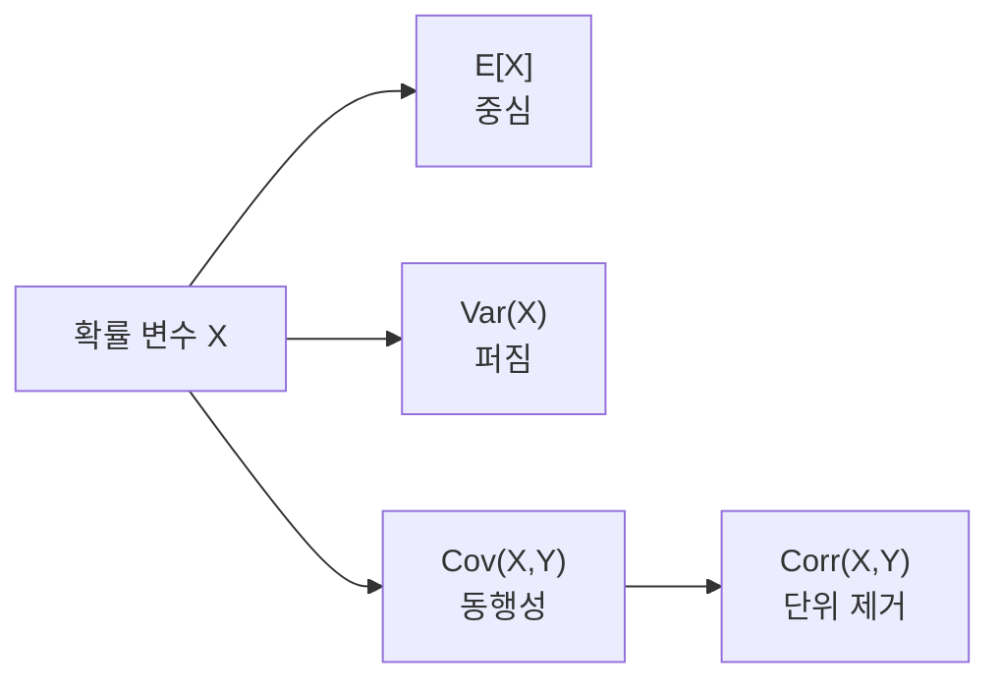

# 기댓값, 분산, 공분산 (Expectation, Variance, Covariance)

- Level: Intermediate
- Prerequisites: [Math/Probability-Statistics/Probability-Basics.md](Probability-Basics.md)
- Status: Draft
- Reviewed-by: -
- Depth: Deep-dive (자기완결)

---

## 개념 (Concept)

기댓값은 확률 변수의 "평균적으로 기대되는 값"이다. 분산은 값이 평균에서 얼마나 퍼져 있는지를, 공분산은 두 변수가 함께 어떻게 변하는지를 잰다.

## 직관 (Intuition)

주사위 한 번의 결과는 매번 다르지만, 수없이 던져 평균을 내면 $3.5$에 가까워진다. 이 $3.5$가 기댓값이다. 분산은 "결과가 평균 주위로 얼마나 흩어지는가"이고, 공분산은 "키가 큰 사람이 몸무게도 큰 경향이 있는가"처럼 두 양의 동행성을 본다.



## 이론 (Theory)

이산 확률 변수의 기댓값:

$$E[X] = \sum_x x\,P(X = x)$$

연속이면 합 대신 적분 $E[X] = \int x\,f(x)\,dx$를 쓴다. 기댓값은 **선형**이다.

$$E[aX + bY] = a\,E[X] + b\,E[Y]$$

분산과 공분산:

$$\operatorname{Var}(X) = E[(X - \mu)^2] = E[X^2] - (E[X])^2$$

$$\operatorname{Cov}(X, Y) = E[(X - \mu_X)(Y - \mu_Y)]$$

상관계수는 공분산을 표준편차로 정규화한 $\rho = \dfrac{\operatorname{Cov}(X,Y)}{\sigma_X \sigma_Y} \in [-1, 1]$다.

### LOTUS: 확률 변수 변환의 기댓값

$Y=g(X)$의 기댓값을 구할 때 $Y$의 분포를 새로 만들 필요 없이

$$
E[g(X)] = \sum_x g(x)P(X=x)
$$

를 쓸 수 있다. 연속형에서는 $\int g(x)f(x)\,dx$다. 이를 LOTUS(Law of the Unconscious Statistician)라고 부르며, 분산 공식 $E[X^2]-(E[X])^2$도 이 관점으로 이해할 수 있다.

### 표본 추정량과 Bessel 보정

데이터 $x_1,\dots,x_n$에서 모평균을 추정할 때 표본평균은

$$
\bar{x}=\frac{1}{n}\sum_i x_i
$$

이다. 모분산을 표본으로 추정할 때는

$$
s^2=\frac{1}{n-1}\sum_i(x_i-\bar{x})^2
$$

처럼 $n-1$로 나누는 불편분산을 자주 쓴다. 평균을 데이터에서 이미 추정했기 때문에 자유도가 하나 줄어든다고 볼 수 있다.

### 공분산 행렬

벡터 확률 변수 $\mathbf{X}\in\mathbb{R}^d$의 공분산 행렬은

$$
\Sigma=E[(\mathbf{X}-\boldsymbol{\mu})(\mathbf{X}-\boldsymbol{\mu})^\top]
$$

이다. 대각 원소는 각 특징의 분산, 비대각 원소는 특징 쌍의 공분산이다. PCA는 이 공분산 행렬의 고유방향을 찾는 방법으로 볼 수 있다.

## 구현 (Implementation)

```python
def expectation(values, probs):
    return sum(x * p for x, p in zip(values, probs))

def variance(values, probs):
    mu = expectation(values, probs)
    return sum((x - mu) ** 2 * p for x, p in zip(values, probs))

faces = [1, 2, 3, 4, 5, 6]
probs = [1/6] * 6
print(expectation(faces, probs))        # 3.5
print(round(variance(faces, probs), 3)) # 2.917
```

표본 데이터에서는 수치 안정성이 좋은 online 알고리즘을 사용할 수 있다.

```python
def online_mean_variance(samples):
    mean = 0.0
    m2 = 0.0
    for n, x in enumerate(samples, start=1):
        delta = x - mean
        mean += delta / n
        m2 += delta * (x - mean)
    variance_unbiased = m2 / (n - 1)
    return mean, variance_unbiased

print(online_mean_variance([1, 2, 3, 4, 5]))
```

## 복잡도 (Complexity)

| 대상 | 비용 |
|---|---|
| 이산 기댓값/분산 (결과 `k`개) | `O(k)` |
| 표본 `n`개로부터 표본평균·표본분산 | `O(n)` |

공분산 행렬을 직접 계산하려면 샘플 수 `n`, 차원 `d`에 대해 시간은 보통 `O(nd^2)`, 저장 공간은 `O(d^2)`다. 고차원에서는 공분산 행렬 자체가 병목이 된다.

## 응용 (Applications)

- 머신러닝 손실의 기대 위험(expected risk) 최소화
- 모델 예측의 불확실성·신뢰 구간
- 포트폴리오·리스크 분석(분산 = 위험)
- 특징 간 상관 분석, 공분산 행렬과 PCA

## 흔한 오해 (Common Misunderstandings)

- 기댓값은 "가장 가능성 높은 값"이 아니다. 실제로 한 번도 안 나오는 값일 수 있다(주사위의 3.5).
- 기댓값의 선형성은 독립이 아니어도 성립한다. 하지만 $E[XY] = E[X]E[Y]$는 일반적으로 독립일 때만 성립한다.
- 공분산이 0이라고 항상 독립은 아니다. 공분산은 선형 관계만 포착한다.
- 상관관계는 인과관계가 아니다.
- 분산은 단위가 원래 값의 제곱이다. 원래 단위로 퍼짐을 보고 싶으면 표준편차를 사용한다.
- 평균과 분산이 존재하지 않거나 매우 불안정한 heavy-tailed 분포도 있다. 이때는 중앙값과 분위수가 더 견고하다.

## TMI

- 분산의 두 공식 $E[(X-\mu)^2]$와 $E[X^2]-\mu^2$는 같지만, 후자는 한 번의 순회로 계산할 수 있어 자주 쓰인다(다만 수치적으로는 덜 안정적일 수 있다).
- "기대 효용" 이론은 같은 기댓값이라도 사람이 위험을 다르게 평가하는 현상을 설명하며, 경제학·의사결정 이론의 출발점이다.

## 연습 / 확인 문제 (Exercises)

- 동전 던지기에서 앞면이면 +1, 뒷면이면 -1인 확률 변수의 기댓값과 분산을 구하라.
- $\operatorname{Var}(X) = E[X^2] - (E[X])^2$ 임을 정의로부터 유도하라.
- 공분산이 0이지만 독립이 아닌 두 변수의 예를 만들어 보라.
- 표본분산을 `n`과 `n-1`로 나누어 각각 계산하고, 작은 표본에서 차이를 비교하라.
- 2차원 표본 데이터의 공분산 행렬을 직접 계산하고 PCA의 첫 방향과 비교하라.

## 이어서 읽기 (Reading Path)

- 이전: [확률 공리와 조건부 확률](Probability-Basics.md)
- 다음: [베이즈 정리](Bayes-Theorem.md), [최대 우도 추정](MLE.md)

## 참조 (References)

- [Math/Probability-Statistics/Probability-Basics.md](Probability-Basics.md)
- [Reference/Books.md](../../Reference/Books.md)
- [Reference/Courses.md](../../Reference/Courses.md)
