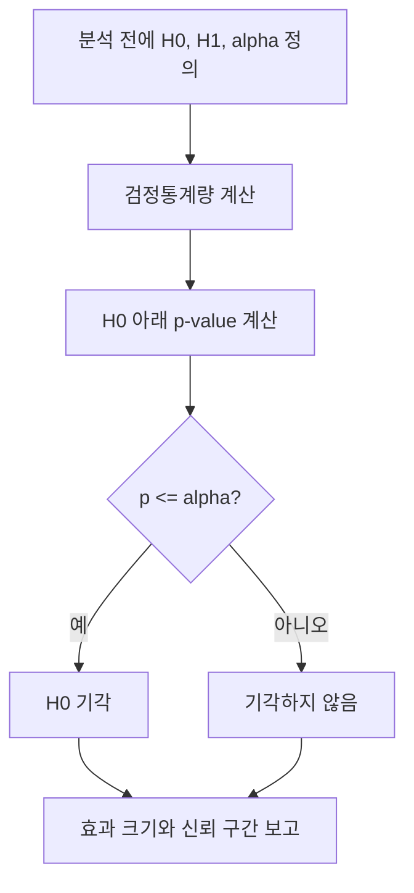

# 가설 검정 (Hypothesis Testing)

- Level: Intermediate
- Prerequisites: [Math/Probability-Statistics/CLT.md](CLT.md), [Math/Probability-Statistics/Expectation.md](Expectation.md)
- Status: Draft
- Reviewed-by: -
- Depth: Deep-dive (자기완결)

---

## 개념 (Concept)

가설 검정은 데이터가 귀무가설 $H_0$과 얼마나 양립하기 어려운지 통계량으로 평가하는 절차다. 대립가설 $H_1$, 유의수준 $\alpha$, 검정통계량을 미리 정하고, 관측 결과가 $H_0$ 아래 지나치게 극단적이면 귀무가설을 기각한다.

## 직관 (Intuition)

공정한 동전이라는 가정 아래 100번 중 앞면이 90번 나오기는 매우 어렵다. 이런 결과를 보면 "공정하다"는 가정을 의심한다. 다만 드문 사건도 일어날 수 있으므로 검정은 확정 판결이 아니라 오류율을 관리하는 의사결정 규칙이다.



## 이론 (Theory)

p-value는 $H_0$이 참이라고 가정했을 때 관측 통계량 이상으로 극단적인 결과가 나올 확률이다. p-value가 $\alpha$보다 작으면 $H_0$을 기각한다.

| 실제 상태 / 결정 | 기각 | 기각하지 않음 |
|---|---|---|
| $H_0$ 참 | 제1종 오류, 확률 $\alpha$ | 올바른 결정 |
| $H_1$ 참 | 검정력 $1-\beta$ | 제2종 오류, 확률 $\beta$ |

평균 검정의 한 예로, 알려진 표준편차 $\sigma$ 아래

$$
z=\frac{\bar x-\mu_0}{\sigma/\sqrt n}
$$

를 사용한다. 실제 검정 선택은 자료형, 표본 크기, 독립성·등분산·분포 가정에 달려 있다. 신뢰 구간, 효과 크기, 검정력도 p-value와 함께 보고해야 한다.

### p-value를 읽는 정확한 방식

p-value는 "귀무가설이 참일 때, 지금 관측한 것만큼 또는 그보다 더 극단적인 결과가 나올 확률"이다. 관측 후에 $H_0$이 참일 확률도 아니고, 결과가 우연일 확률도 아니다. 이 구분이 중요한 이유는 p-value가 데이터의 극단성을 말할 뿐, 효과의 크기나 원인까지 말해 주지 않기 때문이다.

### 효과 크기와 검정력

효과 크기는 차이가 얼마나 큰지를 원래 단위 또는 표준화 단위로 나타낸다. 검정력은 실제 효과가 있을 때 이를 기각할 확률이다.

| 요소 | 검정력에 미치는 영향 |
|---|---|
| 표본 수 증가 | 검정력 증가 |
| 효과 크기 증가 | 검정력 증가 |
| 잡음/분산 증가 | 검정력 감소 |
| 유의수준 $\alpha$ 증가 | 검정력 증가, 제1종 오류도 증가 |

큰 표본에서는 아주 작은 효과도 유의해질 수 있고, 작은 표본에서는 실무적으로 큰 효과도 놓칠 수 있다. 그래서 p-value만 단독으로 보고하면 의사결정 품질이 낮아진다.

### 다중 비교

가설을 100개 동시에 검사하면 각 검정의 $\alpha=0.05$가 작아 보여도 거짓 양성이 여럿 나올 가능성이 커진다. Bonferroni 보정은 임계값을 $\alpha/m$으로 낮추어 가족 단위 오류율을 보수적으로 제어한다. 탐색적 분석에서는 FDR(False Discovery Rate) 제어가 더 적합할 수 있다.

## 구현 (Implementation)

표준정규 근사를 사용한 양측 평균 z 검정의 작은 예다.

```python
import math


def two_sided_z_test(sample_mean, null_mean, std, n):
    z = (sample_mean - null_mean) / (std / math.sqrt(n))
    p_value = math.erfc(abs(z) / math.sqrt(2))
    return z, p_value


z, p = two_sided_z_test(10.6, 10.0, 2.0, 100)
print(round(z, 3), round(p, 4))
```

실무에서는 검증된 통계 라이브러리를 사용하고 분석 전에 단측/양측, 제외 기준, 지표를 정한다.

같은 요약 통계로 신뢰 구간도 함께 계산한다.

```python
def mean_ci(sample_mean, std, n, z_crit=1.96):
    se = std / math.sqrt(n)
    return sample_mean - z_crit * se, sample_mean + z_crit * se

print(mean_ci(10.6, 2.0, 100))
```

## 복잡도 (Complexity)

표본평균과 분산 계산은 표본 수 $n$에 대해 `O(n)`이며 요약 통계가 있으면 검정통계량 계산은 `O(1)`이다. permutation test는 반복 횟수 $R$과 표본 크기에 따라 보통 `O(Rn)`이다.

여러 지표·세그먼트·기간을 동시에 보면 검정 수가 곱셈으로 늘어난다. 계산 비용뿐 아니라 오류율 관리 비용도 함께 증가한다.

## 응용 (Applications)

- A/B 테스트와 제품 실험
- 임상·과학 연구의 효과 검정
- 제조 공정과 이상 탐지
- 모델 성능 차이의 불확실성 평가

## 흔한 오해 (Common Misunderstandings)

- p-value는 귀무가설이 참일 확률이 아니다.
- 기각하지 못했다는 것이 귀무가설을 증명한 것은 아니다.
- 통계적으로 유의하다고 실무적으로 큰 효과인 것은 아니다.
- 여러 가설을 동시에 검사하면 거짓 양성이 늘어나므로 보정이 필요하다.
- 관측 후에 단측/양측 검정을 바꾸면 오류율이 유지되지 않는다.
- 중간 결과를 반복해서 보며 유리할 때 실험을 멈추면 명목상 $\alpha$보다 실제 제1종 오류가 커진다.

## TMI

- 표본 수가 매우 크면 실질적으로 사소한 차이도 매우 작은 p-value를 만들 수 있다.
- 분석을 보고 가설이나 중단 시점을 바꾸면 명목상 오류율이 유지되지 않는다.
- 사전등록과 재현 가능한 분석은 선택적 보고와 p-hacking을 줄이는 장치다.

## 연습 / 확인 문제 (Exercises)

- 제1종 오류와 제2종 오류를 스팸 필터 예로 설명하라.
- 같은 효과 크기에서 표본 수가 증가하면 검정력이 어떻게 변하는지 설명하라.
- p-value, 신뢰 구간, 효과 크기를 함께 보고하는 예시 문장을 작성하라.
- 20개의 독립적인 참 귀무가설을 $\alpha=0.05$로 검사할 때 하나 이상 거짓 양성이 나올 확률을 계산하라.
- 같은 평균 차이에 대해 표본 수를 바꾸며 p-value와 효과 크기가 어떻게 달라지는지 비교하라.

## 이어서 읽기 (Reading Path)

- 이전: [중심 극한 정리](CLT.md)
- 다음: [정보 이론](Information-Theory.md)

## 참조 (References)

- [Math/Probability-Statistics/CLT.md](CLT.md)
- [Math/Probability-Statistics/Expectation.md](Expectation.md)
- [Reference/Books.md](../../Reference/Books.md)
- [Reference/Courses.md](../../Reference/Courses.md)
