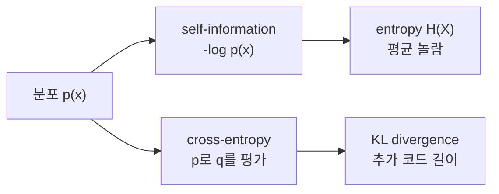

# 정보 이론 (Information Theory)

- Level: Intermediate
- Prerequisites: [Math/Probability-Statistics/Distributions.md](Distributions.md), [Math/Probability-Statistics/Expectation.md](Expectation.md)
- Status: Draft
- Reviewed-by: -
- Depth: Deep-dive (자기완결)

---

## 개념 (Concept)

정보 이론은 불확실성과 정보량을 확률로 측정한다. 드문 사건일수록 관측했을 때 정보량이 크고, 확률 변수의 평균적인 불확실성을 엔트로피로 나타낸다. 압축, 통신, 머신러닝 손실의 공통 언어다.

## 직관 (Intuition)

해가 매일 뜬다는 소식은 놀랍지 않아 정보량이 작다. 거의 일어나지 않는 사건의 소식은 더 놀라워 정보량이 크다. 엔트로피는 결과를 보기 전에 평균적으로 얼마나 놀랄지를 재는 값으로 볼 수 있다.



## 이론 (Theory)

확률 $p(x)$인 사건의 self-information과 이산 엔트로피는

$$
I(x)=-\log_2 p(x),\qquad H(X)=-\sum_x p(x)\log_2 p(x)
$$

이다. 로그 밑이 2면 단위는 bit다. 두 분포 $p,q$의 차이를 재는 KL divergence는

$$
D_{KL}(p\|q)=\sum_x p(x)\log\frac{p(x)}{q(x)}
$$

이고 일반적으로 대칭이 아니므로 거리가 아니다. cross-entropy는

$$
H(p,q)=-\sum_x p(x)\log q(x)=H(p)+D_{KL}(p\|q)
$$

다. 상호정보량 $I(X;Y)=D_{KL}(p(x,y)\|p(x)p(y))$는 한 변수를 알 때 다른 변수의 불확실성이 얼마나 줄어드는지 나타낸다.

### 코드 길이 해석

확률이 높은 결과에는 짧은 코드, 낮은 결과에는 긴 코드를 주면 평균 코드 길이를 줄일 수 있다. 이상적인 코드 길이는 대략 $-\log_2 p(x)$ bit이고, 엔트로피는 최적 무손실 압축에서 기대되는 평균 코드 길이의 하한이다.

모델 $q$로 실제 분포 $p$의 데이터를 코딩하면 평균 길이는 cross-entropy $H(p,q)$가 된다. 최적 분포 $p$를 썼을 때 필요한 길이 $H(p)$보다 더 드는 평균 추가 길이가 $D_{KL}(p\|q)$다.

### cross-entropy와 분류 손실

one-hot target에서 정답 클래스가 $y$이고 모델 예측이 $q$이면 cross-entropy는

$$
-\sum_c \mathbf{1}[c=y]\log q_c=-\log q_y
$$

가 된다. 정답 클래스 확률을 낮게 주면 손실이 크게 증가한다. 이는 "모델이 정답을 얼마나 놀라운 사건으로 보았는가"를 벌점으로 주는 것과 같다.

### KL divergence의 비대칭성

$D_{KL}(p\|q)$는 $p$가 실제로 자주 내는 곳에서 $q$가 낮은 확률을 주면 큰 벌점을 준다. 반대로 $p$가 거의 내지 않는 곳에 $q$가 큰 확률을 주는 것은 상대적으로 다르게 벌점화된다. 그래서 $D_{KL}(p\|q)$와 $D_{KL}(q\|p)$는 모드 덮기와 모드 찾기 성향이 다르게 나타날 수 있다.

## 구현 (Implementation)

```python
import math


def entropy(probabilities):
    return -sum(p * math.log2(p) for p in probabilities if p > 0)


def cross_entropy(target, prediction):
    return -sum(p * math.log(q) for p, q in zip(target, prediction) if p > 0)


print(entropy([0.5, 0.5]))       # 1 bit
print(entropy([0.99, 0.01]))     # 더 작은 불확실성
print(cross_entropy([1, 0], [0.9, 0.1]))
```

확률 0에 로그를 취하지 않도록 모델 출력은 수치적으로 안정적인 log-softmax 같은 연산으로 다룬다.

KL divergence와 cross-entropy 관계를 직접 확인할 수 있다.

```python
def kl_divergence(p, q):
    return sum(pi * math.log(pi / qi) for pi, qi in zip(p, q) if pi > 0)

p = [0.7, 0.3]
q = [0.6, 0.4]
h_p = entropy(p) * math.log(2)   # nat 단위로 변환
ce = cross_entropy(p, q)
print(round(ce, 6), round(h_p + kl_divergence(p, q), 6))
```

## 복잡도 (Complexity)

$k$개 결과의 엔트로피와 KL divergence 계산은 `O(k)`다. 고차원 결합분포를 명시적으로 저장하면 상태 수가 지수적으로 증가할 수 있어 표본 추정이나 구조적 모델을 사용한다.

상호정보량을 표본에서 추정하는 일은 특히 어렵다. 가능한 결합 상태 수가 많으면 빈 칸이 많아지고, naive plug-in 추정량은 편향될 수 있다.

## 응용 (Applications)

- 무손실 압축의 평균 코드 길이 한계
- 통신 채널 용량과 오류 정정
- 분류의 cross-entropy 손실
- 의사결정나무의 정보 이득과 특징 선택

## 흔한 오해 (Common Misunderstandings)

- 엔트로피는 단순히 값의 분산이 아니다. 확률 질량의 불확실성을 잰다.
- KL divergence는 대칭이 아니고 삼각부등식을 만족하지 않는다.
- cross-entropy가 작다는 것은 예측분포가 데이터분포에 가깝다는 뜻이지 인과적으로 올바르다는 뜻은 아니다.
- 연속분포의 differential entropy는 이산 엔트로피와 달리 음수가 될 수 있다.
- 로그 밑이 바뀌면 단위가 바뀐다. 밑 2는 bit, 자연로그는 nat이다.
- KL divergence에서 $p(x)>0$인데 $q(x)=0$이면 값이 무한대가 된다. 모델은 실제 가능한 사건에 0 확률을 주면 위험하다.

## TMI

- 공정한 동전 한 번의 엔트로피는 정확히 1 bit다.
- Shannon의 source coding theorem은 평균 코드 길이가 엔트로피 아래로 임의로 내려갈 수 없음을 보여 준다.
- mutual information은 비선형 의존성도 포착하지만 유한 표본 추정이 어렵다.

## 연습 / 확인 문제 (Exercises)

- 공정한 주사위와 항상 1만 나오는 주사위의 엔트로피를 비교하라.
- 같은 두 분포로 $D_{KL}(p\|q)$와 $D_{KL}(q\|p)$를 계산해 비교하라.
- one-hot target에서 cross-entropy가 정답 클래스의 음의 로그확률이 됨을 보여라.
- 불균형 이진분류에서 정답 클래스 확률이 0.9와 0.99일 때 cross-entropy 차이를 계산하라.
- 두 변수가 독립이면 상호정보량이 0이 되는 이유를 KL divergence 정의로 설명하라.

## 이어서 읽기 (Reading Path)

- 이전: [가설 검정](Hypothesis-Testing.md)
- 다음: 확률 그래프 모델 (예정 [AI/PGMs/](../../AI/PGMs/))
- 관련: [로지스틱 회귀](../../AI/Machine-Learning/Logistic-Regression.md)

## 참조 (References)

- [Math/Probability-Statistics/Distributions.md](Distributions.md)
- [Math/Probability-Statistics/Expectation.md](Expectation.md)
- [Reference/Books.md](../../Reference/Books.md)
- [Reference/Papers.md](../../Reference/Papers.md)
