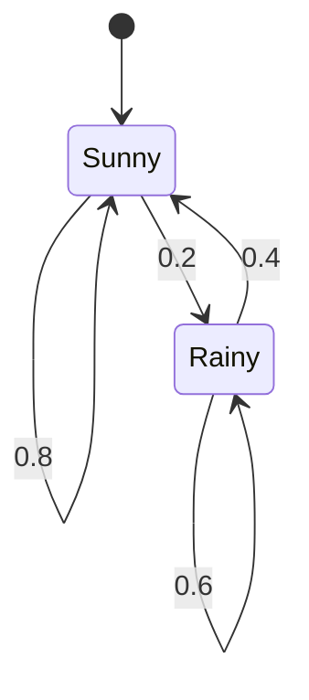

# 마르코프 체인 (Markov Chains)

- Level: Intermediate
- Prerequisites: [Math/Probability-Statistics/Probability-Basics.md](Probability-Basics.md), [Math/Linear-Algebra/Matrices.md](../Linear-Algebra/Matrices.md)
- Status: Draft
- Reviewed-by: -
- Depth: Deep-dive (자기완결)

---

## 개념 (Concept)

마르코프 체인은 "다음 상태가 현재 상태에만 의존하고 과거 이력과는 무관한"(마르코프 성질) 확률 과정이다. 상태 전이를 전이 행렬로 표현하고, 장기 거동을 정상 분포로 분석한다.

## 직관 (Intuition)

날씨가 "오늘이 맑으면 내일 맑을 확률 0.8"처럼 바로 직전 상태만으로 결정된다면, 전체 역사를 기억할 필요가 없다. 이 "기억 없음"이 마르코프 성질이다. 많은 스텝을 거치면 시작점을 잊고 일정한 분포로 수렴하는 경우가 많은데, 그 안정 상태가 정상 분포다.



## 이론 (Theory)

상태 집합 위 전이 행렬 $P$, $P_{ij}=\Pr(X_{t+1}=j\mid X_t=i)$, 각 행의 합은 1(확률 행렬). $n$스텝 전이는 $P^n$이다. 분포 $\pi$가

$$\pi P=\pi,\qquad \sum_i \pi_i=1$$

를 만족하면 **정상 분포**다. 체인이 기약적(irreducible)이고 비주기적(aperiodic)이면 유일한 정상 분포로 수렴한다(에르고딕 정리). 정상 분포는 전이 행렬의 고윳값 1에 대응하는 좌고유벡터다. 가역(detailed balance) 체인은 $\pi_i P_{ij}=\pi_j P_{ji}$를 만족한다.

### 상태 분류

| 개념 | 뜻 |
|---|---|
| 도달 가능 | 어떤 스텝 수 후 한 상태에서 다른 상태로 갈 확률이 양수 |
| communicating class | 서로 도달 가능한 상태들의 묶음 |
| 기약적 | 모든 상태가 하나의 communicating class |
| 주기 | 어떤 상태로 되돌아올 수 있는 스텝 수들의 최대공약수 |
| 흡수 상태 | 들어가면 빠져나오지 않는 상태 |

정상 분포가 있어도 시작 분포에서 항상 그 분포로 수렴하는 것은 아니다. 예를 들어 두 상태가 매번 번갈아 바뀌는 체인은 정상 분포는 있지만 분포가 진동한다. 비주기성이 필요한 이유다.

### 2상태 정상 분포 손계산

전이 행렬

$$
P=\begin{pmatrix}0.8&0.2\\0.4&0.6\end{pmatrix}
$$

에 대해 $\pi=(a,1-a)$라 두면

$$
a=0.8a+0.4(1-a)
$$

이므로 $0.6a=0.4$, $a=2/3$이다. 따라서 정상 분포는 $(2/3,1/3)$이다. 첫 상태에서 둘째 상태로 나가는 확률 흐름 $(2/3)0.2$와 둘째에서 첫째로 들어오는 흐름 $(1/3)0.4$가 같아 균형을 이룬다.

### 수렴 속도와 spectral gap

유한 에르고딕 체인의 수렴 속도는 전이 행렬의 두 번째로 큰 고유값 크기와 관련된다. 가장 큰 고유값은 1이고, 그다음 고유값의 절댓값이 1에 가까울수록 시작 상태의 흔적이 오래 남는다. MCMC에서는 이 mixing time이 실제 표본 품질을 좌우한다.

## 구현 (Implementation)

```python
import numpy as np

def stationary(P, iters=1000):
    n = P.shape[0]
    pi = np.ones(n) / n
    for _ in range(iters):
        pi = pi @ P            # 분포를 반복 전이 → 정상 분포로 수렴
    return pi

P = np.array([[0.8, 0.2],
              [0.4, 0.6]])
print(stationary(P))           # πP = π 만족하는 분포
print(stationary(P) @ P)
```

시뮬레이션으로 경험적 방문 비율을 확인할 수도 있다.

```python
def simulate(P, steps=10000, start=0):
    state = start
    counts = np.zeros(P.shape[0])
    for _ in range(steps):
        counts[state] += 1
        state = np.random.choice(P.shape[0], p=P[state])
    return counts / counts.sum()

print(simulate(P))
```

## 복잡도 (Complexity)

한 스텝 전이(분포 × 행렬)는 상태 수 $n$에 대해 `O(n^2)`이다. 정상 분포는 반복 곱(거듭제곱법)으로 수렴할 때까지, 또는 $\pi P=\pi$ 선형 시스템을 `O(n^3)`에 직접 풀어 구한다. 희소 전이(대부분 상태가 연결 안 됨)면 반복당 비용이 0이 아닌 원소 수로 줄어든다.

## 응용 (Applications)

- PageRank(웹 그래프의 정상 분포)
- 자연어의 N-gram·텍스트 생성
- 큐잉 이론, 신뢰성·대기열 모델
- MCMC 표본화(원하는 분포를 정상 분포로 설계)

## 흔한 오해 (Common Misunderstandings)

- 마르코프 성질은 "과거 무관"이지 "독립"이 아니다. 상태들은 시간에 걸쳐 상관된다.
- 정상 분포가 항상 유일하거나 존재하는 것은 아니다(기약·비주기 조건 필요).
- 주기적 체인은 분포가 진동해 수렴하지 않을 수 있다.
- 정상 분포는 시작 분포와 무관하지만, 수렴 속도는 영향을 받는다.
- 전이 행렬을 행 확률로 둘지 열 확률로 둘지 관례가 다를 수 있다. 식이 $\pi P=\pi$인지 $P\pi=\pi$인지 확인해야 한다.
- 정상 분포에 도달했다는 것과 독립 표본을 얻었다는 것은 다르다. 연속된 상태는 여전히 자기상관을 가질 수 있다.

## TMI

- 마르코프는 1900년대 초 푸시킨 시의 모음·자음 전이를 분석하며 이 이론을 만들었다.
- 구글 PageRank는 웹을 거대한 마르코프 체인으로 보고 정상 분포를 페이지 중요도로 해석한다.
- MCMC는 "샘플하기 어려운 분포를 정상 분포로 갖는 체인을 일부러 만들어" 표본을 얻는 역발상이다.

## 연습 / 확인 문제 (Exercises)

- 2상태 전이 행렬의 정상 분포를 $\pi P=\pi$로 직접 풀어라.
- 주기적 체인의 예를 만들고 수렴하지 않음을 보여라.
- detailed balance를 만족하는 체인이 그 $\pi$를 정상 분포로 가짐을 확인하라.
- 흡수 상태를 가진 3상태 체인을 만들고 장기 분포가 시작 상태에 따라 어떻게 달라지는지 관찰하라.
- 두 번째 고유값 크기가 다른 두 전이 행렬을 비교해 수렴 속도 차이를 시뮬레이션하라.

## 이어서 읽기 (Reading Path)

- 이전: [확률 기초](Probability-Basics.md)
- 다음: [AI/Reinforcement-Learning/MDP.md](../../AI/Reinforcement-Learning/MDP.md), [마르코프 연쇄 몬테카를로](../../AI/PGMs/MCMC.md)

## 참조 (References)

- [Math/Probability-Statistics/Probability-Basics.md](Probability-Basics.md)
- [AI/Reinforcement-Learning/MDP.md](../../AI/Reinforcement-Learning/MDP.md)
- [Reference/Books.md](../../Reference/Books.md)
