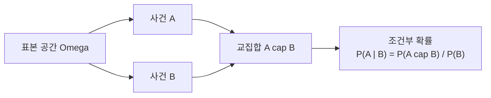

# 확률 공리와 조건부 확률 (Probability Basics)

- Level: Intermediate
- Prerequisites: 집합 기초, 고등학교 수학
- Status: Draft
- Reviewed-by: -
- Depth: Deep-dive (자기완결)

---

## 개념 (Concept)

확률은 불확실한 사건이 일어날 가능성을 0과 1 사이의 수로 나타낸다. **표본 공간** $\Omega$는 가능한 모든 결과의 집합, **사건**은 그 부분집합, **확률** $P$는 각 사건에 수를 대응시키는 함수다.

## 직관 (Intuition)

주사위를 던지면 결과는 $\{1,2,3,4,5,6\}$ 중 하나다(표본 공간). "짝수가 나온다"는 사건 $\{2,4,6\}$이고, 공정한 주사위라면 확률은 $3/6 = 0.5$다. 확률은 "전체 중 해당 경우의 비중"을 수로 약속한 것이다.



## 이론 (Theory)

콜모고로프 공리:

- $P(A) \ge 0$
- $P(\Omega) = 1$
- 서로 배타적인 가산 사건열 $A_1, A_2, \dots$에 대해 $P\left(\bigcup_i A_i\right) = \sum_i P(A_i)$

두 사건만 보면 서로 배타적인 $A, B$에 대해 $P(A \cup B) = P(A) + P(B)$가 된다. 일반 덧셈 법칙은 $P(A \cup B) = P(A) + P(B) - P(A \cap B)$이다.

**조건부 확률** — $B$가 일어났다는 조건에서 $A$가 일어날 확률:

$$P(A \mid B) = \frac{P(A \cap B)}{P(B)}, \qquad P(B) > 0$$

여기서 $A \mid B$의 세로줄은 "주어졌을 때(given)"를 뜻한다. 두 사건이 **독립**이면 $P(A \cap B) = P(A)\,P(B)$이고, 이때 $P(A \mid B) = P(A)$다.

### 표본 공간을 잘 잡는 것이 절반이다

확률 문제의 난이도는 종종 계산보다 모델링에서 나온다. 두 번 동전을 던질 때 표본 공간은 $\{HH, HT, TH, TT\}$처럼 순서를 포함할 수도 있고, "앞면 개수"만 관심 있으면 $\{0,1,2\}$가 될 수도 있다. 다만 앞면 개수 공간에서는 결과들의 확률이 같지 않다. $P(1)=2/4$, $P(0)=P(2)=1/4$다.

따라서 "가능한 값 목록"과 "각 값의 확률"을 함께 정의해야 한다. 결과가 균등하지 않은 공간에서 단순히 경우의 수를 세면 틀린다.

### 곱셈 법칙과 전체 확률 법칙

조건부 확률 정의를 바꾸어 쓰면 곱셈 법칙이 된다.

$$
P(A\cap B)=P(A\mid B)P(B)=P(B\mid A)P(A)
$$

사건 $B_1,\dots,B_k$가 서로 겹치지 않고 전체를 덮는 분할(partition)이면

$$
P(A)=\sum_{i=1}^{k}P(A\mid B_i)P(B_i)
$$

이다. 이 전체 확률 법칙은 베이즈 정리의 분모를 계산할 때 그대로 쓰인다. 예를 들어 여러 공장에서 생산된 부품이 섞여 있을 때, 불량률은 "공장별 불량률 × 그 공장에서 온 비율"의 합이다.

### 워크드 예제

공정한 주사위에서 $B=\{4,5,6\}$, $A=\{2,4,6\}$라 하자.

$$
P(A\mid B)=\frac{P(A\cap B)}{P(B)}
=\frac{P(\{4,6\})}{P(\{4,5,6\})}
=\frac{2/6}{3/6}
=\frac{2}{3}
$$

조건이 붙으면 표본 공간이 사실상 $B$로 줄어든다고 볼 수 있다. 단, 줄어든 공간 안에서 확률을 다시 정규화한다는 점이 중요하다.

## 구현 (Implementation)

빈도주의적으로 확률을 시뮬레이션으로 추정할 수 있다.

```python
import random

def estimate_even_given_gt3(trials=100_000):
    cond = 0      # 3 초과
    both = 0      # 3 초과이면서 짝수
    for _ in range(trials):
        x = random.randint(1, 6)
        if x > 3:
            cond += 1
            if x % 2 == 0:
                both += 1
    return both / cond    # P(짝수 | 3 초과)

print(round(estimate_even_given_gt3(), 2))   # ~0.67  (이론값 2/3: {4,6} / {4,5,6})
```

명시적 표본 공간이 작을 때는 집합 연산으로 확인할 수 있다.

```python
omega = {1, 2, 3, 4, 5, 6}
A = {2, 4, 6}
B = {4, 5, 6}

def prob(event):
    return len(event) / len(omega)

print(prob(A & B) / prob(B))  # 0.666...
```

## 복잡도 (Complexity)

확률 계산 자체는 보통 `O(1)`~`O(결과 수)`이지만, 시뮬레이션 추정의 오차는 시행 횟수 `N`에 대해 약 $1/\sqrt{N}$로 줄어든다. 정밀도를 10배 높이려면 시행을 약 100배 늘려야 한다.

표본 공간을 직접 열거하는 방법은 결과 수가 커지면 빠르게 어려워진다. 독립 시행 $n$번의 모든 결과는 보통 지수적으로 증가하므로, 닫힌 형태의 분포나 동적 계획법, 샘플링 근사가 필요해진다.

## 응용 (Applications)

- 머신러닝의 확률 모델과 분류기 출력 해석
- 베이즈 추론, 스팸 필터, 의료 진단 확률
- 리스크 평가, A/B 테스트
- 무작위 알고리즘의 성공 확률 분석

## 흔한 오해 (Common Misunderstandings)

- $P(A \mid B)$와 $P(B \mid A)$는 다르다(검사 양성일 확률 vs 양성일 때 질병일 확률). 이를 혼동하는 것이 기저율 오류다.
- 독립과 배타(서로소)는 다르다. 배타적이면 동시에 일어날 수 없으므로 오히려 종속이다.
- "확률이 낮다"가 "절대 안 일어난다"는 아니다. 시행이 많으면 드문 일도 일어난다.
- 가능한 결과 수가 같아 보인다고 확률이 같은 것은 아니다. 표본 공간을 어떻게 정의했는지 확인해야 한다.
- 독립은 쌍별 독립(pairwise)과 상호 독립(mutual independence)이 다를 수 있다. 여러 사건을 다룰 때는 조건을 명확히 해야 한다.

## TMI

- 현대 확률론의 공리적 기초는 1933년 콜모고로프가 세웠다. 그 전까지 확률은 직관적·도박적 개념에 가까웠다.
- "몬티 홀 문제"는 조건부 확률 직관이 얼마나 자주 틀리는지 보여 주는 대표적 사례다.

## 연습 / 확인 문제 (Exercises)

- 카드 한 장을 뽑을 때 "하트일 확률"과 "그림 카드일 확률", 그리고 두 사건의 합집합 확률을 구하라.
- 두 번의 동전 던지기에서 "첫 번째가 앞면"과 "둘 다 앞면"의 조건부 확률 $P(\text{둘 다} \mid \text{첫 번째 앞})$을 구하라.
- 독립인 두 사건과 배타적인 두 사건의 예를 각각 들어라.
- 전체 확률 법칙을 사용해 "공장 A/B/C에서 온 제품의 전체 불량률" 문제를 만들어 풀어라.
- 같은 문제를 순서 있는 표본 공간과 요약된 확률 변수 공간으로 각각 모델링해 보고 확률이 어떻게 달라지는지 비교하라.

## 이어서 읽기 (Reading Path)

- 이전: 없음
- 다음: [확률 변수와 분포](Distributions.md), [기댓값, 분산, 공분산](Expectation.md)
- 관련: [상관 vs 인과](../../AI/Causal-Inference/Correlation-vs-Causation.md), [마르코프 체인](Markov-Chains.md)

## 참조 (References)

- [AI/Machine-Learning/](../../AI/Machine-Learning/)
- [Reference/Books.md](../../Reference/Books.md)
- [Reference/Courses.md](../../Reference/Courses.md)
