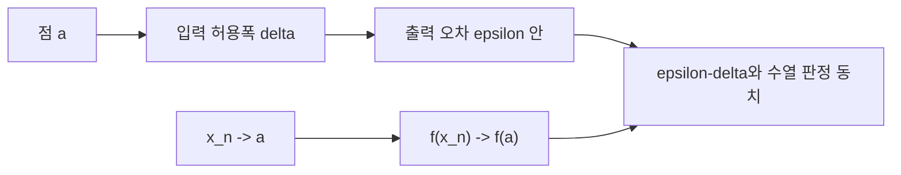

# 연속 함수 (Continuous Functions)

- Level: Advanced
- Prerequisites: [Math/Real-Analysis/Sequences-Series.md](Sequences-Series.md)
- Status: Draft
- Reviewed-by: -
- Depth: Deep-dive (자기완결)

---

## 개념 (Concept)

함수 $f$가 $a$에서 연속이라는 것은 $x$를 $a$에 충분히 가깝게 하면 $f(x)$를 $f(a)$에 원하는 만큼 가깝게 만들 수 있다는 뜻이다.

## 직관 (Intuition)

입력을 조금 바꿨을 때 출력이 갑자기 뛰지 않는다. 다만 "조금"의 크기는 위치 $a$와 원하는 출력 오차에 따라 달라질 수 있다.



## 이론 (Theory)

$$\forall\varepsilon>0\ \exists\delta>0:
|x-a|<\delta\Rightarrow |f(x)-f(a)|<\varepsilon$$

이는 모든 $x_n\to a$에 대해 $f(x_n)\to f(a)$인 sequential characterization과 동치다. 연속함수의 합·곱·합성은 연속이다. Compact interval의 연속함수는 최대·최소를 가지며 intermediate value theorem을 만족한다.

### 점별 연속성과 정의역

연속성은 정의역 안에서 접근하는 점들로 판정한다. 예를 들어 $f(x)=\sqrt{x}$는 $0$에서 오른쪽으로만 정의역이 있으므로, $x\to0^+$ 관점에서 연속이다. 정의역 밖에서 접근하는 값을 요구하지 않는다.

### 수열 판정의 사용법

$f$가 $a$에서 연속이 아님을 보일 때는 $x_n\to a$인데 $f(x_n)\not\to f(a)$인 수열 하나를 찾으면 된다. 예를 들어 디리클레 함수는 유리수에서 1, 무리수에서 0이다. 임의의 점 $a$로 가는 유리수 수열과 무리수 수열을 각각 잡으면 함수값 극한이 서로 달라 불연속이다.

### 콤팩트 구간에서 생기는 강한 결론

$[a,b]$ 같은 닫힌 유계 구간에서 연속인 함수는 다음을 만족한다.

| 정리 | 결론 |
|---|---|
| 최대·최소 정리 | 최댓값과 최솟값을 실제로 달성 |
| 중간값 정리 | 두 함수값 사이 모든 값을 한 번은 가짐 |
| 하이네-칸토어 | 균등 연속 |

이 결론들은 정의역의 compactness가 빠지면 실패할 수 있다.

## 구현 (Implementation)

Bisection은 연속함수의 부호가 바뀌는 구간에 root가 있다는 중간값 정리를 사용한다.

```python
def bisect(f, low, high, steps=60):
    for _ in range(steps):
        mid = (low + high) / 2
        if f(low) * f(mid) <= 0:
            high = mid
        else:
            low = mid
    return (low + high) / 2
```

중간값 정리는 root finding의 존재 보장이고, 이분법은 그 보장을 알고리즘으로 바꾼 것이다. 단, `f(low)`와 `f(high)`의 부호가 다르고 구간에서 연속이어야 한다.

## 복잡도 (Complexity)

Bisection은 구간 폭을 절반으로 줄여 `O(log((b-a)/ε))` 함수 평가가 필요하다.

## 응용 (Applications)

- root finding·optimization
- 안정적 perturbation 분석
- neural network의 연속 mapping
- compact set의 extrema 존재

## 흔한 오해 (Common Misunderstandings)

- 연속이어도 미분 가능하지 않을 수 있다.
- 정의역에 없는 점에서 함수 연속성을 말할 때 경계를 주의한다.
- pointwise continuity가 uniform continuity를 자동 보장하지 않는다.
- float graph가 매끄러워 보여도 증명은 아니다.
- 중간값 정리는 단조성을 보장하지 않는다. 같은 값을 여러 번 가질 수 있다.
- 최대·최소 정리는 열린 구간에서는 실패할 수 있다. $(0,1)$의 $f(x)=x$는 최대와 최소를 달성하지 않는다.

## TMI

- $|x|$는 0에서 연속이지만 미분 불가능하다.
- Dirichlet function은 모든 점에서 불연속이다.
- Compact domain의 연속함수는 uniform continuous하다.

## 연습 / 확인 문제 (Exercises)

- $x^2$의 한 점 연속성을 epsilon-delta로 증명하라.
- 연속이지만 미분 불가능한 함수를 제시하라.
- Bisection의 사전조건을 설명하라.
- 수열 판정으로 디리클레 함수가 모든 점에서 불연속임을 설명하라.
- $(0,1)$에서 연속인 함수가 최댓값을 갖지 않는 예를 들어 compactness의 필요성을 설명하라.

## 이어서 읽기 (Reading Path)

- 이전: [수열과 급수](Sequences-Series.md)
- 다음: [균등 연속성](Uniform-Continuity.md), [측도론](Measure-Theory.md)

## 참조 (References)

- [Math/Real-Analysis/Sequences-Series.md](Sequences-Series.md)
- [Reference/Books.md](../../Reference/Books.md)
