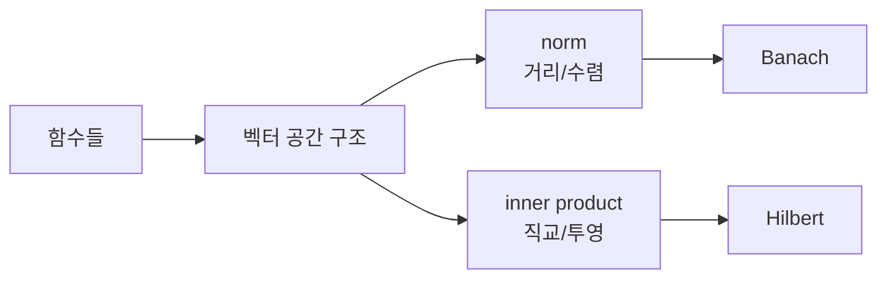

# 함수 공간 (Function Spaces)

- Level: Advanced
- Prerequisites: [Math/Real-Analysis/Measure-Theory.md](Measure-Theory.md), [Math/Linear-Algebra/Vectors.md](../Linear-Algebra/Vectors.md)
- Status: Draft
- Reviewed-by: -
- Depth: Deep-dive (자기완결)

---

## 개념 (Concept)

함수 공간은 함수를 vector처럼 더하고 scalar를 곱하며 norm·inner product·distance로 비교하는 공간이다. $C([a,b])$, $L^p$, Hilbert·Banach space가 대표적이다.

## 직관 (Intuition)

유한 차원 vector의 좌표 대신 함수 전체를 하나의 점으로 본다. 두 함수가 얼마나 가까운지는 최대 오차, 평균 절대 오차, 제곱 적분 등 목적에 맞는 norm으로 정한다.



## 이론 (Theory)

$$\|f\|_p=\left(\int|f(x)|^p\,d\mu\right)^{1/p},\qquad
\|f\|_\infty=\operatorname*{ess\,sup}|f|$$

$L^p$는 almost everywhere 같은 함수를 동일시한다. Banach space는 norm에 대해 complete하고, Hilbert space는 inner product가 norm을 유도하는 complete space다. $L^2$의 inner product는 $\langle f,g\rangle=\int f g$이며 orthogonal projection과 Fourier expansion을 일반화한다.

### norm이 바뀌면 가까움이 바뀐다

같은 두 함수라도 어떤 norm을 쓰는지에 따라 가까움의 의미가 달라진다.

| norm | 해석 |
|---|---|
| $L^1$ | 평균 절대 오차, 전체 면적 차이 |
| $L^2$ | 제곱 오차, 에너지, 직교 투영 |
| $L^\infty$ | 최악점 오차 |

수치해석에서 uniform convergence는 $L^\infty$에 가깝고, 회귀의 MSE는 $L^2$ 구조와 가깝다.

### complete하다는 것

Banach/Hilbert 공간에서 Cauchy sequence가 공간 안의 원소로 수렴한다. 이는 무한 과정의 극한이 공간 밖으로 새지 않는다는 뜻이다. 함수열 근사, Fourier series, PDE 해 존재성에서 완비성은 핵심 조건이다.

### 직교 투영

Hilbert 공간에서는 유한 차원 선형대수처럼 직교와 투영을 말할 수 있다. $L^2$에서 두 함수가 직교라는 것은

$$
\int f(x)g(x)\,dx=0
$$

이라는 뜻이다. Fourier series는 함수를 사인/코사인 직교 기저에 투영해 계수로 표현하는 대표 예다.

## 구현 (Implementation)

표본 grid에서 $L^2$ distance를 근사한다.

```python
import math


def discrete_l2(f_values, g_values, dx):
    return math.sqrt(sum((f - g) ** 2 for f, g in zip(f_values, g_values)) * dx)
```

grid 근사는 연속 함수 norm을 유한 차원 벡터 norm으로 바꾼 것이다.

```python
def discrete_linf(f_values, g_values):
    return max(abs(f - g) for f, g in zip(f_values, g_values))
```

## 복잡도 (Complexity)

$n$개 grid point의 discrete norm은 `O(n)`이다. Infinite-dimensional 문제는 basis truncation·finite element 등으로 유한 근사한다.

기저를 $k$개만 남기는 truncation은 무한 차원 문제를 $k$차원 선형대수 문제로 바꾼다. 정확도는 함수의 smoothness와 선택한 기저에 좌우된다.

## 응용 (Applications)

- differential equation·signal processing
- kernel method와 RKHS
- probability random variable norm
- function approximation·learning theory

## 흔한 오해 (Common Misunderstandings)

- 다른 norm은 다른 convergence 개념을 만든다.
- $L^p$ 원소는 pointwise 함수보다 almost-everywhere equivalence class다.
- 모든 Banach space가 inner product를 갖는 것은 아니다.
- 유한 차원 intuition이 무한 차원에서 항상 유지되지 않는다.
- $L^2$에서 가까운 함수가 모든 점에서 가까운 것은 아니다. 작은 measure의 구간에서 큰 차이가 날 수 있다.
- basis expansion은 선택한 basis에 의존한다. 좋은 basis는 문제 구조를 sparse하게 표현한다.

## TMI

- 모든 Hilbert space는 orthonormal basis에 대해 좌표를 가질 수 있다.
- RKHS에서는 point evaluation이 continuous linear functional이다.
- Fourier series는 function을 orthogonal basis coefficient로 표현한다.

## 연습 / 확인 문제 (Exercises)

- 같은 두 함수의 $L^1,L^2,L^\infty$ 거리를 비교하라.
- $L^2$에서 두 함수의 직교성을 확인하라.
- finite-dimensional vector norm과 function norm을 연결하라.
- 한 점에서만 다른 두 함수가 $L^p$에서 같은 원소로 취급되는 이유를 설명하라.
- 사인 함수들이 $L^2[0,2\pi]$에서 직교함을 적분으로 확인하라.

## 이어서 읽기 (Reading Path)

- 이전: [측도론 입문](Measure-Theory.md)
- 다음: [이론적 머신러닝](../../AI/Theoretical-ML/)

## 참조 (References)

- [Math/Real-Analysis/Measure-Theory.md](Measure-Theory.md)
- [Math/Linear-Algebra/Vectors.md](../Linear-Algebra/Vectors.md)
- [Reference/Books.md](../../Reference/Books.md)
