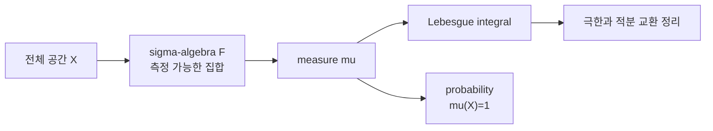

# 측도론 입문 (Introduction to Measure Theory)

- Level: Advanced
- Prerequisites: [Math/Real-Analysis/Sequences-Series.md](Sequences-Series.md), [Math/Probability-Statistics/Probability-Basics.md](../Probability-Statistics/Probability-Basics.md)
- Status: Draft
- Reviewed-by: -
- Depth: Deep-dive (자기완결)

---

## 개념 (Concept)

측도론은 길이·면적·확률을 집합에 일관되게 부여하고 함수 적분과 극한을 다루는 틀이다. Sigma-algebra는 측정 가능한 사건, measure는 가산가법적 크기를 정의한다.

## 직관 (Intuition)

복잡한 집합에도 크기를 주되 분할해서 잰 크기의 합과 전체 크기가 맞아야 한다. 모든 부분집합을 동시에 측정하려 하면 모순이 생겨 측정 가능한 집합족을 선택한다.



## 이론 (Theory)

측도공간 $(X,\mathcal F,\mu)$에서 $\mathcal F$는 여집합과 가산합집합에 닫힌 sigma-algebra이고

$$\mu\left(\bigcup_i A_i\right)=\sum_i\mu(A_i)$$

가 disjoint $A_i$에 성립한다. Lebesgue integral은 simple function에서 시작해 음이 아닌 함수, 일반 적분가능 함수로 확장한다. Monotone·dominated convergence theorem은 극한과 적분 교환 조건을 준다. 확률은 $\mu(X)=1$인 측도다.

### sigma-algebra가 필요한 이유

모든 부분집합에 길이를 일관되게 주고 싶지만, 선택공리까지 허용하면 실수의 모든 부분집합에 평행이동 불변인 길이를 줄 수 없다. 그래서 측정 가능한 집합족 $\mathcal F$를 정하고 그 안에서 닫힘 성질을 요구한다. 확률론의 사건 공간도 같은 구조다.

### 거의 모든 곳

"almost everywhere"는 예외 집합의 측도가 0이라는 뜻이다. 실수선에서 한 점이나 가산 집합은 Lebesgue measure 0이므로, 함수가 가산 개 점에서 달라도 적분 관점에서는 같은 함수처럼 행동할 수 있다. 확률론에서는 "almost surely"가 같은 역할을 한다.

### 극한과 적분 교환

르베그 이론의 큰 장점은 극한과 적분을 교환하는 강력한 정리를 제공한다는 점이다.

| 정리 | 조건 | 결론 |
|---|---|---|
| Monotone convergence | $0\le f_n\uparrow f$ | $\int f_n\to\int f$ |
| Dominated convergence | $f_n\to f$, $\lvert f_n\rvert\le g$, $g$ 적분가능 | $\int f_n\to\int f$ |
| Fatou lemma | $f_n\ge0$ | $\int\liminf f_n\le\liminf\int f_n$ |

## 구현 (Implementation)

유한 표본공간에서는 probability measure가 dictionary 합으로 구현된다.

```python
probability = {"H": 0.5, "T": 0.5}


def measure(event):
    return sum(probability[outcome] for outcome in event)


print(measure({"H"}))
```

유한 확률공간에서 기댓값은 측도에 대한 적분이다.

```python
payoff = {"H": 1.0, "T": -1.0}
expectation = sum(payoff[x] * probability[x] for x in probability)
print(expectation)
```

## 복잡도 (Complexity)

유한 공간 event 측정은 event 크기에 `O(n)`이다. 일반 측도 적분은 수치 quadrature·sampling으로 근사하며 정확도 비용은 함수 regularity와 차원에 좌우된다.

연속 공간의 적분을 표본 평균으로 근사하면 Monte Carlo 오차는 보통 `O(1/sqrt(N))`로 줄어든다. 이는 차원에는 덜 민감하지만 높은 정확도에는 많은 표본이 필요하다.

## 응용 (Applications)

- 확률론과 expectation
- Lebesgue integration
- stochastic process
- learning theory·functional analysis

## 흔한 오해 (Common Misunderstandings)

- measure 0인 집합이 반드시 빈 집합은 아니다.
- 거의 모든 곳(almost everywhere)은 모든 점이라는 뜻이 아니다.
- Riemann 적분 가능 함수보다 Lebesgue 적분 가능한 함수가 넓다.
- density와 measure 자체를 혼동하면 안 된다.
- 확률 1 사건은 논리적으로 반드시 일어나는 사건과 다르다. 예외가 있을 수 있지만 그 예외의 확률이 0이다.
- density 값은 확률이 아니다. 구간에 대해 적분해야 확률이 된다.

## TMI

- 실수의 한 점은 Lebesgue measure 0이지만 uncountable interval은 양의 measure다.
- Cantor set은 uncountable이면서 measure 0이다.
- Radon–Nikodym derivative는 한 measure를 다른 measure에 대한 density로 표현한다.

## 연습 / 확인 문제 (Exercises)

- 유한 확률공간의 sigma-algebra와 measure를 작성하라.
- countable set의 Lebesgue measure가 0임을 설명하라.
- almost sure와 probability 1의 의미를 설명하라.
- 단일 점들의 가산 합집합이 왜 measure 0인지 가산가법성으로 설명하라.
- dominated convergence theorem에서 dominating function 조건이 왜 필요한지 반례를 찾아라.

## 이어서 읽기 (Reading Path)

- 이전: [연속 함수](Continuity.md)
- 다음: [함수 공간](Function-Spaces.md)

## 참조 (References)

- [Math/Probability-Statistics/Probability-Basics.md](../Probability-Statistics/Probability-Basics.md)
- [Reference/Books.md](../../Reference/Books.md)
