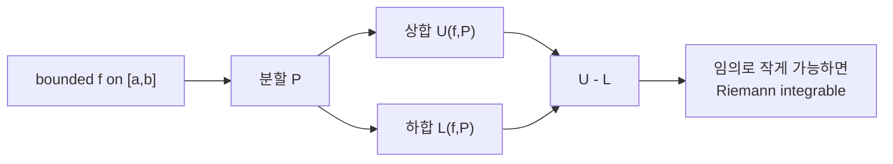

# 리만 적분 (Riemann Integration)

- Level: Advanced
- Prerequisites: [Math/Real-Analysis/Continuity.md](Continuity.md), [Math/Real-Analysis/Uniform-Continuity.md](Uniform-Continuity.md)
- Status: Draft
- Reviewed-by: -
- Depth: Deep-dive (자기완결)

---

## 개념 (Concept)

리만 적분은 함수 아래 넓이를 분할의 상합·하합으로 엄밀하게 정의한다. 미적분에서 직관적으로 쓰던 적분을 해석학적으로 정초하며, 적분 가능성의 조건과 한계를 규명한다.

## 직관 (Intuition)

넓이를 직사각형으로 근사할 때, "위에서 덮는 합(상합)"과 "아래에서 받치는 합(하합)"을 만든다. 분할을 잘게 할수록 둘이 좁혀지고, 그 사이 간극이 0으로 줄면 넓이가 유일하게 정해진다. 그때 함수가 리만 적분 가능하다고 한다. 즉 "위아래 근사가 같은 값으로 수렴하는가"가 핵심이다.



## 이론 (Theory)

분할 $P$에 대해 상합·하합:

$$U(f,P)=\sum M_i\,\Delta x_i,\qquad L(f,P)=\sum m_i\,\Delta x_i$$

상적분 $\overline{\int}=\inf_P U$, 하적분 $\underline{\int}=\sup_P L$. 둘이 같으면 리만 적분 가능하고 그 값이 $\int_a^b f$다.

**적분 가능 조건(리만 판정)**: 임의의 $\varepsilon$에 대해 $U(f,P)-L(f,P)<\varepsilon$인 분할이 존재. 닫힌 구간의 연속 함수(균등 연속이므로)는 적분 가능하고, 유한 개 불연속점을 가진 유계 함수도 적분 가능하다. **르베그 판정**: 유계 함수는 불연속점 집합이 측도 0일 때 정확히 리만 적분 가능하다.

리만 적분의 한계(점별 극한과 적분 교환이 까다로움)는 르베그 적분으로 확장되어 극복된다.

### Darboux 관점과 Riemann sum

상합·하합으로 정의하는 Darboux 적분과 태그가 붙은 리만 합의 극한은 같은 적분 개념을 준다. Darboux 관점은 적분 가능성 판정에 좋고, 리만 합은 계산 직관에 좋다.

### 왜 균등 연속성이 쓰이나

닫힌 구간의 연속 함수는 균등 연속이므로, 충분히 작은 구간에서는 함수값 진동폭을 전체 구간에서 동시에 작게 만들 수 있다. 그러면 각 부분구간의 $M_i-m_i$가 작아져 상합과 하합의 차이를 임의로 줄일 수 있다. 이것이 연속 함수가 리만 적분 가능한 이유의 핵심이다.

### 대표 반례

디리클레 함수

$$
f(x)=\begin{cases}
1 & x\in\mathbb Q\\
0 & x\notin\mathbb Q
\end{cases}
$$

는 모든 구간에 유리수와 무리수가 모두 조밀하므로 각 부분구간에서 상한은 1, 하한은 0이다. 따라서 어떤 분할에서도 상합은 1, 하합은 0이 되어 리만 적분 불가능하다.

## 구현 (Implementation)

```python
def darboux_sums(f, a, b, n):
    h = (b - a) / n
    lower = upper = 0.0
    for i in range(n):
        xl, xr = a + i*h, a + (i+1)*h
        lo = min(f(xl), f(xr))      # 단조 가정 시 근사
        hi = max(f(xl), f(xr))
        lower += lo * h
        upper += hi * h
    return lower, upper             # n이 커지면 둘이 수렴
```

단조 함수처럼 각 구간 끝점에서 극값이 잡히는 경우에는 위 근사가 상·하합 의미와 잘 맞는다. 일반 함수에서는 부분구간 내부의 sup/inf를 정확히 찾는 문제가 별도로 필요하다.

## 복잡도 (Complexity)

이론적 정의는 모든 분할에 대한 상·하한이라 알고리즘 비용 개념이 아니다. 수치적으로 상·하합을 $n$ 분할로 계산하면 `O(n)`이며, 적분 가능 함수에서는 간극 $U-L$이 분할을 잘게 할수록 0으로 줄어든다. 매끄러운 함수는 수렴이 빠르고, 불연속이 많으면 느리다.

## 응용 (Applications)

- 미적분학 기본정리의 엄밀한 토대
- 수치 적분(사다리꼴·심프슨)의 정당화
- 확률의 기댓값·분포 함수 정의
- 르베그 적분·측도론으로의 다리

## 흔한 오해 (Common Misunderstandings)

- 모든 유계 함수가 리만 적분 가능하지는 않다(예: 디리클레 함수).
- 적분 가능성은 연속성보다 약한 조건이다(유한 불연속 허용).
- 상적분과 하적분이 다르면 적분이 정의되지 않는다.
- 점별 극한과 적분의 교환은 리만 적분에서 일반적으로 성립하지 않는다(르베그가 필요).
- 수치 적분값이 그럴듯하다고 리만 적분 가능성이 증명되는 것은 아니다. 정의는 모든 충분히 좋은 분할에 대한 성질이다.
- 한 점의 함수값을 바꾸어도 리만 적분값은 변하지 않는다. 유한한 점 집합은 넓이에 영향을 주지 않는다.

## TMI

- 디리클레 함수(유리수에서 1, 무리수에서 0)는 어디서도 연속이 아니고 리만 적분 불가능한 고전적 반례다.
- 르베그 적분은 "정의역을 쪼개는" 리만과 달리 "치역을 쪼개" 더 넓은 함수족을 적분한다.
- 측도 0 집합(가산 집합 등)은 적분값에 영향을 주지 않는다는 직관이 르베그 판정의 핵심이다.

## 연습 / 확인 문제 (Exercises)

- $f(x)=x$를 $[0,1]$에서 상합·하합으로 적분해 $1/2$를 얻어라.
- 디리클레 함수의 상적분과 하적분을 계산해 적분 불가능함을 보여라.
- 한 점에서만 불연속인 유계 함수가 여전히 적분 가능한 이유를 설명하라.
- Thomae 함수가 리만 적분 가능한지 조사하고 디리클레 함수와 비교하라.
- 연속 함수의 리만 적분 가능성을 균등 연속성으로 증명하는 흐름을 요약하라.

## 이어서 읽기 (Reading Path)

- 이전: [균등 연속성](Uniform-Continuity.md)
- 다음: [측도론 기초](Measure-Theory.md), [함수 공간](Function-Spaces.md)

## 참조 (References)

- [Math/Real-Analysis/Measure-Theory.md](Measure-Theory.md)
- [Math/Calculus/Integration.md](../Calculus/Integration.md)
- [Reference/Books.md](../../Reference/Books.md)
