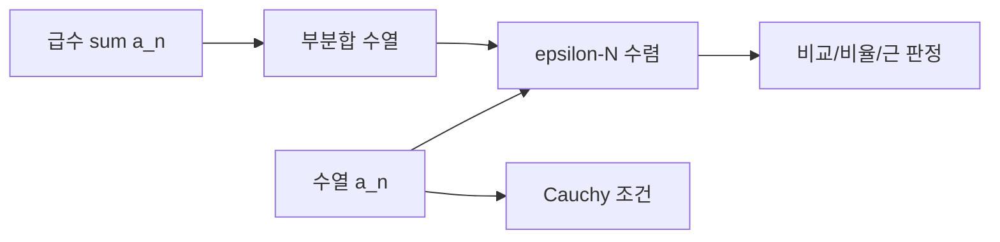

# 수열과 급수의 수렴 (Sequences and Series)

- Level: Advanced
- Prerequisites: [Math/Real-Analysis/Real-Numbers.md](Real-Numbers.md)
- Status: Draft
- Reviewed-by: -
- Depth: Deep-dive (자기완결)

---

## 개념 (Concept)

수열 $a_n$이 $L$로 수렴한다는 것은 임의의 $\varepsilon>0$에 충분히 큰 모든 $n$에서 $|a_n-L|<\varepsilon$인 것이다. 급수 $\sum a_n$의 수렴은 부분합 수열의 수렴으로 정의한다.

## 직관 (Intuition)

항이 목표값 근처에 가끔 오는 것이 아니라 어떤 작은 허용 오차를 정해도 어느 시점 뒤에는 계속 그 안에 머물러야 한다.



## 이론 (Theory)

$$a_n\to L\iff \forall\varepsilon>0\ \exists N\ \forall n\ge N:|a_n-L|<\varepsilon$$

Cauchy sequence는 항끼리 임의로 가까워지며 실수의 완비성 때문에 실수에서 수렴과 동치다. 급수에는 비교, 비율, 근 판정이 있고 절대수렴은 수렴을 보장한다. 조건수렴 급수는 항 순서 변경에 민감할 수 있다.

### epsilon-N 증명의 구조

$a_n=1/n$이 0으로 수렴함을 보이려면 임의의 $\varepsilon>0$에 대해 $1/n<\varepsilon$가 되도록 $n>1/\varepsilon$를 고르면 된다. 즉 $N>\frac1\varepsilon$인 자연수를 택하면 모든 $n\ge N$에서 $|1/n-0|<\varepsilon$다.

이 구조는 항상 같다. 먼저 원하는 부등식을 보고 $N$이 얼마나 커야 하는지 역으로 찾고, 그 값을 선택한 뒤 정의를 만족함을 앞으로 증명한다.

### 급수는 부분합의 수열이다

$$
\sum_{n=1}^{\infty}a_n
$$

이 수렴한다는 말은 $s_N=\sum_{n=1}^{N}a_n$이 어떤 실수로 수렴한다는 뜻이다. 항 $a_n$이 0으로 가는 것은 필요조건이지만 충분하지 않다. 조화급수 $\sum 1/n$은 항이 0으로 가지만 부분합은 무한히 커진다.

### 절대수렴과 조건수렴

$\sum |a_n|$이 수렴하면 $\sum a_n$도 수렴하며 이를 절대수렴이라 한다. $\sum a_n$은 수렴하지만 $\sum |a_n|$은 발산하면 조건수렴이다. 조건수렴 급수는 항 순서를 바꾸면 합이 달라질 수 있어, 무한합에서는 유한합의 직관을 조심해야 한다.

## 구현 (Implementation)

```python
def geometric_partial_sum(r, n):
    return sum(r ** k for k in range(n))


for n in [5, 20, 100]:
    print(n, geometric_partial_sum(0.5, n))  # 2로 수렴
```

부분합을 trace로 보면 급수 수렴을 수열 수렴으로 확인할 수 있다.

```python
def partial_sums(terms, n):
    total = 0.0
    out = []
    for k in range(1, n + 1):
        total += terms(k)
        out.append(total)
    return out

print(partial_sums(lambda k: 1 / (2 ** k), 10)[-1])
```

## 복잡도 (Complexity)

부분합 직접 계산은 `O(n)`이고 recurrence나 닫힌식을 쓰면 `O(1)`이 가능하다. 필요한 $n$은 convergence rate에 좌우된다.

수렴 속도가 느린 급수는 높은 정확도에 매우 많은 항이 필요하다. 예를 들어 조화급수 꼬리는 느리게 줄어 수치적으로 수렴처럼 보이는 착시를 만들 수 있다.

## 응용 (Applications)

- iterative algorithm convergence
- Taylor·Fourier approximation
- 무한 horizon return
- numerical error bound

## 흔한 오해 (Common Misunderstandings)

- $a_n\to0$은 $\sum a_n$ 수렴의 필요조건일 뿐 충분조건이 아니다.
- bounded sequence가 항상 수렴하지 않는다.
- pointwise convergence와 uniform convergence는 다르다.
- 유한 precision에서 안정돼 보이는 것이 수학적 수렴 증명은 아니다.
- 처음 몇 항의 패턴만으로 수렴을 단정하면 안 된다. 꼬리 거동이 핵심이다.
- 조건수렴 급수를 유한합처럼 자유롭게 재배열하면 합이 바뀔 수 있다.

## TMI

- harmonic series는 항이 0으로 가지만 발산한다.
- alternating harmonic series는 조건수렴한다.
- limsup·liminf는 수렴하지 않는 수열의 장기 경계를 설명한다.

## 연습 / 확인 문제 (Exercises)

- $1/n$의 epsilon-N 증명을 작성하라.
- geometric series 합을 유도하라.
- harmonic series 발산을 grouping으로 설명하라.
- alternating harmonic series가 수렴하지만 절대수렴하지 않음을 설명하라.
- Cauchy 조건만으로 극한값을 모른 채 수렴성을 보이는 예를 들어라.

## 이어서 읽기 (Reading Path)

- 이전: [실수의 완비성](Real-Numbers.md)
- 다음: [연속 함수](Continuity.md)

## 참조 (References)

- [Math/Real-Analysis/Real-Numbers.md](Real-Numbers.md)
- [Reference/Books.md](../../Reference/Books.md)
