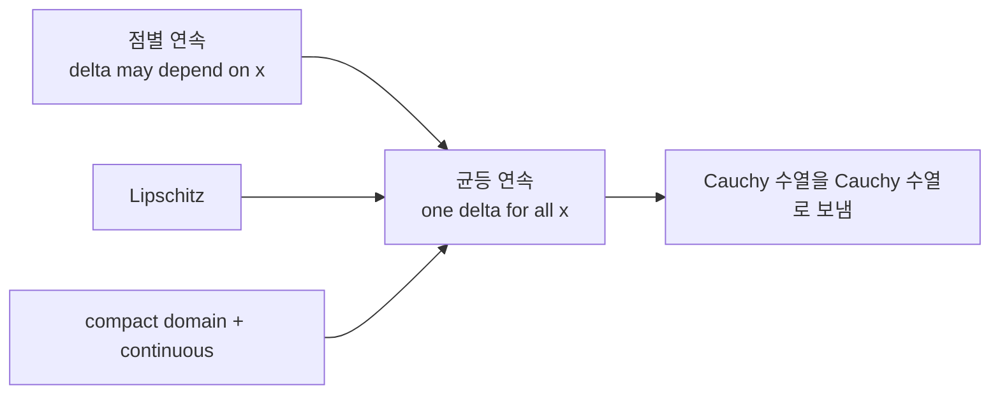

# 균등 연속성 (Uniform Continuity)

- Level: Advanced
- Prerequisites: [Math/Real-Analysis/Continuity.md](Continuity.md)
- Status: Draft
- Reviewed-by: -
- Depth: Deep-dive (자기완결)

---

## 개념 (Concept)

균등 연속은 연속의 강화된 형태로, $\delta$를 점에 무관하게 하나로 고를 수 있는 성질이다. 함수의 거동이 정의역 전체에서 "고르게" 통제됨을 뜻하며, 적분·근사 이론의 토대가 된다.

## 직관 (Intuition)

보통의 연속은 "각 점마다" 충분히 가까우면 함수값도 가깝다고 한다 — 다만 얼마나 가까워야 하는지($\delta$)는 점마다 다를 수 있다. 균등 연속은 "정의역 어디서나 같은 $\delta$"가 통한다. $1/x$는 0 근처에서 점점 더 까다로워져 균등 연속이 아니지만, 닫힌 구간의 연속 함수는 항상 균등 연속이다.



## 이론 (Theory)

$f$가 $D$에서 균등 연속이란, 모든 $\varepsilon>0$에 대해 어떤 $\delta>0$가 존재해

$$\forall x,y\in D:\ |x-y|<\delta \implies |f(x)-f(y)|<\varepsilon$$

핵심은 $\delta$가 $x$에 의존하지 않는다는 점이다(연속 정의에서는 $\delta$가 $x$에 의존할 수 있다).

**하이네-칸토어 정리**: 콤팩트 집합(닫히고 유계) 위의 연속 함수는 균등 연속이다. 립시츠 연속($|f(x)-f(y)|\le L|x-y|$)은 균등 연속을 함의한다. 균등 연속 함수는 코시 수열을 코시 수열로 보내, 완비화·연속 확장에서 중요하다.

### 점별 연속과 균등 연속의 차이

점별 연속은

$$
\forall x\ \forall\varepsilon\ \exists\delta
$$

순서이고, 균등 연속은

$$
\forall\varepsilon\ \exists\delta\ \forall x,y
$$

순서다. $\delta$를 고른 뒤 모든 점에서 동시에 통해야 하므로 훨씬 강하다. 수량자 순서가 성질의 차이를 만든다.

### 반례로 보는 필요 조건

$f(x)=x^2$는 모든 실수에서 연속이지만 $\mathbb R$ 전체에서는 균등 연속이 아니다. 큰 $x$ 근처에서는 아주 작은 입력 차이도 큰 출력 차이를 만든다. 반면 같은 함수도 $[0,1]$에서는 compactness 때문에 균등 연속이다.

$f(x)=1/x$는 $(0,1)$에서 연속이지만 0 근처에서 변화가 너무 가팔라 균등 연속이 아니다.

### Lipschitz는 충분조건

$|f(x)-f(y)|\le L|x-y|$이면 $\delta=\varepsilon/L$로 잡으면 되므로 균등 연속이다. 하지만 균등 연속이라고 항상 Lipschitz는 아니다. $\sqrt{x}$는 $[0,1]$에서 균등 연속이지만 0 근처 기울기가 무한히 커져 Lipschitz가 아니다.

## 구현 (Implementation)

```python
# 립시츠 상수 L을 수치적으로 추정 (균등 연속의 충분조건)
def estimate_lipschitz(f, a, b, n=10000):
    xs = [a + (b - a) * i / n for i in range(n + 1)]
    L = 0.0
    for i in range(n):
        slope = abs(f(xs[i+1]) - f(xs[i])) / (xs[i+1] - xs[i])
        L = max(L, slope)
    return L            # 유한하면 [a,b]에서 균등 연속의 강한 단서
```

수치 추정은 증명이 아니라 단서다. grid가 아무리 촘촘해도 모든 실수쌍을 확인한 것은 아니며, 특이점 근처를 놓칠 수 있다.

## 복잡도 (Complexity)

균등 연속은 해석적 성질이라 알고리즘 복잡도와 직접 관련은 없다. 다만 수치 근사·적분 수렴 증명에서, 균등 연속(또는 립시츠)은 오차를 정의역 전체에서 균일하게 통제할 수 있게 해 알고리즘의 정확도 보장을 가능케 한다.

## 응용 (Applications)

- 리만 적분 가능성 증명(닫힌 구간 연속 → 균등 연속 → 적분 가능)
- 함수의 연속 확장과 완비화
- 수치 근사의 오차 한계 보장
- 머신러닝의 립시츠 제약(안정성, GAN의 1-립시츠)

## 흔한 오해 (Common Misunderstandings)

- 연속이라고 균등 연속은 아니다(예: $(0,1)$의 $1/x$, $\mathbb{R}$의 $x^2$).
- 균등 연속은 정의역에 의존한다. 같은 식도 구간을 바꾸면 성질이 달라진다.
- 립시츠는 균등 연속을 함의하지만 역은 아니다($\sqrt x$는 균등 연속이나 0에서 비립시츠).
- 콤팩트성이 핵심이다. 정의역이 콤팩트가 아니면 보장이 사라진다.
- 균등 연속은 boundedness와 다르다. 함수값이 유계여도 균등 연속이 아닐 수 있고, 균등 연속이어도 정의역이 무한하면 unbounded일 수 있다.
- 도함수가 유계이면 Lipschitz라서 균등 연속이지만, 도함수가 없다고 균등 연속이 불가능한 것은 아니다.

## TMI

- 하이네-칸토어 정리는 "콤팩트성이 국소 성질을 전역 성질로 끌어올린다"는 해석학의 전형적 패턴이다.
- 립시츠 연속성은 ODE 해의 존재·유일성(피카르-린델뢰프)의 핵심 가정이다.
- GAN의 Wasserstein 거리 정식화는 판별자에 1-립시츠 제약을 걸어 학습을 안정화한다.

## 연습 / 확인 문제 (Exercises)

- $f(x)=x^2$가 $\mathbb{R}$에서 균등 연속이 아님을 보여라.
- $f(x)=\sqrt x$가 $[0,\infty)$에서 균등 연속이지만 립시츠가 아님을 설명하라.
- 하이네-칸토어 정리를 $[0,1]$의 연속 함수에 적용해 보라.
- 수량자 순서를 써서 점별 연속과 균등 연속 정의의 차이를 설명하라.
- $f(x)=\sin x$가 $\mathbb R$에서 균등 연속임을 Lipschitz 관점으로 보여라.

## 이어서 읽기 (Reading Path)

- 이전: [연속성](Continuity.md)
- 다음: [리만 적분](Riemann-Integration.md), [함수 공간](Function-Spaces.md)

## 참조 (References)

- [Math/Real-Analysis/Continuity.md](Continuity.md)
- [Math/Real-Analysis/Riemann-Integration.md](Riemann-Integration.md)
- [Reference/Books.md](../../Reference/Books.md)
