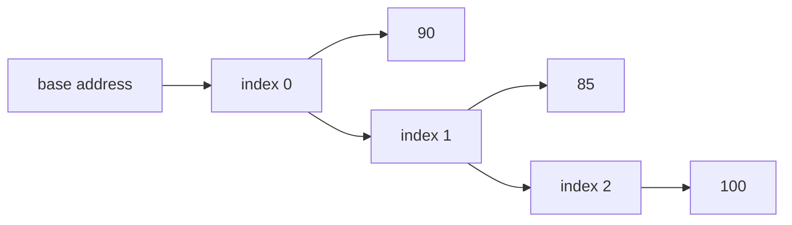

# 배열과 문자열 (Arrays and Strings)

- Level: Beginner
- Prerequisites: [Programming/Variables-and-Types.md](Variables-and-Types.md), [Programming/Control-Flow.md](Control-Flow.md)
- Status: Draft
- Reviewed-by: -
- Depth: Deep-dive (자기완결)

---

## 개념 (Concept)

배열은 여러 값을 순서대로 담는 묶음이고, 문자열은 문자들이 순서대로 나열된 값이다. 둘 다 인덱스로 특정 위치에 접근하고, 반복문으로 처음부터 끝까지 순회할 수 있다.

## 직관 (Intuition)

배열과 문자열은 "순서가 있는 데이터"를 다루는 가장 기본적인 도구다. 점수 목록, 이름 목록, 입력 텍스트, 파일 경로, 명령어 인자처럼 실제 프로그램의 많은 데이터가 이 형태로 들어온다.

배열은 보통 원소를 바꿀 수 있지만, 문자열은 많은 언어에서 불변 값으로 다룬다. 그래서 문자열을 조금씩 이어 붙이는 코드는 예상보다 비쌀 수 있다.



## 이론 (Theory)

배열과 문자열에서 자주 쓰는 연산은 다음과 같다.

| 연산 | 의미 |
|---|---|
| 인덱싱 | 특정 위치의 원소 읽기 |
| 슬라이싱 | 연속된 구간 잘라내기 |
| 순회 | 모든 원소를 차례로 방문 |
| 검색 | 조건을 만족하는 원소 찾기 |
| 변환 | 각 원소를 다른 값으로 바꾸기 |

0-based 인덱스 언어에서는 첫 위치가 `0`이다. 길이가 `n`인 배열의 마지막 인덱스는 `n - 1`이다.

문자열은 문자 배열처럼 순회할 수 있지만, 문자 인코딩 때문에 "보이는 글자 수"와 내부 코드 포인트 수가 다를 수 있다. 입문 단계에서는 ASCII나 단순한 한글 문자열을 기준으로 시작하고, 나중에 Unicode를 따로 다룬다.

### 구간과 반열린 범위

많은 언어는 슬라이스를 `[start, end)`처럼 끝을 포함하지 않는 반열린 범위로 표현한다. 길이는 `end - start`가 되고, 빈 구간은 `start == end`로 자연스럽게 표현된다. 이 관습은 이진 탐색, 투 포인터, 문자열 처리에서 경계 오류를 줄여 준다.

## 구현 (Implementation)

배열 순회:

```python
scores = [90, 85, 100]

for score in scores:
    print(score)
```

인덱스가 필요할 때:

```python
names = ["Ada", "Grace", "Linus"]

for index in range(len(names)):
    print(index, names[index])
```

문자열 순회와 카운트:

```python
def count_char(text, target):
    count = 0
    for char in text:
        if char == target:
            count += 1
    return count
```

새 배열 만들기:

```python
def square_all(values):
    result = []
    for value in values:
        result.append(value * value)
    return result
```

투 포인터 예시:

```python
def has_pair_sum(sorted_values, target):
    left, right = 0, len(sorted_values) - 1
    while left < right:
        s = sorted_values[left] + sorted_values[right]
        if s == target:
            return True
        if s < target:
            left += 1
        else:
            right -= 1
    return False
```

정렬된 배열에서 왼쪽과 오른쪽을 동시에 좁힌다. 각 포인터는 한 방향으로만 움직이므로 전체 시간은 `O(n)`이다.

## 복잡도 (Complexity)

| 연산 | 시간 | 공간 |
|---|---|---|
| 인덱스 접근 | O(1) | O(1) |
| 전체 순회 | O(n) | O(1) |
| 값 검색 | O(n) | O(1) |
| 길이 n 배열 복사 | O(n) | O(n) |
| 길이 n 문자열 생성 | O(n) | O(n) |

슬라이싱은 언어에 따라 새 배열/문자열을 만들 수 있다. 새 값을 만들면 보통 잘라낸 길이만큼 시간과 공간이 든다.

워크드 예제: 길이 5 문자열 `"abcde"`에서 모든 접미사 `text[i:]`를 실제 새 문자열로 만들면 길이는 5,4,3,2,1이라 총 복사량은 15다. 일반화하면 $\sum_{k=1}^{n} k = O(n^2)$다. 문자열 알고리즘에서 무심코 슬라이싱을 반복하면 선형 알고리즘이 이차가 될 수 있다.

## 응용 (Applications)

- 입력 목록 처리
- 문자열 검색과 전처리
- 정렬, 이진 탐색, 투 포인터 알고리즘의 기반
- 스택, 큐, 힙 같은 자료구조의 내부 저장소
- 텍스트 처리와 파싱

## 흔한 오해 (Common Misunderstandings)

- 인덱스 접근이 O(1)이어도 원하는 값을 찾는 검색은 O(n)이다.
- 문자열은 배열과 비슷해 보여도 수정 가능성이 다를 수 있다.
- `len(values)`가 항상 비싼 것은 아니다. 많은 언어에서 길이는 별도로 저장되어 O(1)이다.
- 빈 배열과 `None`은 다르다. 빈 배열은 원소가 0개인 정상 값이다.

## TMI

- C 문자열은 마지막에 `\0`이라는 널 문자를 두어 끝을 표시한다. 그래서 길이를 따로 저장하는 Python 문자열과 성능/안전성 특성이 다르다.
- "문자 하나"도 생각보다 복잡하다. 이모지나 한글 조합 문자처럼 화면에 한 글자처럼 보이는 값이 내부적으로 여러 코드 포인트일 수 있다.
- JavaScript의 배열 정렬은 비교 함수를 주지 않으면 값을 문자열처럼 비교해서 `[1, 10, 2]` 같은 결과가 나올 수 있다.
- Python 문자열은 불변이다. `s += "x"`가 매번 기존 문자열을 직접 고치는 것이 아니라 새 문자열을 만드는 식으로 동작할 수 있다.

## 연습 / 확인 문제 (Exercises)

- 숫자 배열에서 짝수만 골라 새 배열로 반환하라.
- 문자열에서 모음 개수를 세는 함수를 작성하라.
- 배열이 오름차순으로 정렬되어 있는지 검사하라.

## 이어서 읽기 (Reading Path)

- 이전: [함수와 재귀](Functions-and-Recursion.md)
- 다음: [명제 논리와 술어 논리](../Math/Discrete/Logic.md)
- 관련: [언어 선택 가이드](Language-Selection.md), [포인터와 메모리](Pointers-and-Memory.md)

## 참조 (References)

- [Programming/Variables-and-Types.md](Variables-and-Types.md)
- [Programming/Control-Flow.md](Control-Flow.md)
- [Data-Structures/Array.md](../Data-Structures/Array.md)
- [Reference/Books.md](../Reference/Books.md)
- [Reference/Courses.md](../Reference/Courses.md)
