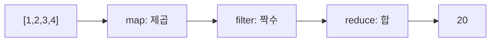

# 함수형 프로그래밍 입문 (Introduction to Functional Programming)

- Level: Intermediate
- Prerequisites: [Programming/Functions-and-Recursion.md](Functions-and-Recursion.md)
- Status: Draft
- Reviewed-by: -
- Depth: Deep-dive (자기완결)

---

## 개념 (Concept)

함수형 프로그래밍(FP)은 계산을 "값을 받아 값을 돌려주는 함수의 평가"로 보는 패러다임이다. 순수 함수, 불변성, 고차 함수, 부수 효과 최소화가 핵심이다.

## 직관 (Intuition)

상태를 마구 바꾸는 코드는 "지금 변수에 무엇이 들었는가"가 실행 흐름에 따라 달라져 추론이 어렵다. FP는 데이터를 바꾸지 않고 새 값을 만들고, 함수가 같은 입력에 항상 같은 출력을 내게 한다. 그러면 함수는 수학의 함수처럼 예측 가능해져, 조합·테스트·병렬화가 쉬워진다.



## 이론 (Theory)

- **순수 함수(pure function)**: 같은 입력 → 같은 출력, 외부 상태를 바꾸지 않음(부수 효과 없음).
- **불변성(immutability)**: 데이터를 수정하지 않고 변형된 새 값을 만든다.
- **고차 함수(higher-order function)**: 함수를 인자로 받거나 반환한다(`map`, `filter`, `reduce`).
- **일급 함수(first-class function)**: 함수가 값처럼 전달·저장된다.
- **참조 투명성(referential transparency)**: 식을 그 값으로 바꿔도 프로그램 의미가 같다.

재귀와 합성으로 반복을 표현하고, 클로저로 상태를 캡처한다. 부수 효과(입출력 등)는 제거할 수 없으므로 경계로 밀어내거나, 순수 언어(Haskell)는 모나드 같은 구조로 다룬다. 게으른 평가(lazy evaluation)는 필요할 때만 계산해 무한 자료구조도 표현한다.

### 부수 효과를 경계로 밀기

실제 프로그램은 입력을 읽고, 파일을 쓰고, 네트워크를 호출한다. 함수형 설계는 이런 일을 없애는 대신, 가능한 한 바깥 경계에 몰아넣고 내부 계산을 순수 함수로 유지한다.

| 계층 | 예 |
|---|---|
| 바깥 경계 | 파일 읽기, HTTP 요청, DB 쿼리 |
| 순수 계산 | 파싱된 값 검증, 점수 계산, 추천 순위 계산 |
| 바깥 경계 | 결과 저장, 화면 출력, 응답 전송 |

## 구현 (Implementation)

```python
# 명령형: 상태 변경
total = 0
for n in nums:
    total += n * n

# 함수형: 순수 함수 합성, 상태 변경 없음
from functools import reduce
total = reduce(lambda acc, x: acc + x, map(lambda n: n * n, nums), 0)
```

더 읽기 쉬운 버전:

```python
def square(n):
    return n * n

def sum_of_squares(nums):
    return sum(map(square, nums))
```

워크드 예제: `nums = [1, 2, 3]`이면 `map(square, nums)`는 `1, 4, 9`를 만들고, `sum`은 이를 합쳐 14를 반환한다. 입력 리스트는 바뀌지 않는다.

## 복잡도 (Complexity)

알고리즘 복잡도는 패러다임과 무관하지만, 불변 데이터는 "수정" 대신 복사를 유발해 추가 비용이 들 수 있다. 영속 자료구조(persistent data structure)는 구조 공유로 이를 `O(log n)` 수준으로 완화한다. 게으른 평가는 불필요한 계산을 피해 이득을 주지만, 미뤄진 계산(thunk)이 쌓이면 메모리 문제가 생길 수 있다.

예를 들어 길이 `n` 리스트 뒤에 원소를 붙일 때 매번 전체 리스트를 복사하면 `O(n)`이다. 이를 반복하면 전체 비용이 `O(n^2)`가 될 수 있다. 함수형 언어의 리스트, 벡터, 맵은 구조 공유를 통해 이런 비용을 줄이도록 설계된다.

## 응용 (Applications)

- 데이터 변환 파이프라인(map/filter/reduce)
- 동시성·병렬 처리(불변 데이터는 경쟁 조건이 적다)
- React 등 UI의 상태 관리, Redux의 순수 reducer
- 스트림 처리, 스프레드시트형 반응형 계산

## 흔한 오해 (Common Misunderstandings)

- FP가 재귀만 쓰는 것은 아니다. 대부분 고차 함수로 반복을 대체한다.
- 부수 효과를 "금지"하는 것이 아니라 통제·격리하는 것이 목표다.
- 불변성이 항상 느린 것은 아니다. 구조 공유로 비용을 줄인다.
- 함수형과 객체지향은 배타적이지 않다. 현대 언어는 둘을 섞는다(멀티패러다임).

## TMI

- 람다 계산법(Lambda Calculus)은 1930년대 Alonzo Church가 만든 FP의 이론적 뿌리다.
- `map`/`filter`/`reduce`는 Lisp 전통에서 왔고 지금은 거의 모든 주류 언어에 있다.
- "순수" 언어 Haskell은 입출력조차 타입으로 표시해 부수 효과를 컴파일러가 추적하게 한다.

## 연습 / 확인 문제 (Exercises)

- 같은 누적 합 계산을 명령형 루프와 `reduce`로 작성하고 차이를 설명하라.
- 순수 함수와 비순수 함수의 예를 각각 들고 무엇이 다른지 말하라.
- 클로저로 카운터를 만들되 외부 상태를 변경하지 않는 방식과 비교하라.

## 이어서 읽기 (Reading Path)

- 이전: [함수와 재귀](Functions-and-Recursion.md)
- 다음: [객체지향 프로그래밍](OOP.md), [CS-Theory/Programming-Languages/Lambda-Calculus.md](../CS-Theory/Programming-Languages/Lambda-Calculus.md)

## 참조 (References)

- [Programming/Functions-and-Recursion.md](Functions-and-Recursion.md)
- [CS-Theory/Programming-Languages/Lambda-Calculus.md](../CS-Theory/Programming-Languages/Lambda-Calculus.md)
- [Reference/Books.md](../Reference/Books.md)
