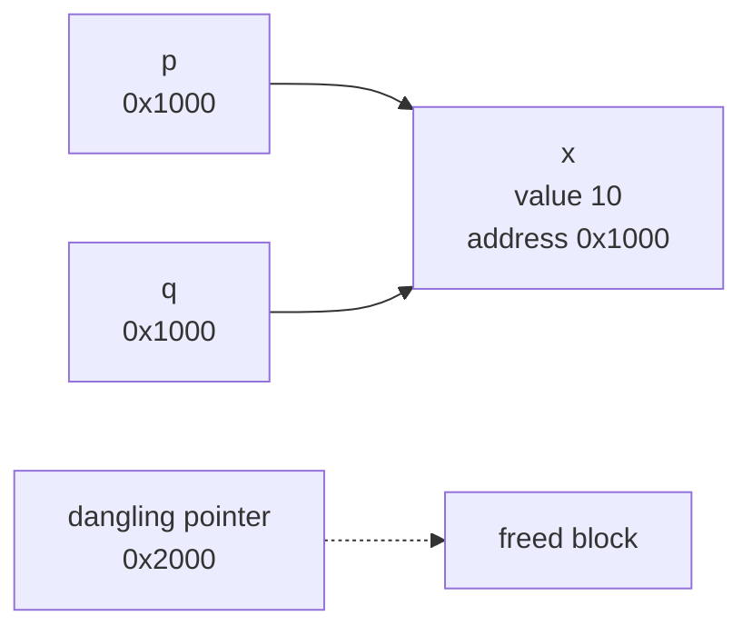

# 포인터와 메모리 (Pointers and Memory)

- Level: Intermediate
- Prerequisites: [Programming/Variables-and-Types.md](Variables-and-Types.md), [Programming/Arrays-and-Strings.md](Arrays-and-Strings.md)
- Status: Draft
- Reviewed-by: -
- Depth: Deep-dive (자기완결)

---

## 개념 (Concept)

포인터는 값이 저장된 메모리 주소를 담는 변수다. C 계열 언어는 포인터로 메모리를 직접 읽고 쓰며, 스택·힙 같은 메모리 영역과 할당/해제를 프로그래머가 다룬다.

## 직관 (Intuition)

변수는 "값이 담긴 상자"이고, 포인터는 "그 상자의 위치를 적은 쪽지"다. 쪽지를 건네면 값을 통째로 복사하지 않고도 같은 상자를 함께 가리켜 고칠 수 있다. 이 간접 참조 덕분에 큰 데이터를 효율적으로 넘기고, 연결 리스트·트리처럼 동적으로 연결된 구조를 만들 수 있다. 대신 잘못된 쪽지(엉뚱한 주소)는 곧장 버그가 된다.



## 이론 (Theory)

메모리는 보통 영역으로 나뉜다.

- **스택(stack)**: 함수 호출 프레임. 자동 할당/해제, 빠르지만 작고 수명이 호출에 묶인다.
- **힙(heap)**: `malloc`/`new`로 동적 할당. 수명을 프로그래머가 관리한다.
- 그 외 정적/전역, 코드 영역.

포인터 연산: 주소 취득 `&x`, 역참조 `*p`. 배열 인덱싱 `a[i]`는 `*(a+i)`와 같다. 포인터 산술은 가리키는 타입 크기 단위로 움직인다. 핵심 위험은 dangling pointer(해제된 메모리 참조), 메모리 누수(해제 누락), 버퍼 오버플로(경계 초과), 이중 해제다. C++은 RAII와 스마트 포인터(`unique_ptr`, `shared_ptr`)로 수명 관리를 자동화한다.

### 수명과 소유권

메모리 버그 대부분은 "누가 이 메모리를 소유하고 언제 해제하는가"가 불분명할 때 생긴다.

| 상황 | 안전한 질문 |
|---|---|
| 주소를 함수 밖으로 넘김 | 그 주소가 가리키는 값이 함수 종료 뒤에도 살아 있는가 |
| 힙 할당 | 해제 책임이 누구에게 있는가 |
| 여러 포인터 공유 | 한쪽이 해제한 뒤 다른 쪽이 계속 쓰지 않는가 |
| 배열 접근 | 인덱스가 할당된 범위 안인가 |

## 구현 (Implementation)

```c
int x = 10;
int *p = &x;       // p는 x의 주소를 담음
*p = 20;           // 역참조로 x를 20으로 변경

int *arr = malloc(3 * sizeof(int));  // 힙 할당
if (arr) {
    arr[0] = 1;    // *(arr + 0) 와 동일
    free(arr);     // 반드시 해제 (누수 방지)
    arr = NULL;    // dangling 방지
}
```

주소 산술 워크드 예제:

```c
int a[3] = {10, 20, 30};
int *p = a;

printf("%d\n", *(p + 2));  // 30
```

`p + 2`는 2바이트가 아니라 `2 * sizeof(int)`만큼 이동한다. `int`가 4바이트인 환경이면 시작 주소에서 8바이트 뒤를 가리킨다.

## 복잡도 (Complexity)

포인터 역참조와 산술은 `O(1)`이다. 동적 할당(`malloc`/`free`)은 할당기 구현에 따라 비용이 다르며 일반적으로 상수에 가깝지만 단편화(fragmentation)가 누적될 수 있다. 포인터를 통한 간접 참조는 캐시 지역성을 떨어뜨려, 연속 배열보다 느린 접근을 유발하기도 한다.

포인터 기반 연결 구조는 삽입/삭제 위치를 알고 있으면 빠르지만, 다음 노드를 따라가야 하므로 순차 접근이 많고 캐시 미스가 늘 수 있다. 그래서 이론상 같은 `O(n)` 순회라도 연속 배열이 연결 리스트보다 훨씬 빠른 일이 흔하다.

## 응용 (Applications)

- 연결 리스트·트리·그래프 등 동적 자료구조
- 함수에 큰 구조체를 복사 없이 참조로 전달
- 시스템 프로그래밍, 디바이스 메모리 접근
- 메모리 풀·커스텀 할당기 구현

## 흔한 오해 (Common Misunderstandings)

- 포인터 자체는 위험하지 않다. 위험한 것은 유효하지 않은 주소를 참조하는 것이다.
- `NULL` 포인터 역참조는 "0번지 접근"이라 대개 즉시 크래시한다.
- 스택 변수의 주소를 반환하면 함수 종료 후 무효가 된다(흔한 버그).
- 가비지 컬렉션 언어에도 참조는 있지만, 수동 해제가 없을 뿐 메모리 누수가 불가능하지는 않다.

## TMI

- "segmentation fault"는 OS가 허용되지 않은 메모리 접근을 막을 때 내는 신호다.
- null 포인터를 발명한 Tony Hoare는 이를 "10억 달러짜리 실수"라고 회고했다.
- AddressSanitizer·Valgrind는 dangling·overflow·누수를 잡아 주는 표준 도구다.

## 연습 / 확인 문제 (Exercises)

- `int a[5]`에서 `a[2]`를 포인터 산술 `*(a+2)`로 표현하고 주소 차이를 계산하라.
- 메모리 누수가 생기는 코드와 그것을 고친 코드를 작성하라.
- dangling pointer가 발생하는 시나리오를 함수 반환 관점에서 설명하라.

## 이어서 읽기 (Reading Path)

- 이전: [배열과 문자열](Arrays-and-Strings.md)
- 다음: [Data-Structures/Linked-List.md](../Data-Structures/Linked-List.md), [Systems/Operating-Systems/Memory-Management.md](../Systems/Operating-Systems/Memory-Management.md)

## 참조 (References)

- [Systems/Computer-Architecture/Data-Representation.md](../Systems/Computer-Architecture/Data-Representation.md)
- [Data-Structures/Linked-List.md](../Data-Structures/Linked-List.md)
- [Reference/Books.md](../Reference/Books.md)
