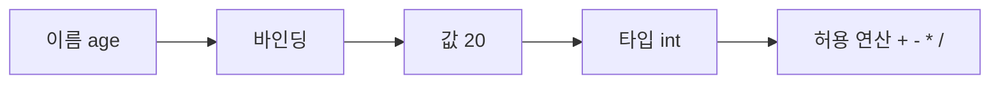

# 변수와 타입 (Variables and Types)

- Level: Beginner
- Prerequisites: 없음
- Status: Review
- Reviewed-by: -
- Depth: Deep-dive (자기완결)

---

## 개념 (Concept)

변수는 값을 저장하고 다시 사용할 수 있게 이름을 붙인 것이다. 타입은 그 값이 어떤 종류의 데이터인지, 어떤 연산이 가능한지를 정하는 분류다.

예를 들어 `age = 20`에서 `age`는 변수 이름이고, `20`은 정수 값이다. 정수에는 덧셈과 뺄셈을 할 수 있지만, 문자열처럼 글자를 이어 붙이는 연산은 언어에 따라 다르게 동작한다.

## 직관 (Intuition)

프로그램은 데이터를 바꾸며 진행된다. 변수는 "지금 기억해야 하는 값"에 이름을 붙이는 방법이고, 타입은 "이 값을 어떻게 다뤄야 하는지"를 알려주는 규칙이다.



타입이 없거나 흐릿하면 프로그램은 다음과 같은 실수를 하기 쉽다.

- 숫자처럼 보여도 실제로는 문자열인 값을 더한다.
- 비어 있을 수 있는 값을 항상 존재한다고 가정한다.
- 정수 나눗셈과 실수 나눗셈의 차이를 놓친다.
- 매우 큰 수나 매우 작은 실수를 정확하다고 믿는다.

## 이론 (Theory)

타입은 크게 정적 타입과 동적 타입으로 나눌 수 있다.

| 구분 | 의미 | 예시 |
|---|---|---|
| 정적 타입 | 실행 전에 변수와 표현식의 타입을 검사 | C, Java, Rust, TypeScript |
| 동적 타입 | 실행 중 값에 붙은 타입을 보고 연산 | Python, JavaScript, Ruby |

자주 등장하는 기본 타입은 다음과 같다.

| 타입 | 의미 | 예 |
|---|---|---|
| 정수 | 소수점 없는 수 | `-1`, `0`, `42` |
| 실수 | 소수점이 있는 근사값 | `3.14`, `0.1` |
| 불리언 | 참/거짓 | `true`, `false` |
| 문자열 | 문자들의 나열 | `"hello"` |
| 배열/리스트 | 여러 값을 순서대로 묶음 | `[1, 2, 3]` |
| 객체/딕셔너리 | 이름과 값을 묶음 | `{ "name": "Ada" }` |

변수 이름은 값 그 자체가 아니라 값을 가리키는 이름이다. 일부 언어에서는 변수에 값이 직접 들어 있다고 설명하고, 일부 언어에서는 변수가 객체를 참조한다고 설명한다. 중요한 점은 "이름", "값", "메모리", "타입"을 같은 것으로 섞어 생각하지 않는 것이다.

### 값, 이름, 바인딩

정적 타입 언어에서는 보통 변수 선언이 "이 이름에는 이런 타입의 값만 들어온다"는 약속을 만든다. 동적 타입 언어에서는 이름보다 값이 타입을 가진다. Python에서 `x = 1` 뒤에 `x = "one"`이 가능한 이유는 `x`라는 이름이 새 문자열 객체를 다시 가리키기 때문이다. 반면 Java의 `int x = 1` 뒤에 `x = "one"`은 타입 규칙에 막힌다.

### 변환과 파싱

타입 변환은 두 종류를 구분해야 한다. `str(42)`처럼 표현만 바꾸는 변환과, `int("42")`처럼 외부 입력을 해석하는 파싱이다. 파싱은 실패할 수 있다. `"42"`는 정수가 되지만 `"4.2"`를 `int`로 바로 파싱하거나 `"forty"`를 숫자로 바꾸는 일은 별도 규칙 없이는 실패한다.

## 구현 (Implementation)

```python
age = 20
name = "Ada"
is_student = True
scores = [90, 85, 100]

average = sum(scores) / len(scores)

print(name)
print(age + 1)
print(average)
print(type(age), type(name), type(scores))
```

타입 변환이 필요한 경우도 많다.

```python
raw = "42"
number = int(raw)

print(number + 1)  # 43
```

문자열 `"42"`와 정수 `42`는 사람이 보기에는 비슷하지만 프로그램 입장에서는 다른 값이다.

워크드 예제:

```python
raw_price = "1000"
quantity = 3

# "1000" * 3 은 언어에 따라 문자열 반복 또는 타입 오류가 될 수 있다.
price = int(raw_price)
total = price * quantity
print(total)       # 3000
```

이 예제의 핵심은 `raw_price`가 "숫자처럼 보이는 문자열"이라는 점이다. 입력 경계에서는 항상 실제 타입과 의미를 확인해야 한다.

## 복잡도 (Complexity)

| 연산 | 시간 | 공간 |
|---|---|---|
| 변수 읽기 | O(1) | O(1) |
| 기본 타입 값 대입 | O(1) | O(1) |
| 길이 n 문자열/리스트 복사 | O(n) | O(n) |

변수 대입이 항상 O(1)처럼 보이더라도, 언어와 값의 종류에 따라 참조만 복사할 수도 있고 실제 데이터를 복사할 수도 있다.

큰 문자열이나 리스트를 복사하는 비용은 데이터 크기에 비례한다. 반대로 참조만 복사하는 언어에서는 대입은 빠르지만, 같은 객체를 여러 이름이 공유하면서 의도치 않은 변경이 생길 수 있다.

## 응용 (Applications)

- 설정값, 사용자 입력, 계산 결과 저장
- 함수 사이에서 데이터 전달
- 조건문과 반복문에서 상태 관리
- 자료구조와 객체의 필드 구성

## 흔한 오해 (Common Misunderstandings)

- 변수 이름이 짧을수록 좋은 것은 아니다. 의미가 드러나는 이름이 유지보수에 유리하다.
- 실수 타입은 모든 소수를 정확히 표현하지 못한다. `0.1 + 0.2` 같은 계산은 언어에 따라 `0.3`과 정확히 같지 않을 수 있다.
- 타입 변환은 값의 의미를 보장하지 않는다. `"0012"`를 정수로 바꾸면 앞의 0 정보는 사라진다.
- 동적 타입 언어가 타입이 없는 언어라는 뜻은 아니다. 타입 검사를 실행 중에 할 뿐이다.

## TMI

- `Boolean` 타입의 이름은 논리 대수의 기반을 만든 수학자 George Boole에서 왔다.
- Python에서는 `bool`이 `int`의 하위 타입이라 `True + True`가 `2`가 된다. 실무 코드에서 일부러 이렇게 쓰는 것은 보통 피한다.
- JavaScript에서는 `typeof null`이 `"object"`로 나온다. 오래된 설계 실수가 호환성 때문에 계속 남아 있는 유명한 TMI다.
- null reference 개념을 만든 Tony Hoare는 훗날 이를 "billion-dollar mistake"라고 불렀다. 비어 있을 수 있는 값을 타입으로 표현하려는 현대 언어들의 흐름은 이 문제의식과 연결된다.

## 연습 / 확인 문제 (Exercises)

- 이름, 나이, 학생 여부, 점수 목록을 변수로 저장하고 한 문장으로 출력해 보라.
- 문자열 `"123"`과 정수 `123`에 각각 `+ 1`을 시도하면 어떤 일이 생기는지 확인하라.
- 정수 나눗셈과 실수 나눗셈의 결과가 어떻게 다른지 예시를 만들어 보라.

## 이어서 읽기 (Reading Path)

- 이전: 없음
- 다음: [조건문과 반복문](Control-Flow.md)
- 관련: [C 컴파일과 기본 문법](Languages/C/C-Setup-and-Compilation.md), [Java 실행 환경과 기본 문법](Languages/Java/Java-Setup-and-Syntax.md), [JavaScript 실행 환경과 기본 문법](Languages/JavaScript/JavaScript-Setup-and-Syntax.md), [Python 실행 환경과 기본 문법](Languages/Python/Python-Setup-and-Syntax.md)

## 참조 (References)

- [Programming/](./)
- [Reference/Books.md](../Reference/Books.md)
- [Reference/Courses.md](../Reference/Courses.md)
