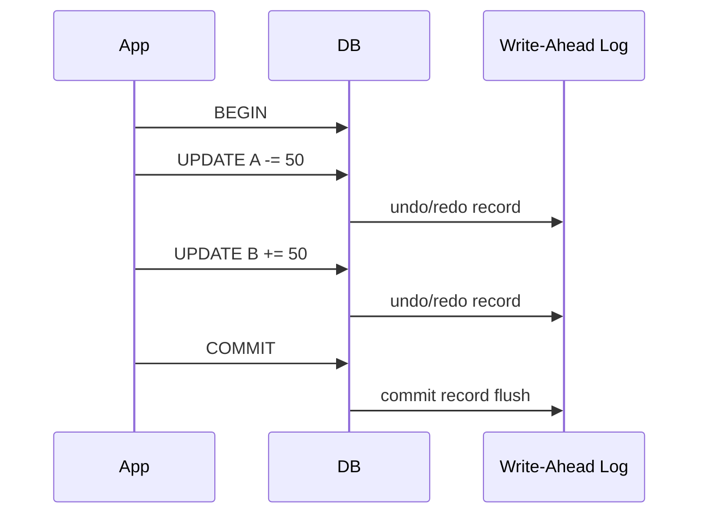

# 트랜잭션과 ACID (Transactions and ACID)

- Level: Intermediate
- Prerequisites: [Systems/Databases/Relational-Model-and-SQL.md](Relational-Model-and-SQL.md)
- Status: Draft
- Reviewed-by: -
- Depth: Deep-dive (자기완결)

---

## 개념 (Concept)

트랜잭션은 "하나로 묶여 전부 성공하거나 전부 취소되어야 하는" 데이터베이스 작업 단위다. **ACID**는 데이터베이스가 트랜잭션에 보장하는 네 가지 성질 — 원자성, 일관성, 격리성, 지속성 — 의 머리글자다.

## 직관 (Intuition)

계좌 이체를 생각하자. "A에서 50 출금"과 "B에 50 입금"은 반드시 둘 다 일어나거나 둘 다 일어나지 않아야 한다. 출금만 되고 입금이 안 되면 돈이 사라진다. 트랜잭션은 이 두 작업을 하나의 묶음으로 보고, 중간에 실패하면 통째로 되돌린다(rollback).



## 이론 (Theory)

| 성질 | 의미 |
|---|---|
| 원자성(Atomicity) | 전부 반영되거나 전부 취소(중간 상태 없음) |
| 일관성(Consistency) | 트랜잭션 전후로 무결성 제약이 유지됨 |
| 격리성(Isolation) | 동시에 실행되는 트랜잭션이 서로 간섭하지 않음 |
| 지속성(Durability) | 커밋된 결과는 장애가 나도 보존됨 |

격리성은 비용이 크기 때문에 보통 **격리 수준(isolation level)** 으로 강도를 조절한다. 약한 격리에서는 다음 이상 현상이 나타날 수 있다.

| 격리 수준 | Dirty Read | Non-repeatable Read | Phantom |
|---|---|---|---|
| Read Uncommitted | 가능 | 가능 | 가능 |
| Read Committed | 불가 | 가능 | 가능 |
| Repeatable Read | 불가 | 불가 | 가능 |
| Serializable | 불가 | 불가 | 불가 |

이 표는 SQL 표준 관점의 요약이다. 실제 DBMS는 이름이 같은 격리 수준도 구현이 다를 수 있다. 예를 들어 PostgreSQL의 Repeatable Read는 스냅샷 격리로 팬텀을 막고, 일부 DBMS는 Read Uncommitted를 요청해도 실제 dirty read를 허용하지 않는다.

높은 격리일수록 정합성은 좋지만 동시성·성능은 떨어진다.

### WAL과 지속성

지속성은 보통 WAL(write-ahead log)로 구현한다. 데이터 페이지를 디스크에 직접 쓰기 전에 "무슨 변경을 할 것인가"를 로그에 먼저 기록하고 flush한다. 장애가 나면 DB는 로그를 보고 커밋된 변경은 redo하고, 커밋되지 않은 변경은 undo한다. 그래서 트랜잭션은 메모리 버퍼와 디스크 flush 사이의 간극을 견딘다.

### MVCC와 격리

MVCC는 한 행의 여러 버전을 유지해 읽기와 쓰기가 서로를 덜 막게 한다. 읽는 트랜잭션은 자기 시작 시점의 스냅샷을 보고, 쓰는 트랜잭션은 새 버전을 만든다. 이 방식은 읽기 성능이 좋지만 오래 열린 트랜잭션이 옛 버전 정리를 막아 저장 공간이 늘어날 수 있다.

## 구현 (Implementation)

```python
import sqlite3

conn = sqlite3.connect(":memory:")
conn.execute("CREATE TABLE account (id INTEGER PRIMARY KEY, balance INTEGER)")
conn.executemany("INSERT INTO account VALUES (?, ?)", [(1, 100), (2, 0)])

try:
    conn.execute("BEGIN")
    conn.execute("UPDATE account SET balance = balance - 50 WHERE id = 1")
    conn.execute("UPDATE account SET balance = balance + 50 WHERE id = 2")
    conn.commit()      # 두 갱신이 함께 확정 (원자성)
except Exception:
    conn.rollback()    # 하나라도 실패하면 전부 취소

print(conn.execute("SELECT id, balance FROM account").fetchall())
# [(1, 50), (2, 50)]
```

실패 trace: 첫 번째 `UPDATE` 뒤 프로세스가 죽으면, 커밋 레코드가 없으므로 복구 과정에서 A의 출금 기록을 undo한다. 두 `UPDATE`와 commit log가 모두 flush된 뒤 죽으면 redo로 A=50, B=50을 보장한다.

## 복잡도 (Complexity)

빅오가 아니라 **정합성과 동시성의 트레이드오프**가 핵심이다.

| 선택 | 정합성 | 동시성/성능 |
|---|---|---|
| 낮은 격리 수준 | 약함 | 높음 |
| 높은 격리 수준 | 강함 | 낮음(잠금·대기 증가) |

잠금(lock)을 많이 쥘수록 충돌·대기·교착 가능성이 커진다.

워크드 예제: 100개의 주문을 처리하며 각 주문이 재고 행 하나를 갱신한다고 하자. 모든 주문이 서로 다른 상품이면 충돌이 작다. 반대로 인기 상품 하나의 재고 행만 갱신하면 같은 row lock을 두고 대기열이 생긴다. 이때 병목은 SQL 문장 수보다 **동시에 같은 논리 자원을 갱신하는 정도**다.

## 응용 (Applications)

- 금융 이체, 결제, 재고 차감
- 여러 테이블을 함께 갱신하는 모든 업무 로직
- 동시 사용자가 같은 데이터를 다룰 때의 정합성 보장
- 장애 복구(커밋된 데이터의 영속성)

## 흔한 오해 (Common Misunderstandings)

- ACID가 느려서 실무에서 안 쓴다는 것은 오해다. 대부분의 관계형 DB는 기본으로 ACID를 보장한다.
- 격리성은 "직렬화"만을 뜻하지 않는다. 여러 수준이 있고, 대부분의 시스템은 기본값으로 중간 수준을 쓴다.
- 커밋 전 변경은 다른 트랜잭션에 보여서는 안 된다(격리). 보이면 Dirty Read 문제다.
- 트랜잭션이 항상 여러 문장일 필요는 없다. 단일 문장도 트랜잭션으로 처리된다.

## TMI

- 분산 시스템에서는 ACID 대신 **BASE**(Basically Available, Soft state, Eventually consistent)를 택하기도 한다. 가용성·확장성을 위해 강한 일관성을 완화하는 절충이다.
- 많은 DB가 잠금 대신 **MVCC**(다중 버전 동시성 제어)로 읽기와 쓰기가 서로를 막지 않게 한다. PostgreSQL이 대표적이다.
- "I" 격리성은 ACID에서 가장 구현이 까다롭고, 성능 튜닝에서 가장 자주 건드리는 항목이다.

## 연습 / 확인 문제 (Exercises)

- 위 코드에서 두 번째 `UPDATE`가 예외를 던지도록 만들고, 롤백 후 잔액이 그대로인지 확인하라.
- Dirty Read, Non-repeatable Read, Phantom Read를 각각 한 문장 시나리오로 설명하라.
- 어떤 업무가 Serializable이 필요하고 어떤 업무가 Read Committed로 충분한지 예를 들어 보라.

## 이어서 읽기 (Reading Path)

- 이전: [관계형 모델과 SQL](Relational-Model-and-SQL.md)
- 다음: [동시성 제어](Concurrency-Control.md), [복구](Recovery.md)

## 참조 (References)

- [Systems/Databases/Relational-Model-and-SQL.md](Relational-Model-and-SQL.md)
- [Reference/Books.md](../../Reference/Books.md)
- [Reference/Courses.md](../../Reference/Courses.md)
