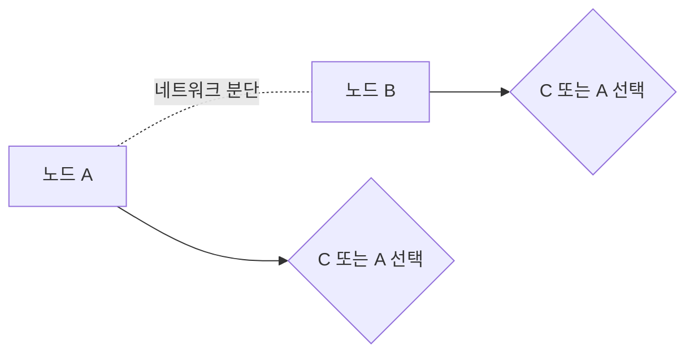

# CAP 정리와 PACELC (CAP Theorem & PACELC)

- Level: Intermediate
- Prerequisites: [Systems/Distributed-Systems/System-Models.md](System-Models.md), [Systems/Databases/Transactions-and-ACID.md](../Databases/Transactions-and-ACID.md)
- Status: Draft
- Reviewed-by: -
- Depth: Deep-dive (자기완결)

---

## 개념 (Concept)

CAP 정리는 분산 시스템이 **일관성(Consistency)**, **가용성(Availability)**, **분단 내성(Partition tolerance)** 세 가지를 동시에 완전히 만족할 수는 없고, 네트워크 분단이 일어나면 일관성과 가용성 중 **하나를 포기해야 한다**는 원리다. PACELC는 여기에 "분단이 없을 때는 지연(Latency)과 일관성 사이의 트레이드오프가 있다"를 덧붙여 확장한다.

## 직관 (Intuition)

두 지점의 데이터베이스를 잇는 네트워크가 끊겼다(분단). 이제 선택해야 한다 — 양쪽이 각자 요청을 계속 받되 서로 값이 달라지는 것을 허용할까(가용성 선택), 아니면 일관성을 지키려 한쪽을 멈출까(일관성 선택)? 분단 자체는 막을 수 없으니(네트워크는 언젠가 끊긴다), 실제 선택지는 "분단 시 C냐 A냐"뿐이다.



## 이론 (Theory)

세 속성의 정의는 다음과 같다.

| 속성 | 의미 |
|---|---|
| 일관성(C) | 모든 노드가 같은 시점에 같은 데이터를 봄(선형성에 가까움) |
| 가용성(A) | 살아 있는 모든 노드가 (오래된 값이라도) 항상 응답함 |
| 분단 내성(P) | 노드 간 메시지가 끊겨도 시스템이 계속 동작함 |

분산 시스템에서 네트워크 분단은 **불가피**하므로 P는 사실상 필수다. 따라서 실질적 선택은 분단이 발생한 순간 **CP**(일관성 우선, 일부 요청 거부)와 **AP**(가용성 우선, 불일치 감수) 사이다.

**PACELC** 는 이 그림을 완성한다: *if Partition then (C or A), Else (L or C)*. 즉 분단이 **없을 때조차** 강한 일관성을 위해 노드 간 동기화를 기다리면 지연이 늘고, 지연을 줄이려면 일관성을 약화해야 한다.

> 흔한 오해와 달리 CAP의 C는 ACID의 C와 다르다. CAP의 C는 "모든 복제본이 같은 값을 본다"는 선형성에 가깝고, ACID의 C는 "무결성 제약 유지"다.

## 구현 (Implementation)

쿼럼(quorum)으로 C와 A의 균형을 조절하는 방식이다. 복제본 `N`개에서 쓰기 `W`개, 읽기 `R`개의 응답을 요구할 때, $W + R > N$이면 강한 일관성을 얻는다.

```python
N = 3
def is_strongly_consistent(W, R):
    return W + R > N      # 읽기·쓰기 쿼럼이 겹쳐 최신값 보장

print(is_strongly_consistent(W=2, R=2))   # True  (CP 쪽: 더 많은 응답 대기)
print(is_strongly_consistent(W=1, R=1))   # False (AP 쪽: 빠르지만 불일치 가능)
```

`W`, `R`을 키우면 일관성↑·가용성/지연↓, 줄이면 그 반대다.

## 복잡도 (Complexity)

| 선택 | 분단 시 동작 | 대가 |
|---|---|---|
| CP | 일관성 유지, 일부 요청 거부/대기 | 가용성 저하 |
| AP | 모든 요청 응답, 값 불일치 허용 | 일관성 저하(나중에 수렴) |
| 강한 일관성(분단 없어도) | 동기화 대기 | 지연 증가 |
| 약한/최종 일관성 | 빠른 응답 | 일시적 불일치 |

## 응용 (Applications)

- CP 성향: ZooKeeper, etcd, HBase, 전통적 RDBMS 클러스터
- AP 성향: Cassandra, DynamoDB, Riak(쿼럼 조정 가능)
- 데이터 저장소 선택의 핵심 판단 기준
- 마이크로서비스의 일관성 경계 설계

## 흔한 오해 (Common Misunderstandings)

- "셋 중 둘만 고른다"는 표현은 오해를 부른다. P는 사실상 필수라, 실제 선택은 분단 시 C냐 A냐 둘 중 하나다.
- CAP는 분단이 **일어났을 때**의 트레이드오프다. 평상시에는 C와 A를 모두 높게 유지할 수 있다(그래서 PACELC가 필요).
- AP 시스템이 "일관성이 없다"는 뜻은 아니다. 보통 **최종 일관성(eventual consistency)** 으로 시간이 지나면 수렴한다.
- CAP의 C(선형성)와 ACID의 C(무결성)는 다른 개념이다.

## TMI

- CAP는 2000년 에릭 브루어가 추측으로 제시했고, 2002년 Gilbert·Lynch가 형식적으로 증명했다.
- 브루어 본인이 2012년 "CAP는 오해를 너무 많이 낳았다"며, 분단은 드물고 그때만 C/A를 고르면 된다고 해명하는 글을 썼다.
- PACELC는 2010년 다니엘 아바디가 "CAP만으로는 평상시 지연 트레이드오프를 설명 못 한다"며 제안했다.

## 연습 / 확인 문제 (Exercises)

- `N=5`에서 강한 일관성을 보장하는 `(W, R)` 조합을 모두 나열하라.
- 같은 서비스라도 기능에 따라 CP/AP를 다르게 택하는 예를 들어 보라(예: 결제 vs 좋아요 수).
- 최종 일관성이 허용되는 기능과 허용되지 않는 기능을 구분하는 기준을 제시하라.

## 이어서 읽기 (Reading Path)

- 이전: [시스템 모델과 장애 유형](System-Models.md)
- 다음: [복제](Replication.md), [분산 합의](Consensus.md)
- 관련: [트랜잭션과 ACID](../Databases/Transactions-and-ACID.md)

## 참조 (References)

- [Systems/Distributed-Systems/System-Models.md](System-Models.md)
- [Systems/Databases/Transactions-and-ACID.md](../Databases/Transactions-and-ACID.md)
- [Reference/Books.md](../../Reference/Books.md)
- [Reference/Papers.md](../../Reference/Papers.md)
