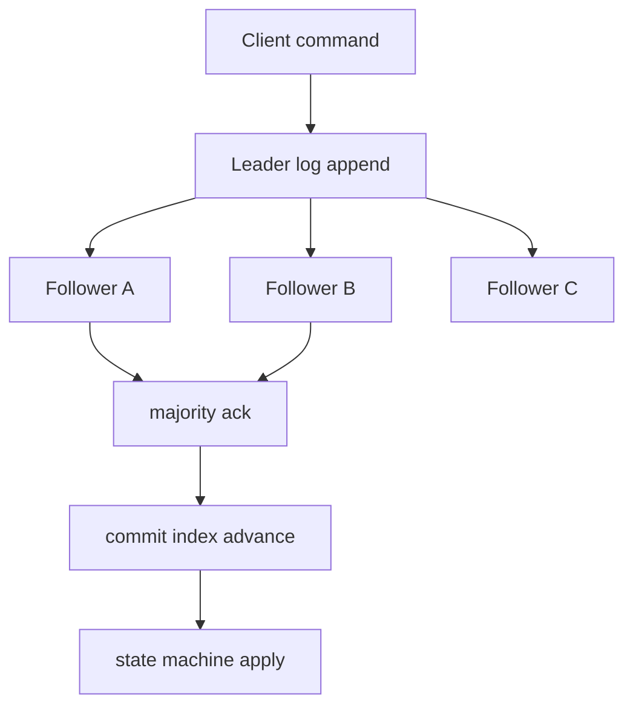

# 분산 합의 (Consensus: Paxos, Raft)

- Level: Advanced
- Prerequisites: [Systems/Distributed-Systems/System-Models.md](System-Models.md)
- Status: Draft
- Reviewed-by: -
- Depth: Deep-dive (자기완결)

---

## 개념 (Concept)

분산 합의는 여러 노드가 일부 장애와 메시지 지연 속에서도 **하나의 값(또는 명령 순서)에 모두 동의하도록** 만드는 문제다. 복제된 상태 기계(replicated state machine)가 같은 명령을 같은 순서로 적용하게 하는 핵심 메커니즘이며, Paxos와 Raft가 대표 알고리즘이다.

## 직관 (Intuition)

여러 사람이 서로 다른 메모를 주고받으며(일부는 늦게 도착하고, 일부는 졸고 있어도) "회의 시작 시각"을 단 하나로 합의해야 한다. 합의 알고리즘은 "과반수가 동의한 값은 절대 번복되지 않는다"는 규칙으로, 혼란 속에서도 모두가 같은 결론에 이르게 한다. 핵심 도구는 **다수결(과반수 쿼럼)** 이다.



## 이론 (Theory)

합의 알고리즘이 보장해야 하는 성질은 다음과 같다.

| 성질 | 의미 |
|---|---|
| 합의(agreement) | 정상 노드는 같은 값을 결정 |
| 유효성(validity) | 결정된 값은 누군가 제안한 값 |
| 종료(termination) | 결국 모든 정상 노드가 결정에 도달 |

근본 한계는 **FLP 불가능성**이다 — 완전 비동기 + 한 노드라도 장애 가능하면, **결정적**으로 종료를 보장하는 합의는 불가능하다. 실용 알고리즘은 이를 타임아웃(부분 동기 가정)이나 무작위성으로 우회한다.

**과반수(majority quorum)** 가 핵심이다. $2f+1$개 노드는 $f$개 장애를 견딘다 — 어떤 두 과반수 집합도 최소 한 노드를 공유하므로, 한 번 과반수가 동의한 값은 다음 과반수에도 전달된다.

- **Paxos**: 제안 번호와 두 단계(prepare/accept)로 안전성을 보장. 강력하지만 이해·구현이 어렵기로 악명 높다.
- **Raft**: "이해 가능성"을 목표로 설계. 리더 선출(leader election), 로그 복제(log replication), 안전성(safety)으로 역할을 명확히 분리했다.

> 위 알고리즘들은 **비잔틴이 아닌**(crash) 장애를 가정한다. 악의적 노드까지 견디려면 PBFT 같은 비잔틴 내성 합의(3f+1 노드 필요)가 필요하다.

### 왜 과반수가 안전한가

5개 노드에서 과반수는 3개다. 어떤 두 과반수 집합도 최소 1개 노드를 공유한다. 첫 번째 값이 `{A,B,C}`에 기록되었다면, 이후 다른 리더가 새 값을 커밋하려 해도 `{C,D,E}` 같은 과반수 안에 이전 값을 아는 노드가 최소 하나 있다. 합의 알고리즘은 이 교집합 노드를 통해 이미 선택된 값을 보존한다.

## 구현 (Implementation)

Raft 리더 선출의 핵심 상태 전이를 단순화한 모델이다.

```python
class RaftNode:
    def __init__(self):
        self.state = "follower"     # follower / candidate / leader
        self.term = 0
        self.votes = 0

    def election_timeout(self, cluster_size):
        # 타임아웃 동안 리더 소식이 없으면 후보가 되어 투표 요청
        self.state = "candidate"
        self.term += 1
        self.votes = 1              # 자신에게 투표
        return ("RequestVote", self.term)

    def receive_vote(self, granted, cluster_size):
        if granted:
            self.votes += 1
        if self.votes > cluster_size // 2:   # 과반수 득표
            self.state = "leader"             # 리더 확정
```

리더가 정해지면 클라이언트 명령을 로그에 추가하고, 과반수에 복제되면 커밋(commit)으로 확정한다.

Raft 로그 커밋 trace:

| 단계 | leader log | follower a | follower b | commit? |
|---|---|---|---|---|
| append x | x | - | - | no |
| replicate a | x | x | - | no |
| replicate b | x | x | x | yes, 3개 중 과반수 |

커밋된 명령은 모든 정상 노드의 상태 기계에 같은 순서로 적용되어야 한다. 순서가 달라지면 같은 명령 집합이어도 최종 상태가 달라질 수 있다.

## 복잡도 (Complexity)

| 항목 | 특징 |
|---|---|
| 내결함성 | `2f+1` 노드로 `f`개 장애 견딤(crash) |
| 비잔틴 내결함성 | `3f+1` 노드 필요(PBFT 등) |
| 정상 시 통신 | 명령 1개 커밋에 1라운드(리더→팔로워→리더) |
| 리더 장애 | 재선출 동안 일시적 가용성 저하 |

워크드 예제: 5노드 클러스터는 `f=2` 장애까지 견딘다. 쓰기 하나를 커밋하려면 3개 노드 응답이 필요하다. 2개가 죽어도 남은 3개로 커밋 가능하지만, 3개가 죽으면 과반수를 만들 수 없어 안전하게 쓰기를 진행할 수 없다.

## 응용 (Applications)

- 분산 코디네이션: ZooKeeper(ZAB), etcd(Raft), Consul
- 분산 데이터베이스의 복제 로그 일관성(Spanner, CockroachDB)
- 리더 선출, 분산 락, 설정 관리
- 블록체인(비잔틴 내성 합의)

## 흔한 오해 (Common Misunderstandings)

- 합의는 "투표로 다수결"이 끝이 아니다. 장애·재시작·메시지 재정렬 속에서도 한 번 정해진 값이 번복되지 않아야 한다는 점이 어렵다.
- Paxos와 Raft는 비잔틴 장애를 견디지 못한다. 악의적 노드는 별도의 BFT 알고리즘이 필요하다.
- 노드를 늘린다고 항상 더 안전한 건 아니다. 과반수를 받아야 하므로, 너무 많으면 지연이 늘고 쓰기 처리량이 준다.
- FLP 불가능성은 "합의가 영영 불가능"이라는 뜻이 아니다. **결정적 종료 보장**이 불가능할 뿐, 타임아웃으로 실용적으로 해결한다.

## TMI

- 램포트의 원 Paxos 논문("The Part-Time Parliament", 1998)은 고대 그리스 의회 비유로 쓰여 너무 난해했고, 결국 그는 "Paxos Made Simple"(2001)을 따로 써야 했다.
- Raft는 2014년 "이해 가능한 합의"를 명시적 목표로 발표됐다. 논문 제목부터 *In Search of an Understandable Consensus Algorithm*이다.
- "합의는 분산 시스템의 가장 어려운 문제"라는 말이 흔하다. 실제로 많은 시스템이 직접 구현하지 않고 etcd·ZooKeeper에 위임한다.

## 연습 / 확인 문제 (Exercises)

- `2f+1` 노드가 `f`개 장애를 견디는 이유를 두 과반수 집합의 교집합으로 설명하라.
- Raft에서 두 후보가 동시에 출마해 표가 갈리면(split vote) 어떻게 해결되는지 설명하라.
- 왜 과반수(과반)가 정확히 절반(1/2)이 아니라 절반 초과여야 하는지 설명하라.

## 이어서 읽기 (Reading Path)

- 이전: [CAP 정리와 PACELC](CAP-Theorem.md)
- 다음: [복제](Replication.md), [분산 트랜잭션](Distributed-Transactions.md)
- 관련: [시스템 모델과 장애 유형](System-Models.md)

## 참조 (References)

- [Systems/Distributed-Systems/System-Models.md](System-Models.md)
- [Reference/Books.md](../../Reference/Books.md)
- [Reference/Papers.md](../../Reference/Papers.md)
