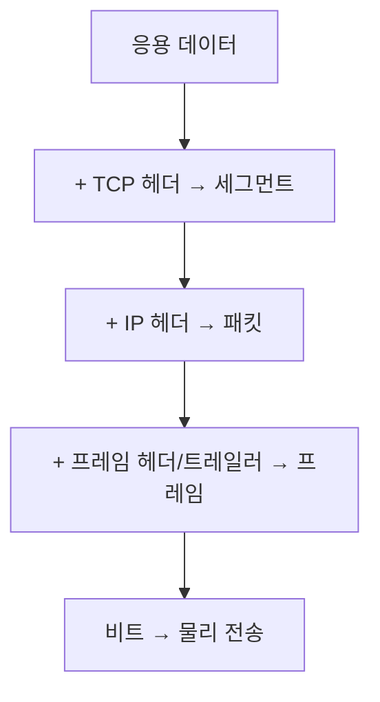

# 네트워크 계층 모델 (Network Models)

- Level: Beginner
- Prerequisites: [Systems/Operating-Systems/](../Operating-Systems/)
- Status: Draft
- Reviewed-by: -
- Depth: Deep-dive (자기완결)

---

## 개념 (Concept)

네트워크 계층 모델은 "컴퓨터가 통신하는 일"을 여러 **계층(layer)** 으로 나눈 설계 방식이다. 각 계층은 바로 아래 계층의 서비스를 이용하고, 위 계층에 자기 서비스를 제공한다. 대표적으로 7계층의 OSI 모델과 4계층의 TCP/IP 모델이 있다.

## 직관 (Intuition)

편지를 보낼 때 우리는 "내용"만 쓰고, 봉투·우편번호·운송 수단은 각 단계가 알아서 처리한다. 네트워크도 마찬가지다. 응용 프로그램은 "데이터를 보낸다"만 신경 쓰고, 신뢰성·주소·물리 전송은 아래 계층이 맡는다. 계층을 나누면 한 계층을 바꿔도(예: Wi-Fi ↔ 이더넷) 나머지는 그대로 쓸 수 있다.

## 이론 (Theory)

| OSI 7계층 | TCP/IP 4계층 | 역할 | 예 |
|---|---|---|---|
| 응용 / 표현 / 세션 | 응용 | 사용자 서비스 | HTTP, DNS |
| 전송 | 전송 | 종단 간 전달, 신뢰성 | TCP, UDP |
| 네트워크 | 인터넷 | 주소 지정, 라우팅 | IP |
| 데이터 링크 / 물리 | 네트워크 접근 | 인접 노드 전송, 비트 | 이더넷, Wi-Fi |

데이터는 위에서 아래로 내려가며 각 계층의 헤더가 덧붙는데, 이를 **캡슐화(encapsulation)** 라 한다. 받는 쪽은 반대로 헤더를 벗기며 올라간다(역캡슐화).



각 계층의 데이터 단위(PDU)는 전송 계층에서 세그먼트, 인터넷 계층에서 패킷, 링크 계층에서 프레임으로 불린다.

## 구현 (Implementation)

응용 프로그램은 소켓으로 아래 계층을 추상화해 사용한다. 아래는 전송·인터넷·링크 계층을 직접 다루지 않고 HTTP 요청을 보내는 예시다.

```python
import socket

# 전송(TCP) + 인터넷(IP)은 OS가 처리, 우리는 응용 계층 메시지만 작성
sock = socket.create_connection(("example.com", 80))
sock.sendall(b"GET / HTTP/1.1\r\nHost: example.com\r\nConnection: close\r\n\r\n")
response = sock.recv(1024)
print(response.split(b"\r\n")[0])   # b'HTTP/1.1 200 OK' 등
sock.close()
```

`create_connection` 한 줄 아래에서 TCP 3-way 핸드셰이크, IP 라우팅, 프레임 전송이 모두 일어난다.

## 복잡도 (Complexity)

알고리즘 복잡도보다 **계층별 오버헤드와 지연**이 핵심이다.

| 관점 | 설명 |
|---|---|
| 헤더 오버헤드 | 계층마다 헤더가 붙어 실제 페이로드 외 바이트가 추가됨 |
| 지연(latency) | 전파·전송·큐잉·처리 지연의 합 |
| 처리량(throughput) | 단위 시간당 전송 가능한 데이터량 |

## 응용 (Applications)

- 네트워크 문제를 계층별로 분리해 진단(케이블? IP? 포트? 응용?)
- 방화벽·로드밸런서가 어느 계층에서 동작하는지 이해(L4 vs L7)
- 프로토콜 설계와 패킷 분석(Wireshark 등)

## 흔한 오해 (Common Misunderstandings)

- OSI 7계층이 실제 인터넷 구현이라고 오해한다. 실제 인터넷은 TCP/IP 모델로 동작하고, OSI는 주로 개념·교육용 참조 모델이다.
- 계층이 완전히 독립적이라고 생각한다. 실제로는 성능을 위해 계층 간 정보가 새기도 한다(cross-layer).
- IP가 신뢰성을 보장한다고 오해한다. 신뢰성(재전송·순서)은 전송 계층의 TCP가 담당하고, IP 자체는 최선 노력(best-effort) 전달이다.

## TMI

- OSI 모델은 표준화 경쟁에서 사실상 TCP/IP에 밀렸지만, "L4 스위치", "L7 로드밸런서"처럼 계층 번호는 업계 용어로 살아남았다.
- "어떤 문제든 계층을 하나 더 추가하면 풀린다 — 단, 계층이 너무 많다는 문제만 빼고"라는 네트워킹 농담이 있다.
- `ping`은 전송 계층(TCP/UDP)이 아니라 인터넷 계층의 ICMP 메시지를 쓴다. 그래서 포트 개념이 없다.

## 연습 / 확인 문제 (Exercises)

- 웹 페이지가 안 열릴 때 물리·인터넷·전송·응용 계층 순으로 점검할 항목을 하나씩 적어 보라.
- 위 소켓 예시에서 어떤 부분이 응용 계층이고, 어떤 동작이 OS의 전송·인터넷 계층에서 일어나는지 구분하라.
- TCP와 UDP가 같은 전송 계층인데도 신뢰성에서 어떻게 다른지 한 문장으로 설명하라.

## 이어서 읽기 (Reading Path)

- 이전: 없음
- 다음: [TCP와 UDP](TCP-UDP.md), [IP 주소와 라우팅](IP-and-Routing.md)
- 관련: [물리 계층과 데이터 링크 계층](Physical-and-Link.md)

## 참조 (References)

- [Systems/Operating-Systems/](../Operating-Systems/)
- [Reference/Books.md](../../Reference/Books.md)
- [Reference/Courses.md](../../Reference/Courses.md)
