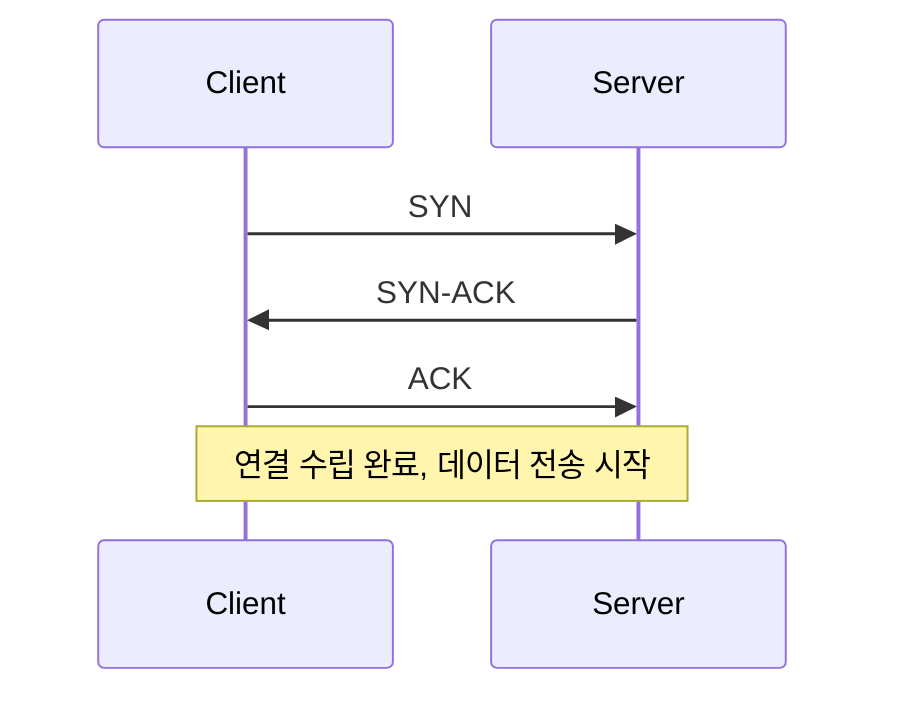

# TCP와 UDP (TCP and UDP)

- Level: Intermediate
- Prerequisites: [Systems/Networks/Network-Models.md](Network-Models.md)
- Status: Draft
- Reviewed-by: -

---

## 개념 (Concept)

TCP와 UDP는 둘 다 전송 계층 프로토콜로, 응용 프로그램의 데이터를 상대 호스트의 올바른 프로그램(포트)으로 전달한다. **TCP**는 연결을 맺고 신뢰성(순서·재전송)을 보장하며, **UDP**는 연결 없이 가볍고 빠르게 보낸다.

## 직관 (Intuition)

TCP는 등기우편이다. 받는 사람을 확인하고(연결 수립), 못 받으면 다시 보내며(재전송), 순서대로 도착하게 한다. UDP는 엽서다. 그냥 던지면 끝이라 빠르지만, 도착·순서·중복을 보장하지 않는다. "정확함"이 중요하면 TCP, "빠름"과 "실시간성"이 중요하면 UDP다.

TCP는 데이터를 주고받기 전에 3-way 핸드셰이크로 연결을 연다.



## 이론 (Theory)

| 특성 | TCP | UDP |
|---|---|---|
| 연결 | 연결 지향(핸드셰이크) | 비연결 |
| 신뢰성 | 보장(ACK·재전송) | 미보장 |
| 순서 | 보장 | 미보장 |
| 흐름·혼잡 제어 | 있음 | 없음 |
| 헤더 크기 | 큼(20바이트~) | 작음(8바이트) |
| 용도 | 웹, 파일 전송, 메일 | 스트리밍, 게임, DNS |

TCP는 수신 측의 처리 속도에 맞추는 **흐름 제어**와, 네트워크 혼잡을 피하는 **혼잡 제어**(예: 느린 시작)를 함께 수행한다. 두 프로토콜 모두 포트 번호로 같은 호스트 안의 여러 프로그램을 구분한다.

## 구현 (Implementation)

UDP는 핸드셰이크 없이 곧바로 보낸다.

```python
import socket

# UDP: 연결 없이 즉시 전송
udp = socket.socket(socket.AF_INET, socket.SOCK_DGRAM)
udp.sendto(b"hello", ("127.0.0.1", 9999))
udp.close()

# TCP: 먼저 연결(핸드셰이크)한 뒤 전송
tcp = socket.socket(socket.AF_INET, socket.SOCK_STREAM)
# tcp.connect(("example.com", 80))  # 여기서 3-way 핸드셰이크 발생
# tcp.sendall(b"...")
```

`SOCK_STREAM`이 TCP, `SOCK_DGRAM`이 UDP다.

## 복잡도 (Complexity)

| 관점 | TCP | UDP |
|---|---|---|
| 연결 비용 | 1 RTT(핸드셰이크) 추가 | 없음 |
| 헤더 오버헤드 | 큼 | 작음 |
| 지연 변동 | 재전송으로 늘 수 있음 | 일정한 편 |

신뢰성에는 비용이 따른다. TCP의 보장은 연결 설정·확인 응답·재전송이라는 추가 지연으로 치른다.

## 응용 (Applications)

- TCP: HTTP/HTTPS, 파일 전송, 이메일, 데이터베이스 연결
- UDP: DNS 조회, 실시간 스트리밍, 온라인 게임, VoIP
- 혼합: HTTP/3(QUIC)는 UDP 위에서 TCP의 신뢰성을 다시 구현

## 흔한 오해 (Common Misunderstandings)

- UDP가 항상 빠르고 "나쁜" 프로토콜인 것은 아니다. 손실을 감수하고 지연을 줄여야 하는 분야에서는 UDP가 정답이다.
- TCP가 보안을 제공한다고 오해한다. 암호화는 TLS(HTTPS)가 담당하고, TCP 자체는 신뢰성만 제공한다.
- "연결"이 물리적 회선을 뜻하지는 않는다. TCP 연결은 양쪽이 상태를 공유하는 논리적 개념이다.
- 포트는 하드웨어가 아니다. 같은 호스트의 프로그램을 구분하는 번호다.

## TMI

- TCP의 순서 보장 때문에 앞 패킷 하나가 늦으면 뒤가 다 막히는 **head-of-line blocking**이 생긴다. HTTP/3가 UDP 기반 QUIC를 택한 이유 중 하나다.
- DNS는 보통 UDP를 쓰지만, 응답이 크거나 영역 전송에는 TCP를 쓴다.
- 3-way 핸드셰이크의 SYN을 악용한 SYN 플러딩은 고전적인 DoS 기법이라, 방어를 위해 SYN 쿠키 같은 기법이 쓰인다(방어적 맥락).

## 연습 / 확인 문제 (Exercises)

- 영상 통화가 TCP보다 UDP에 적합한 이유를 지연·손실 관점에서 설명하라.
- TCP 3-way 핸드셰이크의 각 단계(SYN, SYN-ACK, ACK)가 무엇을 확인하는지 적어 보라.
- 같은 포트 번호가 TCP와 UDP에서 동시에 쓰일 수 있는지 설명하라.

## 이어서 읽기 (Reading Path)

- 이전: [네트워크 계층 모델](Network-Models.md)
- 다음: HTTP / HTTPS (예정 `HTTP.md`), DNS (예정 `DNS.md`)

## 참조 (References)

- [Systems/Networks/Network-Models.md](Network-Models.md)
- [Reference/Books.md](../../Reference/Books.md)
- [Reference/Courses.md](../../Reference/Courses.md)
