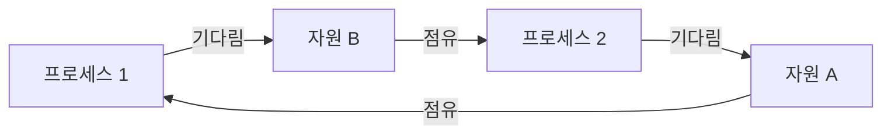

# 교착 상태 (Deadlock)

- Level: Intermediate
- Prerequisites: [Systems/Operating-Systems/Synchronization.md](Synchronization.md)
- Status: Draft
- Reviewed-by: -
- Depth: Deep-dive (자기완결)

---

## 개념 (Concept)

교착 상태는 두 개 이상의 프로세스/스레드가 **서로가 가진 자원을 기다리며 모두 영원히 멈춰 버리는** 상황이다. 각자 일부 자원을 쥔 채 상대의 자원을 기다리므로, 외부 개입 없이는 누구도 진행하지 못한다.

## 직관 (Intuition)

좁은 다리에서 두 차가 마주 봤다. 둘 다 "상대가 후진해야 내가 간다"고 버티면 영원히 못 움직인다. 한 명이 양보(자원 해제)하거나 누군가 끌어내야(선점) 풀린다. 식사하는 철학자 문제도 같다 — 모두가 왼쪽 포크를 들고 오른쪽 포크를 기다리면 아무도 못 먹는다.



## 이론 (Theory)

교착은 **네 조건이 모두 동시에** 성립할 때만 발생한다(코프만 조건, Coffman conditions).

| 조건 | 의미 |
|---|---|
| 상호 배제(mutual exclusion) | 자원을 한 번에 하나만 점유 가능 |
| 점유와 대기(hold and wait) | 자원을 쥔 채 다른 자원을 기다림 |
| 비선점(no preemption) | 점유한 자원을 강제로 뺏을 수 없음 |
| 순환 대기(circular wait) | 대기 관계가 원형 고리를 이룸 |

이 네 조건 중 **하나라도 깨면** 교착은 일어나지 않는다. 대응 전략은 네 가지다.

- **예방(prevention)**: 네 조건 중 하나를 구조적으로 불가능하게 만든다(예: 모든 자원을 정해진 순서로만 획득 → 순환 대기 제거).
- **회피(avoidance)**: 자원 할당 전에 안전 상태인지 검사한다(은행원 알고리즘, Banker's algorithm).
- **탐지와 복구(detection & recovery)**: 자원 할당 그래프에서 사이클을 찾아 프로세스를 종료·롤백한다.
- **무시(ostrich algorithm)**: 드물면 그냥 두고 재부팅으로 해결한다(실제 범용 OS가 흔히 택하는 현실적 선택).

## 구현 (Implementation)

순환 대기로 교착을 만든 뒤, 락 획득 순서를 고정해 예방한다.

```python
import threading

lock_a, lock_b = threading.Lock(), threading.Lock()

# 교착 위험: 두 스레드가 반대 순서로 잡음
def risky(first, second):
    with first:
        with second:        # 상대가 먼저 잡았으면 영원히 대기 가능
            pass

# 예방: 항상 같은 순서(id 기준)로 잡으면 순환 대기가 사라짐
def safe(l1, l2):
    first, second = sorted([l1, l2], key=id)
    with first:
        with second:
            pass
```

## 복잡도 (Complexity)

전략마다 비용과 보장이 다르다.

| 전략 | 비용 | 특징 |
|---|---|---|
| 예방(순서 고정) | 낮음 | 단순하지만 자원 활용도 저하 가능 |
| 회피(은행원) | 높음 | 최대 요구량을 미리 알아야 함, 검사 비용 |
| 탐지·복구 | 중간 | 주기적 사이클 검사 + 희생자 선택 |
| 무시 | 0 | 교착이 드물 때만 합리적 |

## 응용 (Applications)

- 데이터베이스 트랜잭션의 락 관리(교착 탐지 후 한 트랜잭션 롤백)
- 운영체제 커널의 자원 할당
- 분산 시스템의 잠금 서비스
- 멀티스레드 애플리케이션의 락 설계 규칙(획득 순서 표준화)

## 흔한 오해 (Common Misunderstandings)

- 교착과 기아(starvation)는 다르다. 교착은 모두가 멈추고, 기아는 특정 작업만 계속 밀린다.
- 락이 하나면 교착이 안 생긴다고 단정할 수 없다. 재진입 불가 락을 같은 스레드가 다시 잡으면 자기 자신과 교착(self-deadlock)할 수 있다.
- 교착은 항상 즉시 드러나지 않는다. 특정 타이밍·스케줄에서만 재현되어 디버깅이 어렵다.
- 은행원 알고리즘은 교착을 "탐지"하는 게 아니라 "회피"한다. 안전하지 않은 할당을 미리 거절한다.

## TMI

- "타조 알고리즘(ostrich algorithm)"은 머리를 모래에 박는 타조처럼 문제를 외면한다는 농담에서 온 이름이다. 교착이 매우 드문 데스크톱 OS에서는 의외로 합리적이다.
- 데이터베이스는 보통 교착을 탐지해, 가장 롤백 비용이 적은 트랜잭션을 "희생자(victim)"로 골라 중단시키고 재시도하게 한다.
- 식사하는 철학자 문제의 한 해법은 "한 철학자만 포크 잡는 순서를 반대로" 하는 것이다. 이것이 곧 순환 대기를 깨는 순서 고정 기법이다.

## 연습 / 확인 문제 (Exercises)

- 두 락을 반대 순서로 잡는 두 스레드로 교착을 재현하고, 획득 순서를 고정해 해결하라.
- 코프만 네 조건 각각을 깨는 구체적 방법을 하나씩 제시하라.
- 자원 할당 그래프가 주어질 때 사이클(교착)을 탐지하는 함수를 작성하라.

## 이어서 읽기 (Reading Path)

- 이전: [동기화](Synchronization.md)
- 다음: [메모리 관리](Memory-Management.md)
- 관련: [프로세스와 스레드](Processes-and-Threads.md)

## 참조 (References)

- [Systems/Operating-Systems/Synchronization.md](Synchronization.md)
- [Systems/Operating-Systems/Processes-and-Threads.md](Processes-and-Threads.md)
- [Reference/Books.md](../../Reference/Books.md)
- [Reference/Courses.md](../../Reference/Courses.md)
