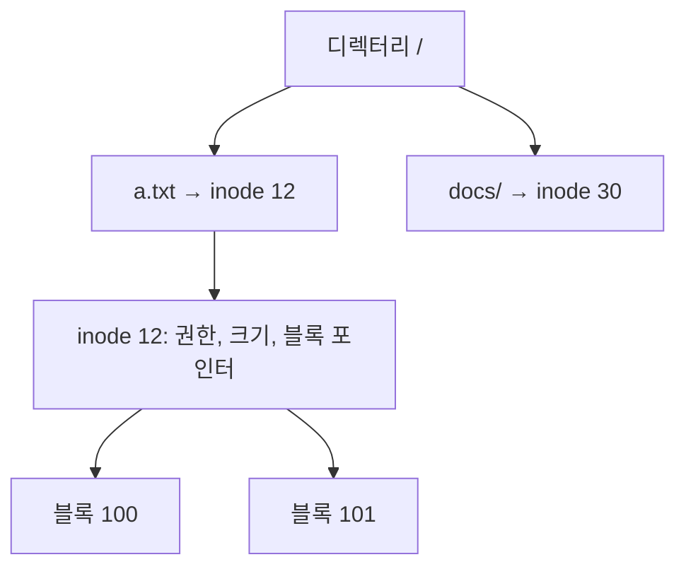

# 파일 시스템 (File Systems)

- Level: Intermediate
- Prerequisites: [Systems/Operating-Systems/Memory-Management.md](Memory-Management.md)
- Status: Draft
- Reviewed-by: -

---

## 개념 (Concept)

파일 시스템은 디스크 같은 저장 장치 위에 **파일과 디렉터리를 조직하고, 이름·위치·권한·크기 같은 메타데이터를 관리**하는 운영체제의 한 부분이다. 사용자는 블록 주소가 아니라 "경로(`/home/user/a.txt`)"라는 추상화로 데이터를 다룬다.

## 직관 (Intuition)

도서관에서 책을 찾을 때 "몇 번 서가 몇 번째 칸"이 아니라 청구기호와 분류 체계를 쓴다. 파일 시스템은 디스크의 물리적 블록 위에 이런 "이름 → 위치" 색인 체계를 올린 것이다. 디렉터리는 폴더(분류), inode는 카드 목록(메타데이터 + 블록 위치)에 해당한다.



## 이론 (Theory)

디스크는 고정 크기 **블록(block)** 단위로 읽고 쓴다. 파일의 데이터 블록을 어떻게 추적하느냐가 핵심 설계다.

| 할당 방식 | 방법 | 단점 |
|---|---|---|
| 연속 할당 | 연속된 블록에 저장 | 외부 단편화, 크기 확장 어려움 |
| 연결 할당 | 각 블록이 다음 블록을 가리킴 | 임의 접근 느림 |
| 색인 할당(inode) | 색인 블록이 모든 블록 포인터를 보유 | 큰 파일은 다단계 색인 필요 |

유닉스 계열은 **inode**(index node)에 메타데이터와 데이터 블록 포인터를 담는다. 작은 파일은 직접 포인터로, 큰 파일은 단일·이중·삼중 간접 포인터로 가리켜 크기를 확장한다. 디렉터리는 "이름 → inode 번호" 매핑을 담은 특수 파일이다.

쓰기 도중 전원이 끊기면 메타데이터가 깨질 수 있다. 이를 막으려고 **저널링(journaling)** 은 실제 변경 전에 "무엇을 바꿀지"를 로그에 먼저 기록해, 복구 시 일관성을 회복한다.

## 구현 (Implementation)

inode 기반 경로 해석을 단순화한 모델이다.

```python
inodes = {
    1: {"type": "dir", "entries": {"a.txt": 12, "docs": 30}},
    12: {"type": "file", "blocks": [100, 101]},
    30: {"type": "dir", "entries": {"b.txt": 31}},
    31: {"type": "file", "blocks": [205]},
}

def resolve(path):
    node = 1                       # 루트 inode
    for name in [p for p in path.split("/") if p]:
        node = inodes[node]["entries"][name]   # 이름 -> inode 번호
    return inodes[node]

print(resolve("/docs/b.txt"))      # {'type': 'file', 'blocks': [205]}
```

## 복잡도 (Complexity)

| 항목 | 특징 |
|---|---|
| 순차 읽기 | 블록을 차례로 읽어 효율적 |
| 임의 접근 | 색인 할당이 연결 할당보다 빠름 |
| 작은 파일 다수 | inode·디렉터리 조회 오버헤드 |
| 단편화 | 시간이 지나며 블록이 흩어져 성능 저하 |

저장 장치 특성도 크다 — HDD는 탐색 시간이 지배적이고, SSD는 임의 접근이 빠르지만 쓰기 수명(wear)이 있다.

## 응용 (Applications)

- 운영체제의 파일 저장 전반(ext4, NTFS, APFS, XFS)
- 데이터베이스의 저장 엔진 기반
- 네트워크·분산 파일 시스템(NFS, HDFS)
- 로그·백업·스냅샷 시스템

## 흔한 오해 (Common Misunderstandings)

- 파일을 "삭제"해도 보통 데이터 블록은 바로 지워지지 않는다. 디렉터리 항목과 inode 참조만 제거되어, 복구 도구로 살릴 수 있는 경우가 있다.
- 파일 이름은 inode에 저장되지 않는다. 이름은 디렉터리에 있고, 그래서 하드 링크로 한 inode에 여러 이름을 붙일 수 있다.
- 블록 크기가 크면 항상 빠른 게 아니다. 작은 파일이 많으면 내부 단편화로 공간이 낭비된다.
- 저널링은 데이터 자체가 아니라 보통 **메타데이터**의 일관성을 우선 보장한다(모드에 따라 다름).

## TMI

- 유닉스에서 파일을 열어 둔 채 삭제하면, 디렉터리에서는 사라지지만 그 파일을 연 프로세스가 닫을 때까지 inode와 블록은 살아 있다. 그래서 로그 파일을 지워도 디스크 공간이 안 줄어드는 일이 생긴다.
- inode가 다 떨어지면 디스크에 공간이 남아도 "No space left on device" 오류가 난다. 작은 파일이 수백만 개일 때 실제로 마주친다.
- 파일 끝을 넘어선 영역을 건너뛰고 쓰면, 중간이 실제 블록을 차지하지 않는 "구멍 난 파일(sparse file)"이 만들어진다.

## 연습 / 확인 문제 (Exercises)

- 연결 할당과 색인 할당에서 파일의 `k`번째 블록을 찾는 비용을 비교하라.
- inode의 직접·간접 포인터 구조로 표현 가능한 최대 파일 크기를 계산하라(블록 크기와 포인터 수 가정).
- 하드 링크와 심볼릭 링크의 차이를 inode 관점에서 설명하라.

## 이어서 읽기 (Reading Path)

- 이전: [가상 메모리와 페이지 교체](Virtual-Memory.md)
- 다음: [입출력과 디바이스 드라이버](IO-and-Drivers.md)
- 관련: [메모리 관리](Memory-Management.md)

## 참조 (References)

- [Systems/Operating-Systems/Memory-Management.md](Memory-Management.md)
- [Reference/Books.md](../../Reference/Books.md)
- [Reference/Courses.md](../../Reference/Courses.md)
