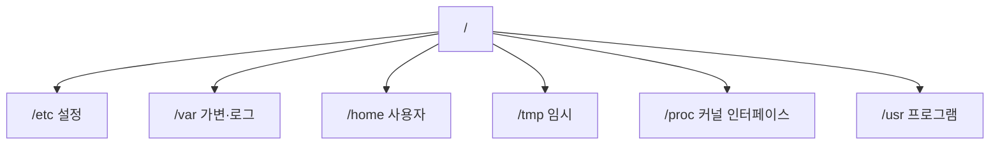

# Linux 파일 시스템 (Linux File System)

- Level: Beginner
- Prerequisites: [Systems/Operating-Systems/Linux/Linux-Shell-Basics.md](Linux-Shell-Basics.md)
- Status: Draft
- Reviewed-by: -
- Depth: Deep-dive (자기완결)

---

## 개념 (Concept)

Linux는 **단일 디렉터리 트리**(`/` 하나) 아래에 파일·디렉터리·장치·마운트 지점을 배치한다. Windows의 드라이브 문자(C:, D:)와 달리, 다른 디스크·네트워크 저장소를 트리의 한 디렉터리에 **mount**(접붙이기)한다.

## 직관 (Intuition)

하나의 큰 나무에 다른 저장소를 가지처럼 붙인다. 이 붙이는 작업이 mount다. **모든 것이 파일** — 장치(`/dev/sda`)·커널 정보(`/proc`)·소켓까지 파일 인터페이스로 다룬다.

## 이론 (Theory)

### 1. FHS와 표준 경로



`/etc`(설정), `/var/log`(로그), `/home`(홈), `/tmp`(임시), `/proc`·`/sys`(커널이 제공하는 **가상 파일** — 디스크에 없음).

### 2. inode·dirent·mount

파일 데이터·메타데이터는 **inode**([파일 시스템 이론](../File-Systems.md)), 이름→inode 매핑은 **디렉터리 항목(dirent)**. **mount**는 다른 파일 시스템을 기존 경로에 연결(`/mnt/data` 에 디스크 붙이기). 그래서 한 경로 아래가 다른 디스크일 수 있다.

### 3. du vs df가 다른 이유

`du`(파일 크기 합)와 `df`(파일 시스템 블록 사용)가 어긋날 수 있다 — **삭제됐지만 프로세스가 연 파일**(공간 점유하나 du엔 안 보임), sparse file, 예약 블록 때문.

## 구현 (Implementation)

```bash
df -h               # 파일 시스템별 여유 공간
du -sh /var/log     # 디렉터리 사용량
find / -name "*.log" -mtime -1   # 1일 내 수정된 로그
lsof /var/log/app.log            # 이 파일을 연 프로세스
mount | grep /mnt                # 마운트 상태
```

**워크드 예제(공간 미스터리).** `df` 는 디스크가 꽉 찼다는데 `du` 합은 작다 → 보통 **삭제된 대용량 로그를 어떤 프로세스가 아직 열고 있음**. `lsof | grep deleted` 로 찾아 그 프로세스를 재시작하면 공간이 회수된다.

## 복잡도 (Complexity)

| 작업 | 좌우 요인 |
|---|---|
| recursive scan(`find`/`du`) | 파일 수에 비례 |
| 메타데이터 조회 | 네트워크 FS·느린 디스크에서 병목 |

## 응용 (Applications)

- 디스크 사용량 조사, 설정 파일 위치, 로그·임시 파일 정리, 마운트 진단.

## 흔한 오해 (Common Misunderstandings)

- **`/root` 는 루트 디렉터리가 아니라** root 사용자의 홈.
- **확장자가 실행 가능 여부를 정하지 않는다** — 권한(`x`)과 shebang.
- **삭제해도 프로세스가 열고 있으면** 공간이 바로 회수 안 된다(du/df 불일치).
- **`/proc` 파일은 디스크 파일이 아니라** 커널 인터페이스(읽으면 실시간 생성).

## TMI

- hard link는 같은 inode를 여러 이름으로(같은 파일시스템 내), symbolic link는 경로를 가리키는 별도 파일(다른 FS·디렉터리 가능).
- `lsof`(list open files)는 "어떤 프로세스가 무엇을 열었나"의 만능 진단 도구.
- bind mount(`mount --bind`)는 한 디렉터리를 다른 경로에도 보이게 한다(컨테이너에서 흔함).

## 연습 / 확인 문제 (Exercises)

- `/etc`, `/var/log`, `/tmp`, `/proc` 의 역할을 설명하라.
- `du` 와 `df` 가 어긋나는 시나리오(삭제된 열린 파일)를 재현·설명하라.
- symbolic link와 hard link의 차이를 inode 관점에서 정리하라.
- `/proc/self/status` 를 읽으면 왜 매번 다른지 설명하라.

## 이어서 읽기 (Reading Path)

- 이전: [셸과 기본 명령](Linux-Shell-Basics.md)
- 다음: [사용자와 권한](Linux-Users-Permissions.md)
- 관련: [파일 시스템 이론](../File-Systems.md)

## 참조 (References)

- [Systems/Operating-Systems/File-Systems.md](../File-Systems.md)
- [Reference/Books.md](../../../Reference/Books.md)
