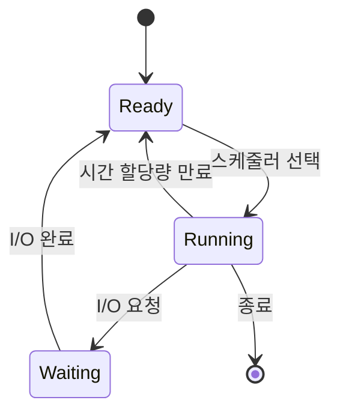

# 프로세스와 스레드 (Processes and Threads)

- Level: Beginner
- Prerequisites: [Systems/Computer-Architecture/Data-Representation.md](../Computer-Architecture/Data-Representation.md)
- Status: Draft
- Reviewed-by: -
- Depth: Deep-dive (자기완결)

---

## 개념 (Concept)

**프로세스(process)** 는 실행 중인 프로그램이다. 각자 독립된 메모리 공간과 자원을 가진다. **스레드(thread)** 는 프로세스 안에서 실제로 명령을 실행하는 흐름이며, 같은 프로세스의 스레드끼리는 메모리를 공유한다. 운영체제는 이 둘을 단위로 CPU와 메모리를 나눠 준다.

## 직관 (Intuition)

프로세스를 "집"이라고 하면, 스레드는 그 집 안에서 일하는 사람들이다. 집(프로세스)끼리는 벽으로 분리돼 서로의 물건에 함부로 접근하지 못하지만, 한 집 안의 사람들(스레드)은 같은 냉장고·거실(힙·전역 데이터)을 공유한다. 공유는 빠르지만, 동시에 같은 물건을 건드리면 충돌(경쟁 조건)이 난다.

프로세스는 다음 상태를 오간다.



## 이론 (Theory)

프로세스의 메모리는 보통 코드(text), 데이터, 힙(heap), 스택(stack)으로 나뉘고, 운영체제는 각 프로세스를 PCB(Process Control Block)로 관리한다. CPU를 한 실행 흐름에서 다른 흐름으로 바꾸는 것을 **컨텍스트 스위치(context switch)** 라 하며, 레지스터·상태를 저장·복원하므로 비용이 든다.

스레드는 같은 프로세스 안에서 일부 자원을 공유하고 일부는 따로 가진다.

| 자원 | 프로세스 간 | 같은 프로세스의 스레드 간 |
|---|---|---|
| 코드, 전역/정적 데이터, 힙 | 분리 | **공유** |
| 스택, 레지스터, 프로그램 카운터 | 분리 | 분리 |

**동시성(concurrency)** 은 여러 작업을 번갈아 진행하는 것(논리적), **병렬성(parallelism)** 은 여러 코어에서 실제로 동시에 실행하는 것(물리적)이다. 공유 자원을 여러 스레드가 동시에 수정하면 **경쟁 조건(race condition)** 이 생기므로 동기화가 필요하다.

## 구현 (Implementation)

```python
import threading

counter = 0
lock = threading.Lock()

def worker():
    global counter
    for _ in range(100_000):
        with lock:          # 공유 자원 보호
            counter += 1

threads = [threading.Thread(target=worker) for _ in range(2)]
for t in threads:
    t.start()
for t in threads:
    t.join()

print(counter)   # 200000 (lock이 없으면 경쟁 조건으로 더 작아질 수 있음)
```

CPU 위주 작업을 진짜 병렬로 돌리려면 파이썬에서는 스레드 대신 `multiprocessing`(프로세스)을 쓰는 경우가 많다(아래 TMI 참고).

## 복잡도 (Complexity)

빅오로 표현하는 알고리즘 비용이 아니라 **자원·전환 비용**이 핵심이다.

| 항목 | 특징 |
|---|---|
| 프로세스 생성 | 무겁다(별도 메모리 공간 할당) |
| 스레드 생성 | 가볍다(공간 공유) |
| 컨텍스트 스위치 | 레지스터·캐시 영향으로 비용 발생 |
| 통신 | 프로세스 간은 IPC 필요, 스레드 간은 공유 메모리 |

## 응용 (Applications)

- 웹 서버의 다중 요청 동시 처리
- 다운로드·계산을 백그라운드로 돌려 UI 반응성 유지
- 멀티코어를 활용한 병렬 계산
- 파이프라인·생산자-소비자 구조

## 흔한 오해 (Common Misunderstandings)

- 스레드를 늘리면 항상 빨라진다고 오해한다. 컨텍스트 스위치·동기화 비용과 코어 수 한계 때문에 오히려 느려질 수 있다.
- 프로세스와 프로그램은 다르다. 프로그램은 디스크의 파일, 프로세스는 그것이 실행되어 메모리에 올라온 인스턴스다.
- 동시성과 병렬성은 같지 않다. 코어가 하나여도 동시성은 가능하다.
- 공유 변수는 그냥 같이 쓰면 안 된다. 동기화 없이 동시에 수정하면 값이 깨진다.

## TMI

- CPython에는 전역 인터프리터 잠금(GIL)이 있어, 한 시점에 하나의 스레드만 파이썬 바이트코드를 실행한다. 그래서 CPU 위주 작업은 스레드로 잘 병렬화되지 않고 보통 프로세스를 쓴다. I/O 위주 작업은 스레드로도 이득이 크다.
- 유닉스의 `fork()`는 프로세스를 통째로 복제한다. 자식이 종료됐는데 부모가 회수하지 않으면 좀비 프로세스, 부모가 먼저 죽으면 고아 프로세스가 된다.
- "스레드가 안전하다(thread-safe)"는 표현은 여러 스레드가 동시에 호출해도 정상 동작함을 뜻한다. 라이브러리 문서에서 자주 보게 된다.

## 연습 / 확인 문제 (Exercises)

- 위 코드에서 `lock`을 제거하고 여러 번 실행해 결과가 200000보다 작아지는 경우를 관찰하고 이유를 설명하라.
- 프로세스와 스레드가 각각 공유하는 자원과 분리하는 자원을 표로 정리하라.
- 동시성과 병렬성의 차이를 코어가 1개인 경우와 4개인 경우로 나눠 설명하라.

## 이어서 읽기 (Reading Path)

- 이전: [데이터 표현](../Computer-Architecture/Data-Representation.md)
- 다음: [CPU 스케줄링](Scheduling.md), [동기화](Synchronization.md)
- 관련: [셸과 기본 명령](Linux/Linux-Shell-Basics.md)

## 참조 (References)

- [Systems/Computer-Architecture/Data-Representation.md](../Computer-Architecture/Data-Representation.md)
- [Reference/Books.md](../../Reference/Books.md)
- [Reference/Courses.md](../../Reference/Courses.md)
