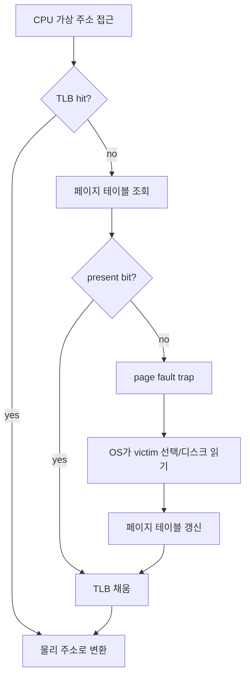

# 가상 메모리와 페이지 교체 (Virtual Memory & Page Replacement)

- Level: Intermediate
- Prerequisites: [Systems/Operating-Systems/Memory-Management.md](Memory-Management.md)
- Status: Draft
- Reviewed-by: -
- Depth: Deep-dive (자기완결)

---

## 개념 (Concept)

가상 메모리는 **물리 메모리보다 큰 주소 공간을 쓰는 것처럼** 보이게 하는 기법이다. 당장 필요한 페이지만 물리 메모리(RAM)에 올리고 나머지는 디스크(스왑 영역)에 두며, 접근하는 순간 가져온다(**요구 페이징, demand paging**). 메모리에 없는 페이지에 접근하면 **페이지 폴트(page fault)** 가 발생해 OS가 디스크에서 적재한다.

## 직관 (Intuition)

책상(RAM)은 좁고 책장(디스크)은 넓다. 지금 보는 책만 책상에 올려 두고, 다른 책이 필요해지면 책상에서 안 쓰는 책을 책장에 꽂은 뒤 새 책을 꺼낸다. "어떤 책을 책장으로 돌려보낼까"가 바로 페이지 교체 문제다. 잘못 고르면 방금 치운 책을 또 꺼내느라 시간을 다 쓴다.



## 이론 (Theory)

물리 메모리가 꽉 찼는데 새 페이지가 필요하면, 기존 페이지 하나를 내보내야 한다. 어떤 페이지를 고르냐가 **페이지 교체 알고리즘**이다.

| 알고리즘 | 기준 | 특징 |
|---|---|---|
| FIFO | 가장 먼저 들어온 페이지 | 단순, 벨라디의 모순 발생 |
| OPT(최적) | 앞으로 가장 늦게 쓸 페이지 | 이론적 최소 폴트, 미래를 알아야 해 비현실적 |
| LRU | 가장 오래 안 쓴 페이지 | OPT 근사, 구현 비용 있음 |
| Clock(2차 기회) | 참조 비트 순회 | LRU의 실용적 근사 |

페이지 폴트가 잦으면 실행보다 디스크 입출력에 시간을 더 쓰는 **스래싱(thrashing)** 에 빠진다. 이는 동시에 실행하는 프로세스가 각자 필요로 하는 페이지 집합(**워킹 셋, working set**)의 합이 물리 메모리를 초과할 때 일어난다. 유효 접근 시간은 폴트율 $p$로 다음과 같이 추정한다.

$$\text{EAT} = (1-p)\times t_{\text{mem}} + p \times t_{\text{fault}}$$

$t_{\text{fault}}$(디스크 접근)가 $t_{\text{mem}}$보다 수만 배 크므로, 작은 $p$도 성능을 크게 떨어뜨린다.

### 페이지 폴트 처리 흐름

페이지 폴트는 CPU 예외로 OS 커널에 제어권을 넘긴다. OS는 접근이 합법적인지 먼저 확인한다. 합법적인데 RAM에 없을 뿐이면 빈 프레임을 찾거나 victim 페이지를 고르고, victim이 dirty이면 디스크에 기록한 뒤 필요한 페이지를 읽어 온다. 마지막으로 페이지 테이블과 TLB를 갱신하고, 실패했던 명령을 다시 실행한다. 매핑 자체가 불법이면 프로세스에 segfault를 보낸다.

## 구현 (Implementation)

LRU 페이지 교체를 시뮬레이션한다.

```python
def lru_faults(pages, capacity):
    cache, faults = [], 0
    for p in pages:
        if p in cache:
            cache.remove(p)        # 최근 사용으로 갱신
        else:
            faults += 1
            if len(cache) == capacity:
                cache.pop(0)       # 가장 오래 안 쓴 것 제거
        cache.append(p)
    return faults


refs = [1, 2, 3, 1, 4, 2, 5]
print(lru_faults(refs, capacity=3))   # 6
```

워크드 trace(capacity 3, LRU):

| 참조 | cache 상태 | fault? |
|---|---|---|
| 1 | [1] | yes |
| 2 | [1, 2] | yes |
| 3 | [1, 2, 3] | yes |
| 1 | [2, 3, 1] | no |
| 4 | [3, 1, 4] | yes, 2 제거 |
| 2 | [1, 4, 2] | yes, 3 제거 |
| 5 | [4, 2, 5] | yes, 1 제거 |

## 복잡도 (Complexity)

| 항목 | 비용 |
|---|---|
| 페이지 적중(hit) | 메모리 접근 속도(나노초) |
| 페이지 폴트 | 디스크 접근(밀리초) — 수만 배 느림 |
| LRU 정확 구현 | 접근마다 갱신, 하드웨어 지원 또는 근사 필요 |
| TLB 적중 | 페이지 테이블 접근 없이 즉시 변환 |

TLB(Translation Lookaside Buffer)는 최근 주소 변환을 캐시해, 페이지 테이블 조회 비용을 줄인다.

워크드 예제: 메모리 접근 100ns, 페이지 폴트 10ms, 폴트율이 0.1%라면

$$\text{EAT}=0.999\times100\text{ns}+0.001\times10\text{ms}\approx10.1\mu s$$

평균 접근 시간이 100ns에서 약 10마이크로초로 100배 이상 커진다. 그래서 폴트율을 작게 유지하는 것이 중요하다.

## 응용 (Applications)

- 물리 메모리보다 큰 프로그램 실행
- 프로세스 격리와 메모리 보호
- 메모리 맵 파일(mmap), 공유 라이브러리
- copy-on-write(fork 시 페이지 공유 후 쓰기 시점 복사)

## 흔한 오해 (Common Misunderstandings)

- 가상 메모리는 "RAM을 늘리는 마법"이 아니다. 디스크는 RAM보다 압도적으로 느려, 스왑에 의존하면 성능이 급락한다.
- 페이지가 많을수록 항상 폴트가 주는 건 아니다. FIFO에서는 프레임을 늘려도 폴트가 늘 수 있다(**벨라디의 모순, Belady's anomaly**). LRU·OPT는 이 모순이 없다.
- LRU가 항상 최적은 아니다. OPT가 이론적 하한이고 LRU는 근사다.
- 페이지 폴트가 항상 오류는 아니다. 요구 페이징의 정상 동작 중 하나이며, 매핑 자체가 없을 때만 실제 오류(segfault)다.

## TMI

- 벨라디의 모순은 1969년 발견됐다. "메모리를 늘렸는데 더 느려진다"는 반직관적 현상이라 시험 단골 주제다.
- copy-on-write 덕분에 유닉스 `fork()`는 거대한 프로세스도 즉시 복제할 수 있다. 실제 복사는 자식이나 부모가 페이지를 수정하는 순간으로 미뤄진다.
- 스래싱에 빠진 시스템은 디스크 표시등만 계속 깜빡이고 화면은 멈춘 것처럼 보인다. 해결책은 보통 실행 프로세스 수를 줄이거나 RAM을 늘리는 것이다.

## 연습 / 확인 문제 (Exercises)

- 같은 참조열에 FIFO와 LRU를 적용해 페이지 폴트 수를 비교하라.
- FIFO에서 프레임을 3개→4개로 늘렸을 때 폴트가 늘어나는 벨라디의 모순 예제를 찾아라.
- 폴트율 `p`와 디스크/메모리 접근 시간으로 유효 접근 시간(EAT)을 계산하는 함수를 작성하라.

## 이어서 읽기 (Reading Path)

- 이전: [메모리 관리](Memory-Management.md)
- 다음: [파일 시스템](File-Systems.md)
- 관련: [데이터 표현](../Computer-Architecture/Data-Representation.md)

## 참조 (References)

- [Systems/Operating-Systems/Memory-Management.md](Memory-Management.md)
- [Reference/Books.md](../../Reference/Books.md)
- [Reference/Courses.md](../../Reference/Courses.md)
